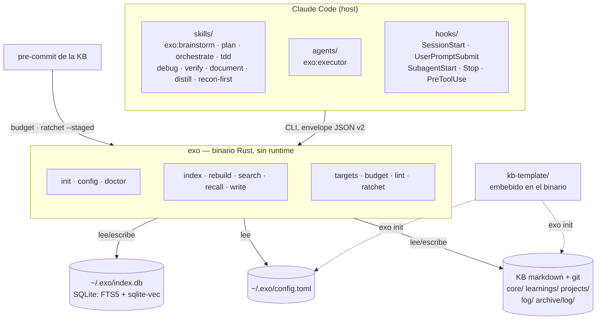

# exo

Framework de trabajo agéntico con memoria persistente. Tres capas:
**thin** (skills-router, hooks) → **engine** (`init`/`config`/`index`/`rebuild`/
`search`/`write`/`recall`/`doctor`/`budget`/`lint`/`ratchet`/`targets`, ver
`exo --help`) → **thick** (KB markdown+frontmatter ≈OKF).

## Instalar

```bash
curl -fsSL https://raw.githubusercontent.com/pguerrerolinares/exo/main/install.sh | bash
```

Requisitos: `git` y `jq`. Ni Rust ni toolchain C. Detalle y camino desde
fuente: [`docs/instalacion.md`](docs/instalacion.md).

El engine es un binario Rust (`exo`) que se construye desde `engine/` y arranca con
`~/.exo/config.toml` — sin dependencia de `basic-memory` para funcionar (la única
lectura de `~/.basic-memory/config.json` que queda es `exo init --from-basic-memory`,
una migración explícita y de una sola vez). La capa thin (`plugins/exo/`)
invoca ese binario desde hooks y scripts de shell.

- Cómo funciona el sistema, derivado del código: `docs/arquitectura.md`
- Cómo compilarlo e instalarlo: `docs/instalacion.md`
- Spec de diseño original: `docs/superpowers/specs/2026-07-16-framework-unificado-design.md`
- Spec de exo genérico (config propia, D8/D9): `docs/superpowers/specs/2026-08-26-exo-generico-design.md`
- Audit trail de consultorías: `docs/superpowers/consultas/`
- Plan de cierre (M2-08 → M5b): `docs/superpowers/plans/2026-08-17-cierre-exo-m2-a-m5b.md`
- **Deuda abierta y hallazgos sin barrer: `docs/backlog.md`** — léelo antes de asumir
  que algo está terminado solo porque este README lo menciona.
- Revisión crítica externa del repo completo (veredicto, lo que está bien, nueve
  críticas argumentadas y su mapa al backlog): `docs/2026-09-04-revision-critica-externa.md`
- Estado (2026-09-02): M0, M1a, M2 (E1 read), M4 (E2 write) y **M6 completo**
  cerrados — `exo write new|append` escribe la KB, `/document` va por el engine
  y `exo recall` sirve el arranque de sesión y el recall en el punto de uso
  (`recall-inject.sh` en cada prompt); los subagentes reciben su bloque de
  inyección por perfil (`subagent-inject.sh`). Las tres
  olas de exo genérico también: **1A** config propia (`engine/src/config.rs`,
  precedencia `flag > env > config > error accionable`; cero código de
  producción lee `~/.basic-memory/config.json`; envelope JSON con claves en
  inglés, `schema_version` 2; flags largos en inglés con alias español oculto
  hasta 1.1), **1B** fusión y cutover del plugin único `plugins/exo/`, y
  **1C** hermeticidad de la suite respecto a `~/.exo/config.toml`, con gate
  falsable (`engine/scripts/test-hermetico.sh`) y KB semilla propia de
  `exo init`. El privacy-pass de publicación (B1) está ejecutado sobre la
  historia completa. Suite: 434 tests verdes en 44 binarios (2 ignorados), corridos por
  `.github/workflows/ci.yml` en ubuntu-latest / windows-latest / macos-latest
  vía el gate hermético (`engine/scripts/test-hermetico.sh`), con la caché del
  modelo de embeddings pineada por revisión del modelo (no por rama, así que
  no vuelve a subir nada) — más `fmt --check`, `clippy -D warnings` y un
  check de la MSRV declarada (1.95). Pendiente: MCP propio (M5a), desinstalar
  basic-memory (M5b).

  G5b entregó release, instaladores y `exo doctor`, y **`v0.1.0` está
  publicada** con binarios para linux-x86_64, windows-x86_64 y macos-arm64.
  Queda G4d (`rotate`, `stale`) y el check de desfase binario↔plugin.

## Arquitectura



## Idioma

exo es un producto **en español**: el default de embeddings es
`jina-embeddings-v2-base-es` y la línea base del eval de retrieval está medida
en español. El modelo es configurable (`[embeddings] model` en
`~/.exo/config.toml`), pero **multiidioma es un frente futuro, no una
promesa**: nadie ha medido el retrieval de exo en otra lengua.

## Capa thin: el plugin `exo`

`plugins/exo/` es la capa de skills. Nueve: brainstorm · plan · orchestrate ·
tdd · debug · verify · document · distill · recon-first. Fusiona los antiguos
plugins `process` y `reflex` en uno solo — el proceso de trabajo completo más
la capa de reflejos que lo activa en el punto de acción. Sustituye a
`superpowers` y a `paul-profile:orchestrate-personal` en el uso diario.

Agente: `agents/executor.md` (`exo:executor`) — ejecutor de tareas de
implementación acotadas, despachado por `orchestrate` (subagent-driven
development).

Hooks (nueve, cableados en `plugins/exo/hooks/hooks.json`; tabla completa con
qué hace cada uno y su abstención en `plugins/exo/README.md`):

| Reflejo | Evento | Fichero |
|---|---|---|
| clean-orchestrator | `PreToolUse:WebSearch\|WebFetch` | `scripts/clean-orchestrator-research.sh` |
| git-c | `PreToolUse:Bash` | `scripts/git-c-bash.sh` |
| zero-residuo | `PreToolUse:Bash` | `scripts/git-add-all-guard.sh` |
| verify-before-done | `PreToolUse:Bash` | `scripts/verify-before-commit.sh` |
| exo-recall | `SessionStart` | `scripts/exo-recall.sh` |
| document-remind | `Stop` | `scripts/document-remind.sh` |
| exo-index | `Stop` | `scripts/exo-index.sh` |
| subagent-inject | `SubagentStart` | `scripts/subagent-inject.sh` |
| recall-inject | `UserPromptSubmit` | `scripts/recall-inject.sh` |

Este repo es la **fuente de verdad** del plugin (co-evoluciona con el engine y con
sus evals de paridad en `evals/prep-m3/`) y además es su propio marketplace:
`.claude-plugin/marketplace.json` (en la raíz de este repo) sirve `plugins/exo/`
directamente. Id de plugin: `exo@exo`. Ya no se publica vía `exo-plugins`/
git-subdir — ese modelo de publicación quedó atrás con la fusión de plugins.

## Atribución

`exo` destila el catálogo de [`obra/superpowers`](https://github.com/obra/superpowers)
— **MIT, © 2025 Jesse Vincent** — más doctrina propia. La copia literal de la licencia
está en `plugins/exo/LICENSES/superpowers.LICENSE`, y el reparto skill a skill
(qué absorbe de superpowers y qué es fuente propia) en `plugins/exo/README.md`.

El engine **no** contiene ni vendoriza código de basic-memory (AGPL-3.0-or-later):
el diseño se estudió, el código no se copió. Veto explícito en la spec madre.
