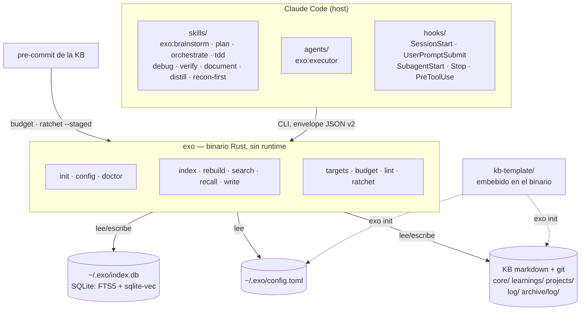

# exo

Memoria persistente para agentes de código. exo guarda lo que decides y
aprendes en una KB de notas markdown versionada con git, la indexa en local
(texto completo + embeddings, SQLite en un solo fichero) y se la devuelve al
agente cuando la necesita: al empezar la sesión y en cada prompt.

**Para quién es hoy:** exo es el sistema de trabajo de su autor, publicado tal
cual (MIT). Funciona y se prueba en Linux, macOS y Windows, pero lo decide un
solo usuario: sin promesa de estabilidad ni soporte.

## Qué problema resuelve

Un agente como Claude Code empieza cada sesión sin memoria: las decisiones de
ayer, los errores ya diagnosticados y las convenciones del proyecto hay que
volver a contárselas. exo lo resuelve con tres piezas que se usan por
separado:

- **La KB** — notas markdown con frontmatter (`tier: core | stable | log`), en
  tu disco y en git. Se leen sin exo.
- **El engine** — `exo`, un binario sin runtime: indexa la KB y sirve búsqueda
  y recall (`exo --help`).
- **El plugin de Claude Code** — `plugins/exo/`: hooks que inyectan el recall
  al arrancar y en cada prompt, y skills de proceso (plan, tdd, debug,
  document…) que escriben en la KB.

## Instalar

```bash
curl -fsSL https://raw.githubusercontent.com/pguerrerolinares/exo/main/install.sh | bash
```

Requisitos: `git` y `jq`. Ni Rust ni toolchain C. Detalle y camino desde
fuente: [`docs/instalacion.md`](docs/instalacion.md).

## Ejemplo de extremo a extremo

```bash
# 1. KB nueva desde la plantilla, versionada con git e indexada.
#    La primera vez descarga el modelo de embeddings (~0,6 GB).
exo init --kb ~/mi-kb --name mi-kb

# 2. Una decisión, como nota.
printf 'Usamos SQLite con FTS5: el índice cabe en un fichero y no hay servidor que mantener.\n' > nota.md
exo write new --dir learnings --title "Por qué SQLite" --from nota.md

# 3. `write` no indexa: lo hace `exo index` (con el plugin, lo refrescan sus hooks).
exo index

# 4. Recupérala.
exo search "servidor que mantener"
exo recall --query "qué base de datos usamos" --limit 3
```

`exo search` devuelve `mi-kb/learnings/por-que-sqlite` como primer resultado,
y `exo recall` la sirve primera con su primer párrafo: es el bloque que el
plugin inyecta al agente.

## Arquitectura



## Idioma

exo es un producto **en español**: el default de embeddings es
`jina-embeddings-v2-base-es` y la línea base del eval de retrieval está medida
en español. El modelo es configurable (`[embeddings] model` en
`~/.exo/config.toml`), pero **multiidioma es un frente futuro, no una
promesa**: nadie ha medido el retrieval de exo en otra lengua.

## Capa thin: el plugin `exo`

`plugins/exo/` es la capa de skills. Nueve: brainstorm · plan · orchestrate ·
tdd · debug · verify · document · distill · recon-first. Fusiona los antiguos
plugins `process` y `reflex` en uno solo — el proceso de trabajo completo más
la capa de reflejos que lo activa en el punto de acción. Sustituye a
`superpowers` y a `paul-profile:orchestrate-personal` en el uso diario.

Agente: `agents/executor.md` (`exo:executor`) — ejecutor de tareas de
implementación acotadas, despachado por `orchestrate` (subagent-driven
development).

Hooks (nueve, cableados en `plugins/exo/hooks/hooks.json`; tabla completa con
qué hace cada uno y su abstención en `plugins/exo/README.md`):

| Reflejo | Evento | Fichero |
|---|---|---|
| clean-orchestrator | `PreToolUse:WebSearch\|WebFetch\|navegación MCP` | `plugins/exo/scripts/clean-orchestrator-research.sh` |
| git-c | `PreToolUse:Bash` | `plugins/exo/scripts/git-c-bash.sh` |
| zero-residuo | `PreToolUse:Bash` | `plugins/exo/scripts/git-add-all-guard.sh` |
| verify-before-done | `PreToolUse:Bash` | `plugins/exo/scripts/verify-before-commit.sh` |
| exo-recall | `SessionStart` | `plugins/exo/scripts/exo-recall.sh` |
| document-remind | `Stop` | `plugins/exo/scripts/document-remind.sh` |
| exo-index | `Stop` | `plugins/exo/scripts/exo-index.sh` |
| subagent-inject | `SubagentStart` | `plugins/exo/scripts/subagent-inject.sh` |
| recall-inject | `UserPromptSubmit` | `plugins/exo/scripts/recall-inject.sh` |

Este repo es la **fuente de verdad** del plugin (co-evoluciona con el engine y con
sus evals de paridad en `evals/prep-m3/`) y además es su propio marketplace:
`.claude-plugin/marketplace.json` (en la raíz de este repo) sirve `plugins/exo/`
directamente. Id de plugin: `exo@exo`. Ya no se publica vía `exo-plugins`/
git-subdir — ese modelo de publicación quedó atrás con la fusión de plugins.

## Documentación

- Cómo funciona, derivado del código: [`docs/arquitectura.md`](docs/arquitectura.md)
- Instalación, compilar desde fuente y tests: [`docs/instalacion.md`](docs/instalacion.md)
- **Qué falta y qué está roto: [`docs/backlog.md`](docs/backlog.md)** — léelo
  antes de asumir que algo está terminado.
- Historial de diseño (specs, planes, verdicts, consultorías):
  `docs/superpowers/` y `evals/`. Son instantáneas fechadas, no documentación
  viva.

## Atribución

`exo` destila el catálogo de [`obra/superpowers`](https://github.com/obra/superpowers)
— **MIT, © 2025 Jesse Vincent** — más doctrina propia. La copia literal de la licencia
está en `plugins/exo/LICENSES/superpowers.LICENSE`, y el reparto skill a skill
(qué absorbe de superpowers y qué es fuente propia) en `plugins/exo/README.md`.

El engine **no** contiene ni vendoriza código de basic-memory (AGPL-3.0-or-later):
el diseño se estudió, el código no se copió. Veto explícito en la spec madre.
