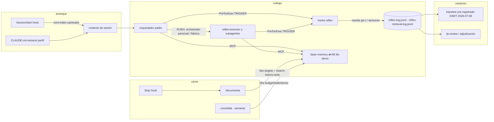

# Foto as-is del framework — 2026-08-02

Snapshot firmable del sistema agéntico completo de Paul tal y como funciona HOY.
No es una spec: no diseña nada nuevo. Sirve como baseline para evaluaciones
futuras (comparar contra esta foto) y como mapa de qué pieza absorbe exo en qué
milestone. La spec del futuro es otra: `docs/superpowers/specs/2026-07-16-framework-unificado-design.md`.

Evaluación D/M/T que acompaña esta foto: `agent-develop/docs/superpowers/evals/2026-08-02-reflex-v2-verdict.md`.

## 1. Las piezas

| Pieza | Qué es | Dónde vive | Estado |
|---|---|---|---|
| **kb-demo** (KB) | Memoria persistente: ~115 notas markdown+frontmatter, contrato v2 (canon-delta en `core/`+destilados, bitácora append en `log/`, `archive/` para lo colapsado) | `~/Documentos/proyectos/kb-demo` (repo git) | Vivo, es la capa **thick** ya en forma ≈OKF |
| **basic-memory** (MCP) | Motor actual de la KB: index/search/write vía MCP | uvx, config `~/.basic-memory/config.json` | Vivo; sentenciado a jubilación por **estrangulamiento** (nunca big-bang) conforme el engine de exo lo sustituya |
| **reflex 0.10.0** (plugin) | Capa TRIGGER: hooks portables (tabla §2), rol `reflex:executor` (sonnet pineado + doctrina en system prompt), skills `recon-first` y `consolida`, instrumentación de medición | Fuente: `agent-develop/plugins/reflex/` · instalado: `~/.claude/plugins/cache/agent-develop/reflex/0.10.0/` | Vivo (sonda 2026-08-01: `git-c-rewrite` disparó y logueó) |
| **paul-profile 0.5.0** (plugin) | Capa PUSH: skills `orchestrate-personal` (orquestador + ejecutores con gate de validación y de completitud del brief) y `fabrica` (campañas largas, gate de merge asíncrono) + guard `fabrica-main-guard.sh` | `agent-develop/plugins/paul-profile/` | Vivo |
| **workflow-lint** (plugin) | Lint + dry-run de scripts de Workflow antes de lanzarlos | repo propio `pguerrerolinares/workflow-lint`, registrado en marketplace agent-develop | Vivo |
| **superpowers** (plugin externo) | Motor de proceso: brainstorming, writing-plans, TDD, debugging, subagent-driven-development… `orchestrate-personal` hace layering encima, no lo duplica | marketplace oficial | Vivo; absorción destilada prevista (plugin `process`, 7 skills preparadas en `evals/prep-m3/`, SIN instalar) |
| **/documenta** (command) | Cierre de sesión → KB: contrato de routing, search-before-write, consume `kbx targets` | `~/.claude/commands/documenta.md` | Vivo; único command suelto (todo lo demás va por plugins) |
| **kbx** (binario Go) | Consulta determinista read-only sobre la KB: `doctor / targets / history / diff-since / budget / stale`, todo `--json` | fuente `~/Documentos/proyectos/kbx`, instalado `~/.local/bin/kbx` | Vivo; **no se migra** a exo (el envelope JSON hace el lenguaje decisión por-binario) |
| **exo engine** (Rust) | El sustituto en construcción: FTS5 + grafo wikilinks + embeddings jina-es/768 (sqlite-vec), `exo index/rebuild/search --type fts\|vector\|hybrid` | `~/Documentos/proyectos/exo/engine/` | M2-07 sellado (hybrid 49/55 diagnóstico, config `bonus=0.0 / β=0.6 / thr=0.40`); siguiente M2-08 `exo recall` → M2-09 gate final |
| **Identidad + doctrina** | `~/.claude/CLAUDE.md` (extracto del perfil; fuente de verdad `[[Paul - perfil de trabajo]]` en KB) + `core-index` inyectado al arranque (≤3.600 bytes) | `~/.claude/` + `kb-demo/core/` | Vivo |

Distribución: todo lo propio viaja por el **marketplace `agent-develop`** (`/plugin marketplace add pguerrerolinares/agent-develop`); `~/.claude/skills/` y `~/.claude/agents/` están vacíos a propósito. El marketplace sigue siendo el vivo hasta M1b (post-métrica-D).

## 2. Cómo se conecta todo

Hooks activos (reflex `hooks/hooks.json`, v0.10.0):

| Evento | Matcher | Script | Efecto real |
|---|---|---|---|
| SessionStart | — | `basic-memory-recall.sh --cached` | Inyecta core-index (cache TTL 1800s stale-while-revalidate; hit ~0.03s, miss ~6.6s — causa upstream: imports del CLI de basic-memory) |
| PreToolUse | `Bash` | `git-c-bash.sh` | **Único hook que modifica input**: reescribe `cd X && git …` → `git -C X …` (`updatedInput`+allow) y loguea; rama warn degradada a sensor log-only |
| PreToolUse | `Bash` | `git-add-all-guard.sh` | Sensor log-only (`zero-residuo`): detecta `git add -A/.`, ya no avisa |
| PreToolUse | `Bash` | `verify-before-commit.sh` | Sensor log-only (`verify-before-done`) |
| PreToolUse | `WebSearch\|WebFetch` | `clean-orchestrator-research.sh` | Reflejo de orquestador limpio (research → subagente) |
| PreToolUse | `write_note` | `search-before-write.sh` | Recuerda search-before-write al escribir en KB |
| PreToolUse | reads basic-memory | `retrieval-logger.sh` | Sensor puro: llena el blind-spot de accesos de lectura a la KB (basic-memory solo persiste created/updated) |
| Stop | — | `basic-memory-remind.sh` | Recordatorio de /documenta al cerrar |

Flujo de una sesión tipo:

Las dos mitades de la metodología, conectadas físicamente: **PUSH** (prosa que
empuja: orchestrate-personal, fabrica, doctrina en core-index) + **TRIGGER**
(hooks que disparan: reflex). kbx es el puente determinista entre skills y KB;
basic-memory es el puente semántico; el engine de exo está construyéndose para
quedarse con el segundo papel.

## 3. Salud de las costuras (evaluado 2026-08-01/02)

| Costura | Estado | Evidencia |
|---|---|---|
| Sensores reflex | 🟢 vivos | Sonda `cd /tmp && git status` (marcada LIVE-TEST) → `git-c-rewrite` logueado 2026-08-01T21:59Z. El silencio del log 28-jul→01-ago era ausencia real de sesiones (solo 1 transcript nuevo en ese hueco) |
| Integridad de los logs | 🟢 | `jq empty` limpio en `reflex-log.jsonl` (1218 líneas) y `reflex-retrieval-log.jsonl` (412+); prerrequisito del baseline cumplido por la vía alternativa anotada |
| Segmentación padre/subagente | 🟢 | `agent_id`/`agent_type` sí se pueblan en líneas de subagente (las muestras vacías del recon eran líneas de padre) |
| **Cobertura de la doctrina de ejecutor** | 🔴 **la costura mayor** | En la ventana post-despliegue, de 542 disparos git-c/zero-residuo de subagentes solo 82 (15%) vienen de `reflex:executor`; 460 vienen de `general-purpose` y decenas de tipos ad-hoc de fábrica que NO llevan la doctrina en su system prompt. El rol executor no puede bajar violaciones de dispatches que no lo usan |
| **Contrato memory packet** | 🔴 rota en origen | Solo 16/199 briefs de ejecutores en ventana (8%) llevaban packet 3-5 permalinks (el contrato dice "todo brief"); de esos 16, **cero** ejecutores llamaron a memoria. Mismo fallo de transporte que la doctrina: lo que el orquestador debe inyectar en cada brief no está viajando |
| Doctrina en system prompt del executor | 🟡 | El propio `reflex:executor` disparó 81 rewrites git-c en ventana: la doctrina escrita no elimina el patrón `cd && git` (parte puede ser inducida por briefs, indistinguible en el log — limitación ya anotada en el baseline) |
| Adjudicación de FPs | 🔴 abierta desde el 10-jul | Dump `~/.claude/reflex-fp-review-20260710.txt` (113 KB) sin veredicto; el gate de ≥10 disparos está superado 89× en git-c. Las degradaciones a log-only y retiradas (stuck-loop, cost-pyramid) se decidieron a mano, sin cerrar el análisis |
| Pin post-compactación | 🔴 roto (conocido) | `basic-memory-recall.sh:57` matchea `verify-before-commit` pero el hook loguea `verify-before-done` → nunca dispara |
| `reflex-baseline.sh` | 🟡 | Traga errores de jq (`2>/dev/null`); mitigado hoy validando el log aparte. El fix de una línea sigue pendiente |
| Recall de arranque | 🟡 | Cache funciona (hit ~0.03s); el miss de ~6.6s es upstream (basic-memory 0.22.1) — candidato a issue |
| Docs del repo exo | 🟡 drift | README dice "pre-M1a"; el estado real es M2-07 mergeado. Residuo untracked `evals/retrieval-fase0/results/metrics-textfts.md` |
| Marketplace / versiones | 🟢 | reflex 0.10.0 en uso real (`.in_use`); huérfanas 0.6.0/0.8.0 en cache (limpieza menor) |

## 4. Veredicto D/M/T (resumen)

Detalle y método completos en `agent-develop/docs/superpowers/evals/2026-08-02-reflex-v2-verdict.md`.

- **D (reincidencia git-c/zero-residuo por sesión)**: **NO-PASS** sobre la métrica pre-registrada — media por sesión 11,4 (pre, 27 sesiones) → 14,5 (post, 45 sesiones), sin caída medible. Lectura honesta: el supuesto causal del pre-registro ("rol executor como único cambio") se rompió — la ventana contuvo campañas de fábrica y maratones CTF que multiplicaron la exposición de subagentes, y el 85% de las violaciones de subagente viene de tipos que no llevan la doctrina. El NO-PASS señala sobre todo un problema de **cobertura**, no (solo) de eficacia del rol.
- **M (ejecutores que usan memoria con packet en el brief)**: **NO-PASS** — 0% con el contrato literal (0/16 briefs con packet de 3-5 permalinks acabaron en llamada a memoria), 5% con definición laxa. El hallazgo upstream es peor que la métrica: solo el 8% de los 199 briefs de ejecutores de la ventana llevaba packet — el contrato dice "todo brief". El problema no es que los ejecutores ignoren el packet: es que casi nunca lo reciben, y cuando lo reciben tampoco lo usan.
- **T (rol/modelo apropiado en 20 dispatches)**: **PASS** — 85% conservador (17/20; umbral ≥80%), 94% excluyendo dudosos. Único inapropiado claro: un dispatch de research sin `model` explícito. La pirámide de tiers se está respetando.

## 5. Mapa de migración a exo (qué absorbe qué, cuándo)

| Pieza actual | Destino en exo | Milestone / condición |
|---|---|---|
| basic-memory (MCP) | `exo` engine (Rust): index/search/recall/write/budget/doctor | Estrangulamiento progresivo; E1-read tras gate M2-09 (3 patas pre-registradas en `evals/e1-read/gate.md`); config leída RO de basic-memory hasta M5a |
| marketplace agent-develop (reflex + paul-profile) | capa **thin** de exo (skills-router + hooks) | M1b, condicionado a post-métrica-D — es decir, a esta evaluación |
| superpowers | plugin `process` propio (7 skills destiladas, MIT con atribución; paridad 135/135 verificada) | M3 (preparado en `evals/prep-m3/`, sin instalar) |
| kbx (Go) | **NO se migra** — sigue como binario aparte; el envelope JSON v1 (`{schema_version, command, data}`) es el contrato entre binarios | — |
| KB kb-demo | capa **thick** tal cual (markdown+frontmatter ≈OKF) | Ya lo es; exo la indexa desde M2 |
| Identidad (CLAUDE.md + perfil) | instancia personal encima del framework genérico (KB + profile plano + fabrica) | Decisión raíz "personal-primero; genérico de base" |

Límites firmados que esta foto respeta: veto AGPL (diseño sí, código de
basic-memory no), superpowers MIT (absorción con atribución), régimen de gates
delegado a consultor fable (línea roja: destructivo/externo).

## 6. Qué firma esta foto

1. La arquitectura de dos mitades (PUSH + TRIGGER) + KB + puente determinista (kbx) **está montada y viva**: cada pieza responde y las conexiones del §2 son las reales, verificadas hoy.
2. El canal de medición funciona y tiene volumen (1.218 disparos, 412+ lecturas logueadas), pero **el lazo de evaluación no se estaba cerrando**: adjudicación FP abierta desde el 10-jul, y esta es la primera corrida de D/M/T desde que la ventana maduró (23-jul).
3. La costura más débil no es ninguna pieza sino **el transporte orquestador→subagente**: ni la doctrina (solo viaja a `reflex:executor`, y el 85% de las violaciones de la ventana vino de tipos ad-hoc sin ella) ni el memory packet (en el 8% de los briefs, usado en el 0%) están llegando a quienes hacen el trabajo. D y M fallan por la misma causa raíz; T aprueba porque la selección de tier sí ocurre en el orquestador, que es donde la doctrina sí vive.
