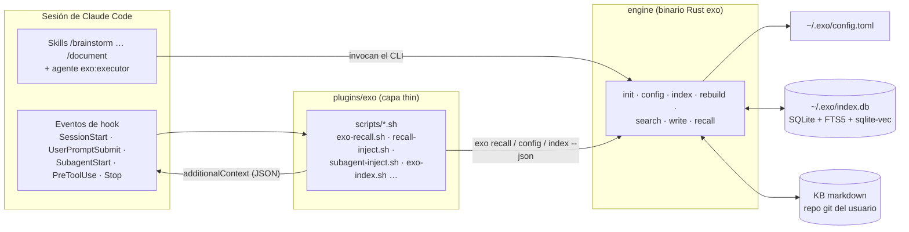
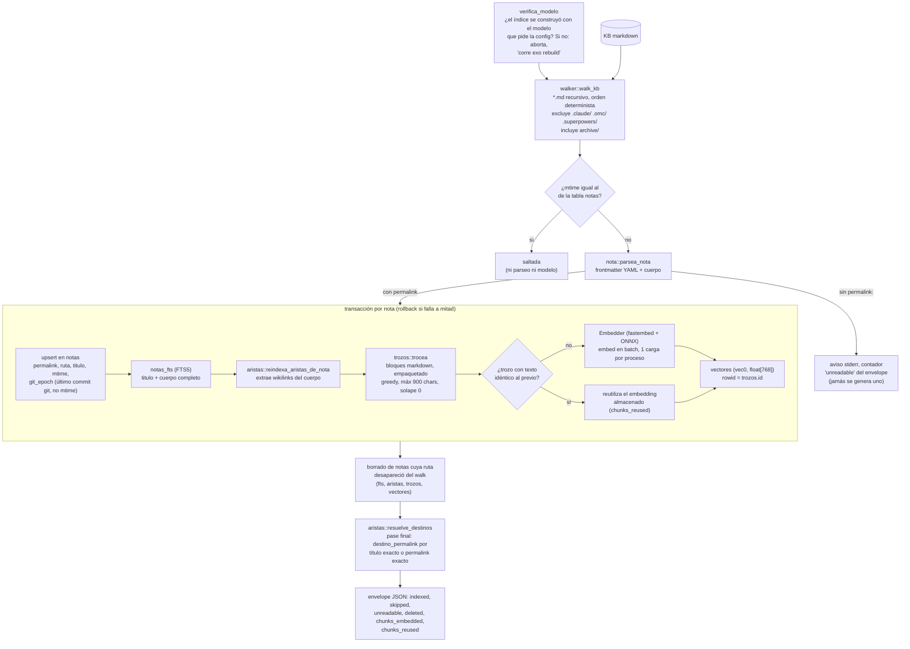
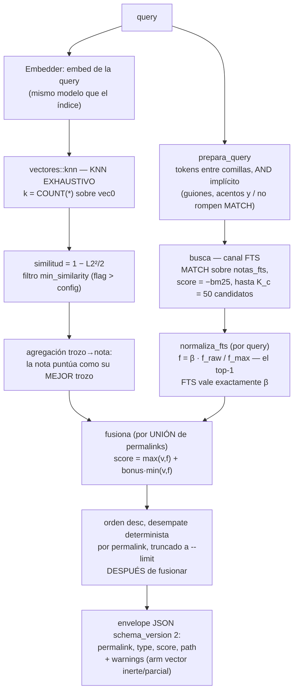
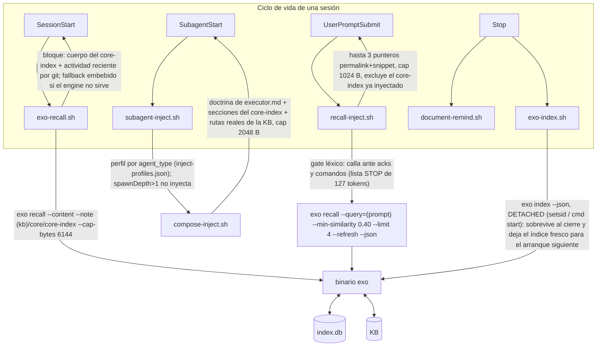

# Arquitectura de exo

> Este documento describe el sistema **tal como está implementado**, a fecha
> 2026-09-02, derivado de la lectura de `engine/src/`, `plugins/exo/`,
> `engine/kb-template/` y `evals/`. Las specs y planes de `docs/superpowers/`
> son el registro histórico de diseño; la deuda abierta vive en
> `docs/backlog.md`.

## 1. Qué es exo

exo es un sistema de **memoria persistente para agentes de código**. Su
materia prima es una base de conocimiento (KB): una carpeta de notas Markdown
con frontmatter YAML, versionada con git, donde una persona —o el propio
agente— va destilando decisiones, aprendizajes y estado de proyectos. exo
indexa esa carpeta en SQLite (texto completo + embeddings semánticos), la hace
buscable en milisegundos, y **empuja** el contexto relevante al agente en el
momento en que lo necesita: al arrancar la sesión, al enviar cada prompt y al
lanzar subagentes, sin que el agente tenga que acordarse de buscar.

El problema que resuelve es concreto: un agente de código arranca cada sesión
sin memoria, y "guárdalo en una nota" solo funciona si algo garantiza que esa
nota vuelve al contexto después. exo cierra el ciclo entero — escribir con
disciplina (rutas, gates contra duplicados y contra corromper el canon),
indexar sin daemon, recuperar por búsqueda híbrida léxico+semántica, e
inyectar el resultado mediante hooks del harness del agente. Todo corre en
local: un binario Rust autosuficiente, una base SQLite y un modelo de
embeddings que se descarga una vez.

## 2. Vista de conjunto: tres capas

| Capa | Dónde vive | Qué es |
|---|---|---|
| **thin** | `plugins/exo/` | Plugin para Claude Code: 9 skills de proceso, el agente `exo:executor` y 9 hooks (los "reflejos") que invocan al engine desde shell. |
| **engine** | `engine/` | Binario Rust `exo`: indexación, búsqueda, recall y escritura sobre la KB. Sin servidor, sin daemon: procesos de vida corta. |
| **thick** | la KB del usuario | Notas Markdown + frontmatter, contrato definido por `engine/kb-template/` (la semilla que `exo init` vuelca). |

El repo es además su propio marketplace de plugin:
`.claude-plugin/marketplace.json` en la raíz sirve `plugins/exo/` directamente
(id `exo@exo`).



## 3. El engine

### 3.1 Config y precedencia

El engine arranca con `~/.exo/config.toml` (sobreescribible con `$EXO_CONFIG`),
que declara `[kb] path`/`name`, `[index] db` y `[embeddings]
model`/`dims`/`min_similarity` (`engine/src/config.rs`). La precedencia,
resuelta en `main.rs`, es **flag CLI > variable de entorno (`EXO_DB`,
`EXO_KB`) > config > error accionable** — deliberadamente sin defaults
inventados: el error de config ausente nombra el comando que la crea
(`exo init`).

`exo init` tiene dos modos excluyentes:

- **Creación** (`--kb <ruta> --name <nombre>`): valida el nombre (whitelist
  ASCII: es el prefijo de permalink de todas las notas), vuelca la KB semilla
  (12 ficheros de `kb-template/`, embebidos en el binario con `include_str!`,
  con `{{KB_NAME}}` sustituido), la versiona con `git init` + primer commit
  (best-effort: sin git la KB funciona igual), la indexa y verifica que lo
  volcado quedó indexado.
- **Adopción** (`--from-basic-memory`): lee `~/.basic-memory/config.json` una
  única vez y adopta una KB ya poblada sin tocar un byte dentro de ella. Es la
  **única** lectura de basic-memory que queda en el engine, explícita y
  borrable (`engine/src/inicia.rs`).

### 3.2 Pipeline de indexación

`exo index` es incremental, **al invocar, sin daemon**: cada corrida recorre la
KB, compara `mtime` y reindexa solo lo cambiado. `exo rebuild` borra la DB
entera y reconstruye. La lógica vive en `engine/src/indexer.rs::indexa`.



Decisiones que conviene conocer:

- **El permalink manda y viene del frontmatter.** El indexer jamás genera uno:
  una nota sin `permalink:` se salta con aviso. Generarlos es del write-path.
- **Recencia = git, nunca mtime.** `git_epoch` (fecha del último commit que
  tocó el fichero) es lo que consume el recall; `mtime` es solo detección de
  cambio. Un clone fresco resetea mtimes y no debe resetear la recencia.
- **Troceado** (`engine/src/trozos.rs`): la unidad es el bloque Markdown
  (separado por línea en blanco o heading ATX); bloques consecutivos se
  empaquetan greedy hasta 900 caracteres por trozo; un bloque que por sí solo
  excede se corta duro; sin solape. Los parámetros vigentes son los de
  `trozos.rs`: salen del sweep de calibración de M2-07 (resultados en
  `evals/retrieval-fase0/results/`) y no hay mecanismo de recalibración
  para otra KB.
- **Cache de embeddings por contenido**: antes de borrar los trozos viejos de
  una nota se leen sus vectores indexados por texto exacto; un trozo cuyo
  texto no cambió reutiliza su embedding sin pasar por el modelo. Editar una
  línea de una nota larga no re-embebe la nota entera.
- **Transacción por nota**: el upsert de `notas` (mtime fresco) y los vectores
  se commitean juntos; un fallo a mitad hace rollback en vez de dejar una nota
  con mtime nuevo y vectores viejos que el incremental saltaría para siempre.
- **Guarda de modelo**: `meta.modelo_embeddings` registra con qué modelo se
  construyó el índice; si la config pide otro, `exo index` aborta y exige
  `exo rebuild` — evita mezclar vectores de dos modelos de la misma dimensión
  en la misma tabla.

### 3.3 Esquema de la base de datos

`engine/src/schema.rs`, un solo fichero SQLite (`~/.exo/index.db` por defecto),
abierto siempre en modo WAL con `busy_timeout` de 5 s (el hook de cierre que
indexa y el de arranque que lee pueden solaparse):

| Tabla | Contenido |
|---|---|
| `notas` | Una fila por nota: `permalink` (PK), `ruta` relativa, `titulo`, `tipo`, `mtime`, `git_epoch`. |
| `notas_fts` | FTS5 sobre `titulo` + `cuerpo` (tokenizer `unicode61`, `/` como tokenchar para que los permalinks sean buscables). |
| `aristas` | Grafo de wikilinks: `origen`, `destino_texto` (literal, incluida la forma `destino\|alias`), `destino_permalink` (resuelto, o NULL si el destino no existe — tolerado). |
| `trozos` | Chunks del cuerpo: `permalink`, `orden`, `texto`. |
| `vectores` | Tabla virtual `vec0(embedding float[768])` de sqlite-vec; `rowid` = `trozos.id`. |
| `meta` | Procedencia del índice: `kb_root`, `modelo_embeddings`, `dims_embeddings`. |

### 3.4 Embeddings: qué modelo y por qué

El modelo por defecto (el que `exo init` graba en la config) es
**`jinaai/jina-embeddings-v2-base-es`**, 768 dimensiones, **pineado a un sha
concreto de HuggingFace** (`REVISION_JINA_ES` en `engine/src/lib.rs`). Los
motivos, tal como los declara el código:

- Es un modelo bilingüe con foco en español — la KB y el producto entero están
  en español, y es el mismo modelo con el que se midió la línea base del eval
  de retrieval (§6), así que los números son comparables.
- El pin de revisión existe porque `main` es una referencia móvil: si el repo
  de HF se re-sube, los embeddings cambian en silencio y el índice deja de ser
  comparable con la línea base de 55 queries. Un modelo distinto configurado
  por el usuario funciona, pero resuelve `main` y el engine lo avisa por
  stderr.
- Se carga vía fastembed como `UserDefinedEmbeddingModel` (fastembed no trae
  variante para el jina-es), descargando de HF el ONNX (~0,6 GB) más los
  ficheros de tokenizer, con pooling `Mean` explícito. fastembed normaliza los
  embeddings a norma unidad, propiedad que el buscador explota: la DDL de
  `vectores` usa la métrica por defecto de vec0 (L2 al cuadrado), y para
  vectores unitarios `cos = 1 − L2²/2` — así el umbral `min_similarity` de la
  config (0.35 por defecto) se compara en escala coseno.
- El modelo se carga **una vez por proceso**, perezosamente
  (`con_embedder_de_proceso`): un `exo index` sin cambios no lo paga.

### 3.5 Pipeline de búsqueda

`exo search` tiene tres modos (`--type fts|vector|hybrid`, default `fts`),
implementados en `engine/src/buscador.rs`. Todos devuelven resultados
**a nivel de nota** (`type: "entity"`), nunca de trozo. Ojo con el default:
el modo calibrado y medido (48/55 hit@5, §6) es `--type hybrid` **con el
umbral pasado explícito** (`--min-similarity 0.40`); `fts` a secas es el modo
léxico barato, no el medido. `exo recall --query` sí usa hybrid con los
parámetros sellados de serie.



- **fts**: FTS5 puro, score `-bm25` (mayor = mejor). Query sin hits = éxito
  con lista vacía, no error.
- **vector**: embed de la query + KNN exhaustivo (pedir menos vecinos no
  ahorra trabajo en vec0 sin partición y arriesga perder el mejor trozo de una
  nota), umbral de similitud coseno, agregación trozo→nota por máximo.
- **hybrid**: los dos canales fusionados por unión. Los parámetros de fusión
  van **sellados** en `main.rs` tras el sweep de calibración de M2-07:
  `bonus = 0.0` y `β = 0.6` (`BONUS_SELLADO`, `ESCALA_FTS_SELLADA`),
  sobreescribibles con `--bonus`/`--fts-scale`. El umbral ganador del sweep
  (0.40) **no** está sellado como constante: difiere del 0.35 de config y los
  consumidores lo pasan explícito con `--min-similarity 0.40` (así lo hace el
  hook `recall-inject.sh`).
- **Avisos de degradación**: si `vectores` está vacía o a medio poblar
  respecto a `trozos`, el envelope lleva `warnings` ("arm vector INERTE" /
  "cobertura vectorial PARCIAL") y se imprimen por stderr — un hybrid que en
  realidad es FTS puro no puede pasar desapercibido.

### 3.6 Recall: servir contexto

`exo recall` (`engine/src/recall.rs`) es la pieza que consumen los hooks. Tres
formas:

- **Arranque** (sin `--query`): notas con `tier: core` en el frontmatter
  (releído del `.md` en disco — el índice no persiste `tier`) más las `--limit`
  notas más recientes por `git_epoch`. Una línea por nota.
- **Arranque con contenido** (`--content`, opcionalmente `--note <permalink>`):
  vuelca el **cuerpo** de la nota pedida (o de todas las `tier: core`) más la
  lista de actividad reciente. Es lo que consume el hook de SessionStart; qué
  nota es "la de arranque" lo decide el consumidor, no el engine.
- **Consulta** (`--query`): `busca_hybrid` con los defaults sellados; cada hit
  lleva un snippet (su primer trozo, recortado a ~200 bytes).

Contratos transversales: presupuesto duro de salida (`--cap-bytes`, default
2048, trunca por **líneas enteras**, nunca una nota a medias, con aviso por
stderr); `--refresh` reindexa incrementalmente antes de servir (barato si nada
cambió: un `stat` por fichero y cero carga del modelo — es lo que sustituye al
watcher en background de otros sistemas); recall vacío = exit 1, para que el
consumidor gatee por código de salida.

### 3.7 Write-path

`exo write` (`engine/src/escritor.rs`) es **file-first**: escribe el Markdown
de la KB y nada más — no commitea (eso es del agente, commit scoped por rutas)
y no indexa (lo absorbe el `--refresh` del recall siguiente).

- `write new --dir <carpeta> --title <título> --from <fichero|->`: crea la
  nota con frontmatter completado (`permalink`, `title`, `type`, `tier` — solo
  las claves que falten; el YAML del autor se preserva literal), permalink
  `<nombre-kb>/<dir>/<slug>`, escritura atómica (temporal + rename). Antes de
  tocar disco corre el **dup-gate**: solape de tokens (Jaccard) entre el slug
  nuevo y los permalinks indexados, umbral 0.6. Es deliberadamente léxico y no
  semántico: el umbral del retrieval está calibrado para "tráeme contexto",
  no para "esto ya existe", y como gate producía falsos rojos; además no carga
  el modelo, así que no añade segundos al cierre de sesión.
- `write append <permalink> --from <fichero|->`: anexa al final de una
  bitácora **sin releerla** (`O_APPEND`, solo inspecciona la cola y la
  cabecera). Rechaza si el destino no es `tier: log` — el anti-patrón medido
  de la KB original era anexar deltas al canon. `--create` crea la bitácora si
  no existe.

Un gate rechazado no es un error: sale con **exit 3** (frente al 1 de error
real), con el detalle en el envelope, y `--force` es la vía de excepción — que
queda registrada (`forced: true`) para ser auditable.

### 3.8 Superficie de CLI

Extraída del parser de clap (`engine/src/main.rs`):

| Comando | Qué hace | Flags principales |
|---|---|---|
| `exo init` | Crea `~/.exo/config.toml`; en modo creación vuelca y versiona la KB semilla e indexa | `--kb`, `--name`, `--from-basic-memory`, `--force`, `--json` |
| `exo config` | Emite la config efectiva con rutas expandidas (existe porque jq no lee TOML) | `--json` |
| `exo index` | Indexado incremental por mtime | `--db`, `--kb`, `--json` |
| `exo rebuild` | Borra la DB y reconstruye desde cero | `--db`, `--kb`, `--json` |
| `exo search <query>` | Búsqueda FTS / vector / hybrid | `--type` (default `fts`), `--limit` (10), `--min-similarity`, `--bonus`, `--fts-scale`, `--db`, `--json` |
| `exo write new` | Nota nueva con dup-gate | `--dir`, `--title`, `--from`, `--tier`, `--force`, `--db`, `--kb`, `--json` |
| `exo write append <permalink>` | Append a bitácora con gate de tier | `--from`, `--create`, `--force`, `--db`, `--kb`, `--json` |
| `exo recall` | Bloque de arranque o consulta híbrida | `--query`, `--limit` (5), `--cap-bytes` (2048), `--content`, `--note`, `--refresh`, `--min-similarity`, `--db`, `--kb`, `--json` |
| `exo targets <tema>` | Candidatas de la KB para un tema, portado de `kbx targets` | `--limit` (10), `--db`, `--kb`, `--json` |

Los flags largos están en inglés con **alias ocultos en español**
(`--limite`, `--titulo`, `--crea`, `--min-similitud`, `--escala-fts`) durante
el cutover; el backlog los marca para retirar en 1.1.

Contrato de salida común: con `--json`, stdout lleva **exclusivamente** el
envelope `{"schema_version": 2, "command": …, "data": …}` en una línea; todo
lo humano y los avisos van a stderr. Los consumidores gatean por exit code
(0 ok, 1 error, 3 gate rechazado), jamás parseando `data`.

## 4. El plugin: donde el motor se convierte en algo que se usa

`plugins/exo/` es la capa que conecta el engine con el agente. Tres piezas:
skills, un agente de rol y hooks.

**Skills** (9, cada una un `SKILL.md` router con reference files):
`brainstorm`, `plan`, `orchestrate`, `tdd`, `debug`, `verify`, `document`,
`distill`, `recon-first`. Cubren el ciclo completo de trabajo; `document` y
`distill` son las que escriben en la KB (vía `exo write`), y `orchestrate`
despacha el agente **`exo:executor`** (`agents/executor.md`), un ejecutor de
tareas acotadas con la doctrina en su system prompt. El catálogo destila
[`obra/superpowers`](https://github.com/obra/superpowers) (MIT) más doctrina
propia; el reparto exacto está en `plugins/exo/README.md`.

**Hooks** (9 comandos cableados en `plugins/exo/hooks/hooks.json`). Son los
"reflejos": guardrails deterministas que activan el conocimiento en el punto
de acción. Invariantes de todos ellos: **never-block** (exit 0 siempre; como
mucho `additionalContext` o un rewrite silencioso de alta confianza),
abstención por defecto, y logging best-effort a `~/.claude/reflex-log.jsonl`
para poder medir falsos positivos a posteriori.

El camino por el que el contexto recuperado llega al punto de uso:



Detalles que el diagrama no cuenta:

- **`exo-recall.sh`** (SessionStart) inyecta el cuerpo del `core-index` de la
  KB (el mapa + doctrina) como `additionalContext`. Nunca bloquea el arranque:
  ante engine ausente, índice ausente, bloque vacío o un bloque que no
  contiene la frase-guarda `Contrato de memoria`, cae a un fallback de texto
  embebido y deja un evento greppable con la razón (`no-engine`, `no-index`,
  `no-contract`…). Tras una compactación de contexto, reafirma las reglas de
  los reflejos que ya dispararon en la sesión.
- **`recall-inject.sh`** (UserPromptSubmit) es "recall en el punto de uso": el
  transporte es mecánico, el modelo no decide si buscar. Un gate léxico
  (traducción literal del artefacto normativo
  `docs/superpowers/consultas/2026-08-22-m6-06/gate-artefacto.py`) filtra
  acks, comandos y prompts triviales. Este evento tiene un hazard propio: un
  exit 2 aquí **borra el prompt del usuario**, así que el script no usa
  `set -e` y termina en `exit 0` incondicional.
- **`subagent-inject.sh` + `compose-inject.sh`** (SubagentStart) componen un
  bloque por perfil de tipo de agente (`inject-profiles.json`:
  `exo:executor` → `reducido`, `general-purpose`/`claude` → `ejecucion`,
  `Explore`/`Plan` → `divergente`, resto → `doctrina`), mezclando la doctrina
  de `executor.md`, secciones del core-index y rutas reales de la KB.
  Subagentes de profundidad > 1 no reciben inyección.
- **`exo-index.sh`** (Stop) reindexa al **cierre**, no al arranque: sin
  cambios cuesta ~25 ms, pero con cambios carga el runtime ONNX, y tras un
  clone fresco puede tardar minutos — eso no puede vivir en SessionStart. Se
  lanza detached (con `setsid` en POSIX o `cmd start` en Windows/Git Bash)
  para sobrevivir al kill del process group del hook.
- Los otros cuatro hooks son guardrails de disciplina, no de memoria:
  `clean-orchestrator-research.sh` (recuerda delegar la investigación web a
  subagentes; solo en el padre, 1 vez por sesión), `git-c-bash.sh` (reescribe
  `cd X && git <read-only>` a `git -C X …`, warn en el resto),
  `git-add-all-guard.sh` (avisa ante `git add -A|--all|.`) y
  `verify-before-commit.sh` (avisa ante `git commit` de código sin un test
  verde reciente en el transcript).

## 5. El contrato de la KB

Definido por la semilla `engine/kb-template/` (que `exo init` vuelca) y por el
código que la lee (`nota.rs`, `walker.rs`, `recall.rs`).

**Estructura de directorios:**

```
kb/
├── core/        # doctrina e identidad estables; punto de entrada (core-index.md es el mapa)
├── projects/    # una nota por proyecto: el destilado canónico, "la foto, no el vídeo"
├── learnings/   # principios reutilizables, independientes del proyecto que los originó
├── log/         # bitácoras cronológicas append-only, una por proyecto
├── archive/     # retirado de circulación activa (SÍ se indexa)
├── AGENTS.md    # el contrato de lectura/escritura para agentes
└── README.md
```

**Frontmatter.** Lo que el parser (`nota::parsea_nota`, deserialización laxa:
claves de más no rompen) consume:

```yaml
---
permalink: "mi-kb/core/core-index"   # OBLIGATORIO para indexarse; el indexer jamás lo genera
title: core-index — mapa de esta KB  # opcional (cae al nombre del fichero)
type: note                            # opcional
tier: stable                          # stable | log | core (core marca las notas de arranque; §3.6)
tags: [core, indice]                  # tolerado, no lo consume el engine
---
```

- `permalink` es la identidad: `<nombre-kb>/<carpeta>/<slug>`. El slug pliega
  diacríticos y colapsa a guiones (no es invertible — por eso el índice guarda
  también `ruta`).
- `tier` gobierna la escritura: `stable` se edita como delta (append rechazado
  por `exo write`), `log` crece por append. La regla de oro del contrato
  (`AGENTS.md`): *canon como delta, bitácora como append, nota nueva casi
  nunca*.
- Los **wikilinks** `[[destino]]` / `[[destino|alias]]` del cuerpo alimentan
  el grafo `aristas`; un link a nota inexistente queda con destino NULL y se
  cura solo cuando la nota aparece.
- El walker excluye `.claude/`, `.omc/` y `.superpowers/` a cualquier nivel e
  **incluye** `archive/`.
- El core-index declara además una disciplina de presupuesto: cap de bytes por
  nota-índice con 15% de aire, y "retirar entradas muertas, no comprimir las
  vivas" — es contrato editorial de la KB, no lo impone el engine.

La semilla cumple el contrato de arranque que los hooks esperan de una KB: su
`core-index` es `tier: core` (lo que `exo recall` selecciona en modo
arranque), contiene la frase-guarda `Contrato de memoria` con la que
`exo-recall.sh` valida el bloque, y las secciones `## Doctrina compacta` y
`## Cores` que extrae `compose-inject.sh`; `AGENTS.md` documenta el tier
`core`. Una KB recién creada con `exo init` arranca, por tanto, con su propio
mapa, no con el fallback embebido — verificado ejecutando `exo init` sobre un
directorio limpio.

## 6. Cómo se mide la calidad del retrieval

`evals/` no es una suite de CI: es el **registro de gates pre-registrados**
con los que se decidió cada pieza — el gate se redacta y commitea antes de la
corrida, y los números no se renegocian.

- **`evals/retrieval-fase0/`** (M0): línea base sobre 55 queries etiquetadas
  contra la KB real, medida sobre basic-memory (hybrid 36/55 hit@5). Su gate
  tenía una decisión de arquitectura embebida: si la semántica local resultaba
  *load-bearing* (≥3 queries con hit en vector/hybrid y miss en texto), el
  engine se escribía en Rust; salió load-bearing, y por eso el engine es Rust
  (`verdict/m0-verdict.md`). El harness (`replay.py`, `replay-engine.py`,
  `analyze.py`, `atribucion-cruzada.py`) rejuega el set de queries por CLI y
  computa hit@5 con comparación **pareada** (qué arregla y qué rompe cada
  candidato), con atribución de cada miss (FTS-miss / vector-miss /
  threshold-miss).
- **`evals/e1-read/`**: el gate de cierre de la capa de lectura. Tres patas:
  paridad de corpus (diff de permalinks = ∅, cero tolerancia), retrieval
  pareado engine vs basic-memory el mismo día sobre el mismo estado de la KB, y
  latencia. Corrida final (2026-08-17, `verdict/m2-09-corrida.md`):
  **engine-hybrid 48/55 vs bm-hybrid 39/55**. Los parámetros sellados del
  hybrid (§3.5) salen del sweep de 15 celdas cuyos resultados están en
  `retrieval-fase0/results/metrics-engine-hybrid-*`.
- **`evals/prep-m3/`**: eval de otra naturaleza — paridad de **movimientos**
  de las skills destiladas frente a sus fuentes de superpowers. El oráculo no
  es mecánico: checklists gold por skill (`gold/*.md`, con sección DESCARTES
  de lo que se tira a propósito) verificadas por un revisor fresco.

Un límite declarado: el fichero de queries (`eval.jsonl`, referenciado por el
harness) y la KB contra la que se midió **no están en el repo** — son
privados. Los evals publicados son audit trail verificable de método y
resultados, no un benchmark reproducible por un tercero tal cual.

## 7. Qué NO está implementado

Bordes explícitos del sistema; el detalle y el siguiente paso de cada uno
viven en `docs/backlog.md`:

- **`exo budget` y `exo doctor` no existen todavía** (planeados). En
  particular, el check de desfase binario↔scripts del plugin (asignado a
  `exo doctor`) no existe: si los scripts nuevos corren contra un binario
  viejo, el hook de arranque degrada al fallback embebido **con forma
  válida**, sin gritar.
- **MCP propio (M5a) y desinstalación de basic-memory (M5b)**: pendientes. El
  engine ya no depende de basic-memory para funcionar (la única lectura que
  queda es la migración explícita `exo init --from-basic-memory`), pero el
  plan de retirada completa no está ejecutado.
- **Sin CI**: no hay `.github/` — ningún gate automático compila ni corre la
  suite fuera de la máquina de desarrollo. Compilar exige toolchain C
  (rusqlite bundled + sqlite-vec); sin él, el build muere en `cc-rs`. Los
  requisitos completos están en `docs/instalacion.md`.
- **La suite de tests no es hermética fuera de la máquina de desarrollo**: los
  tests que embeben texto dependen del cache local del modelo ONNX (~0,6 GB);
  el gate de hermeticidad (`engine/scripts/test-hermetico.sh`) cubre la config
  pero no esa segunda dependencia. `exo-recall.sh`, el hook de SessionStart,
  no tiene suite de test propia.
- **Aliases españoles del CLI**: vivos como alias ocultos, marcados para
  retirar en 1.1.
- **Troceado y fusión son la calibración de un corpus concreto**: 900 chars,
  β=0.6, bonus=0.0 y el umbral 0.40 son los ganadores del sweep sobre la KB
  del autor; no hay mecanismo de recalibración para otra KB.
- El bloque de arranque de la KB del autor va al ~96% de su cap de 6.144 B y
  el desbordamiento se trunca por el final (el engine avisa por stderr y el
  hook lo loguea, pero nada lo impide) — item abierto en el backlog.
