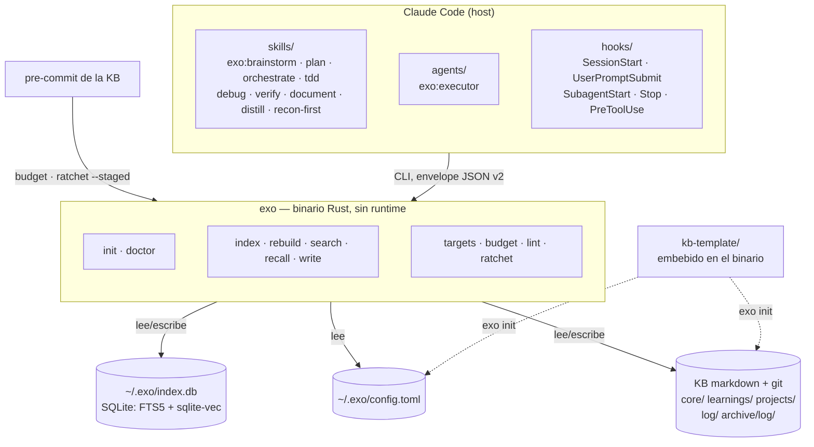

# G5b — Distribución, `exo doctor` e instaladores Implementation Plan

> **For agentic workers:** REQUIRED SUB-SKILL: usa `exo:orchestrate`
> para ejecutar este plan tarea a tarea. Los pasos usan checkbox (`- [ ]`)
> para tracking.

**Goal:** que exo se instale en una máquina limpia sin Rust ni toolchain C
—binario precompilado de una GitHub Release, verificado por SHA256 y colocado
donde el gate de la KB lo busca— y que `exo doctor` diga, artefacto por
artefacto, qué falta en esa máquina en vez de degradar en silencio.

**Architecture:** tres piezas independientes que convergen en la última tarea.
(1) `exo doctor`: módulo nuevo `engine/src/doctor.rs` que sigue el patrón ya
establecido por `lint` — un informe serializable, emitido ENTERO por envelope
v2 o por líneas TSV, y solo después el gate (`GateFallido` ⇒ exit 3).
(2) Distribución: `.github/workflows/release.yml` (tag `v*` → 3 targets +
`.sha256`) más `install.sh` / `install.ps1`, que bajan de la release y
verifican el checksum antes de instalar. (3) Docs: `README.md`,
`docs/instalacion.md`, `docs/arquitectura.md`. La Tarea 12 corta la release
real y verifica los instaladores contra ella en las dos máquinas — hasta ahí
no hay evidencia, solo maquinaria.

**Tech Stack:** Rust 2024 edition (crate `exo` en `engine/`, MSRV 1.95) ·
`clap` 4.6.2 derive · `serde` 1.0.228 / `serde_json` 1.0.150 · `dirs` 6.0.0 ·
`rusqlite` 0.40.1 · `tempfile` 3.14 (dev) · GitHub Actions
(`actions/checkout@v4`, `dtolnay/rust-toolchain`, `Swatinem/rust-cache@v2`,
`actions/upload-artifact@v4`, `actions/download-artifact@v4`) · `gh` CLI ·
bash (Git Bash en Windows) · PowerShell 5.1.

## Global Constraints

- **El crate vive en `engine/`, no en la raíz.** No hay workspace de Cargo.
  Todo comando `cargo` se ejecuta con cwd `engine/`.
- **MSRV declarada: `rust-version = "1.95"`** (`engine/Cargo.toml`). El job
  `msrv` del CI la comprueba con `cargo check --all-targets --locked`. Nada de
  lo que entre aquí puede exigir más.
- **El CI actual (`.github/workflows/ci.yml`, G5a) NO se modifica en este
  plan.** Está verde en `main` desde `a0d538b` (run 34460567995, 4m30s). El
  release es un workflow NUEVO y separado.
- **`engine/scripts/test-hermetico.sh` NO se modifica.** Es el gate ya
  demostrado falsable (2026-08-27) y el CI lo consume tal cual. Todo test que
  entre aquí tiene que pasar con `EXO_CONFIG` apuntando a un fichero
  inexistente: **ningún test nuevo puede depender de que exista
  `~/.exo/config.toml`, ni del HOME real de la máquina.**
- **Envelope v2, verbatim de `engine/src/envelope.rs:7-24`:**
  `{"schema_version":2,"command":<command>,"data":<data>}`, una línea, a
  stdout, vía `envelope::emite(command, data)`. Las claves de `data` van en
  **inglés** (D8). Los consumidores gatean por exit code, **jamás** por campos
  de `data`.
- **Códigos de salida, verbatim del contrato vigente (`main.rs:355-393`):**
  `0` éxito · `3` gate de dominio (`gate::GateFallido` downcasteado) · `1`
  cualquier otro error. Un error real **no ensucia stdout**.
- **Patrón «emite el informe y LUEGO gatea»** (`main.rs:1000-1047`,
  `lint_cmd`): se calcula el informe entero, se imprime SIEMPRE —con `--json`
  o en texto— y solo después se devuelve el `GateFallido`. El envelope no se
  repite en la rama de error: `main()` solo añade `eprintln!("rechazado: …")`.
- **Los tests de CLI usan `std::process::Command` con
  `env!("CARGO_BIN_EXE_exo")`, `tempfile` para fixtures y
  `serde_json::from_slice` para asertar el envelope.** NO hay `assert_cmd` ni
  `predicates` en `[dev-dependencies]` y este plan no los añade.
- **`doctor` no aborta nunca por un check.** Un check que no puede leer su
  artefacto es una fila `fail` con el error dentro, no un `Err` que mata el
  comando. `analiza` devuelve `InformeDoctor`, no `Result<InformeDoctor>`.
- **Cada check reporta el artefacto que miró** —ruta absoluta, versión,
  bytes— y **ninguno desaparece del informe**: lo que no aplica a esta
  plataforma sale como `na` con lo que miró. Decisión de Paul (2026-09-10):
  *una fila ausente no se distingue de un check que nunca existió.* Es la
  lección literal de
  `docs/superpowers/runbooks/2026-08-24-integracion-equipo-trabajo-windows.md`:
  **«el código de salida no es evidencia»**.
- **El instalador deja el binario en `~/.local/bin/` y en ningún otro sitio.**
  `plugins/exo/scripts/kb-precommit.sh:18` resuelve
  `EXO="${EXO_BIN:-$HOME/.local/bin/exo}"` y su línea 20 es
  `[ -x "$EXO" ] || { echo …; exit 0; }` — **exit 0 = commit permitido sin
  gate**. Instalar en otro punto del PATH deja el gate de la KB apagado sin
  romper nada.
- **Dato medido el 2026-09-10 en la W11 de Paul, que CONTRADICE a la spec:**
  con solo `~/.local/bin/exo.exe` en disco, `[ -x "$HOME/.local/bin/exo" ]` en
  Git Bash da **verdadero** — msys resuelve la extensión en `stat()`. La spec
  (G5, primer bullet) afirma lo contrario. Por eso el check
  `hook_fallback_binary` **reporta qué fichero existe**, en vez de dar por
  buena ninguna de las dos versiones.
- **Nombre del binario por SO:** `exo` en Linux/macOS, `exo.exe` en Windows.
  Sale de `[package] name = "exo"` + `src/main.rs`; no hay `[[bin]]` explícito.
- **`.gitattributes` de la raíz fuerza `* text=auto eol=lf`.** `install.sh`
  entra en LF; no añadir pasos de normalización de finales de línea.
- **`sha256sum` NO existe en los runners de macOS.** Se usa `shasum -a 256`,
  que sí está en los tres.
- **Modelo pineado:** `jinaai/jina-embeddings-v2-base-es`, revisión
  `8e2d780d8fd38f81ca9123ee28e4c5a968aaf21e` (`engine/src/lib.rs:166-167`).
  La caché la resuelve `hf_hub` internamente: `$HF_HOME/hub` si la variable
  está puesta, si no `~/.cache/huggingface/hub`. Layout:
  `models--jinaai--jina-embeddings-v2-base-es/{blobs,refs,snapshots}`,
  **615 MB medidos**.
- **El privacy-pass de la spec de G5 YA se ejecutó en B1** (repo público
  desde el 2026-09-02, MIT, `github.com/pguerrerolinares/exo`). Este plan
  **no lo repite** y no vuelve a barrer `docs/superpowers/` ni `evals/`. Lo
  que sí hereda: cada fichero nuevo de aquí —`install.sh`, `install.ps1`,
  `release.yml`, el runbook de la Task 12— nace público, así que **ninguna
  ruta de máquina de empresa ni usuario corporativo entra en ellos**.
- **Fuera de scope, declarado en vez de disimulado:** renombrar
  `docs/superpowers/` y sacar `reports/` de la raíz (decisión de Paul,
  2026-09-10: son un `git mv` ancho que ensucia el diff de una release) ·
  portar `rotate`/`stale`/`diff-since`/`history` (G4d) · los gates de paridad
  de `targets` y `ratchet`, que exigen la máquina Linux con Go · el fixture
  `kb-demo` en 8 ficheros de test (1C).

---

### Task 1: `exo doctor` — tipos, wiring de CLI y el primer check

**Files:**
- Create: `engine/src/doctor.rs`
- Modify: `engine/src/lib.rs:9` (insertar `pub mod doctor;` entre
  `pub mod config;` y `pub mod envelope;`)
- Modify: `engine/src/main.rs` (variante `Doctor` en `enum Comando`:34-75 ·
  `struct ArgsDoctor` junto a `ArgsLint`:321-334 · brazo en
  `quiere_json`:399-415 · brazo en `ejecuta`:451-468 · `fn doctor_cmd` junto a
  `lint_cmd`:1000-1047)
- Test: `engine/tests/doctor_cli.rs`

**Interfaces:**
- Consumes: `exo::config::carga_desde(ruta: &Path) -> Result<Config>` y
  `exo::config::ruta_config() -> Result<PathBuf>` (`config.rs:49,81`);
  `exo::envelope::emite(command: &str, data: serde_json::Value)`;
  `exo::gate::GateFallido { comando: &'static str, detalle: String }`.
- Produces:
  - `exo::doctor::Estado` — enum `Ok | Warn | Fail | Na`, `Serialize` en
    minúscula, con `impl Display`.
  - `exo::doctor::Check { id: &'static str, estado: Estado, artefacto: String,
    detalle: String }`, serializado como `{id, status, artifact, detail}`.
  - `exo::doctor::InformeDoctor { ok: bool, plataforma: &'static str,
    checks: Vec<Check> }`, serializado como `{ok, platform, checks}`, con
    `pub fn fallidos(&self) -> usize`.
  - `exo::doctor::Entorno { home: PathBuf, config: PathBuf, cache_hf: PathBuf,
    path: String }` y `Entorno::del_proceso() -> Entorno`.
  - `exo::doctor::analiza(entorno: &Entorno) -> InformeDoctor`.

- [ ] **Step 1: Escribir el test que falla**

`engine/tests/doctor_cli.rs`:

```rust
//! La superficie de CLI de `exo doctor`: envelope v2, informe ANTES del gate,
//! exit 3 cuando algún check sale `fail`.
//!
//! Los tests NO asertan exit 0: en un runner limpio faltan la DB y el modelo,
//! y eso es precisamente lo que doctor tiene que reportar. Lo determinista
//! —y lo que se aserta aquí— es el caso config-ausente.
use std::fs;
use std::process::Command;

fn bin() -> &'static str {
    env!("CARGO_BIN_EXE_exo")
}

/// Config mínima válida en un tempdir. Se apunta con `$EXO_CONFIG` para no
/// tocar el `~/.exo/config.toml` de la máquina (gate hermético).
fn config_valida(dir: &std::path::Path) -> std::path::PathBuf {
    let kb = dir.join("kb");
    fs::create_dir_all(&kb).unwrap();
    let ruta = dir.join("config.toml");
    fs::write(
        &ruta,
        format!(
            "schema_version = 1\n\n[kb]\npath = \"{}\"\nname = \"kb-demo\"\n\n\
             [index]\ndb = \"{}\"\n\n[embeddings]\n\
             model = \"jinaai/jina-embeddings-v2-base-es\"\ndims = 768\n\
             min_similarity = 0.35\n",
            kb.display().to_string().replace('\\', "/"),
            dir.join("index.db").display().to_string().replace('\\', "/"),
        ),
    )
    .unwrap();
    ruta
}

#[test]
fn doctor_emite_envelope_v2_con_el_comando_y_la_plataforma() {
    let dir = tempfile::tempdir().unwrap();
    let cfg = config_valida(dir.path());
    let salida = Command::new(bin())
        .args(["doctor", "--json"])
        .env("EXO_CONFIG", &cfg)
        .output()
        .unwrap();
    let v: serde_json::Value = serde_json::from_slice(&salida.stdout).unwrap();
    assert_eq!(v["schema_version"], 2);
    assert_eq!(v["command"], "doctor");
    assert!(v["data"]["checks"].is_array());
    assert!(
        v["data"]["platform"].is_string(),
        "el informe declara la plataforma que midió"
    );
    let checks = v["data"]["checks"].as_array().unwrap();
    let config = checks.iter().find(|c| c["id"] == "config").unwrap();
    assert_eq!(config["status"], "ok");
    assert_eq!(
        config["artifact"],
        cfg.display().to_string(),
        "el check reporta el fichero que miró, no un veredicto pelado"
    );
}

#[test]
fn sin_config_el_informe_sale_igual_y_luego_gatea_con_exit_tres() {
    let dir = tempfile::tempdir().unwrap();
    let salida = Command::new(bin())
        .args(["doctor", "--json"])
        .env("EXO_CONFIG", dir.path().join("no-existe.toml"))
        .output()
        .unwrap();
    assert_eq!(
        salida.status.code(),
        Some(3),
        "config ausente es gate de dominio, no error de sistema"
    );
    let v: serde_json::Value = serde_json::from_slice(&salida.stdout).unwrap();
    assert_eq!(
        v["data"]["ok"], false,
        "el informe entero se emite ANTES de gatear"
    );
    let checks = v["data"]["checks"].as_array().unwrap();
    let config = checks.iter().find(|c| c["id"] == "config").unwrap();
    assert_eq!(config["status"], "fail");
}

#[test]
fn la_salida_humana_lleva_estado_id_y_artefacto_en_cada_linea() {
    let dir = tempfile::tempdir().unwrap();
    let cfg = config_valida(dir.path());
    let salida = Command::new(bin())
        .arg("doctor")
        .env("EXO_CONFIG", &cfg)
        .output()
        .unwrap();
    let texto = String::from_utf8_lossy(&salida.stdout);
    let linea = texto
        .lines()
        .find(|l| l.contains("\tconfig\t"))
        .expect("hay una línea del check config");
    let campos: Vec<&str> = linea.split('\t').collect();
    assert_eq!(campos.len(), 4, "estado\tid\tartefacto\tdetalle");
    assert_eq!(campos[0], "ok");
    assert_eq!(campos[1], "config");
    assert_eq!(campos[2], cfg.display().to_string());
}
```

- [ ] **Step 2: Correr el test y verificar que falla**

Run: `cd engine && cargo test --test doctor_cli`
Expected: FAIL — los tres tests fallan; el binario sale con código 2 y stderr
trae `error: unrecognized subcommand 'doctor'`, así que
`serde_json::from_slice` sobre un stdout vacío revienta con
`EOF while parsing a value`.

- [ ] **Step 3: Implementación mínima**

`engine/src/doctor.rs` (fichero nuevo, completo):

```rust
//! Preflight de **entorno**: `lint` juzga la KB, `doctor` juzga la máquina.
//!
//! Contrato, y es el punto entero del comando: **cada check reporta el
//! artefacto que miró** —la ruta, la versión, los bytes— y **ninguno
//! desaparece del informe**. Lo que no aplica a esta plataforma sale como
//! `na` con lo que miró, porque una fila ausente no se distingue de un check
//! que nunca existió. Es la lección literal de los seis casos del runbook de
//! W11 (`docs/superpowers/runbooks/2026-08-24-integracion-equipo-trabajo-windows.md`):
//! «el código de salida no es evidencia; lo que valió fue mirar el artefacto
//! real».
use serde::Serialize;
use std::path::PathBuf;

/// Estado de un check. `Na` NO es `Ok`: es «aquí esto no se mide».
#[derive(Serialize, Debug, Clone, Copy, PartialEq, Eq)]
#[serde(rename_all = "lowercase")]
pub enum Estado {
    Ok,
    Warn,
    Fail,
    Na,
}

impl std::fmt::Display for Estado {
    fn fmt(&self, f: &mut std::fmt::Formatter<'_>) -> std::fmt::Result {
        f.write_str(match self {
            Estado::Ok => "ok",
            Estado::Warn => "warn",
            Estado::Fail => "fail",
            Estado::Na => "na",
        })
    }
}

#[derive(Serialize, Debug, Clone)]
pub struct Check {
    pub id: &'static str,
    #[serde(rename = "status")]
    pub estado: Estado,
    /// Lo que se miró: ruta absoluta, comando resuelto, versión, tamaño.
    #[serde(rename = "artifact")]
    pub artefacto: String,
    #[serde(rename = "detail")]
    pub detalle: String,
}

impl Check {
    fn nuevo(
        id: &'static str,
        estado: Estado,
        artefacto: impl Into<String>,
        detalle: impl Into<String>,
    ) -> Self {
        Self {
            id,
            estado,
            artefacto: artefacto.into(),
            detalle: detalle.into(),
        }
    }
}

#[derive(Serialize)]
pub struct InformeDoctor {
    pub ok: bool,
    #[serde(rename = "platform")]
    pub plataforma: &'static str,
    pub checks: Vec<Check>,
}

impl InformeDoctor {
    fn nuevo(checks: Vec<Check>) -> Self {
        // `warn` informa y NO gatea: una DB rancia o el modelo sin cachear son
        // deuda con arreglo conocido, no una máquina rota.
        let ok = !checks.iter().any(|c| c.estado == Estado::Fail);
        Self {
            ok,
            plataforma: std::env::consts::OS,
            checks,
        }
    }

    pub fn fallidos(&self) -> usize {
        self.checks
            .iter()
            .filter(|c| c.estado == Estado::Fail)
            .count()
    }
}

/// El entorno que doctor juzga, inyectable entero: un test no puede mover el
/// HOME ni el PATH del proceso, y sin inyección estos checks solo se podrían
/// probar en la máquina del que los escribió.
pub struct Entorno {
    pub home: PathBuf,
    pub config: PathBuf,
    pub cache_hf: PathBuf,
    pub path: String,
}

impl Entorno {
    /// El entorno real del proceso. La caché replica lo que hace `hf_hub`
    /// (`Cache::from_env`): `$HF_HOME/hub`, y si no `~/.cache/huggingface/hub`.
    pub fn del_proceso() -> Self {
        let home = dirs::home_dir().unwrap_or_else(|| PathBuf::from("."));
        let cache_hf = match std::env::var_os("HF_HOME") {
            Some(h) => PathBuf::from(h).join("hub"),
            None => home.join(".cache").join("huggingface").join("hub"),
        };
        Self {
            config: crate::config::ruta_config()
                .unwrap_or_else(|_| home.join(".exo").join("config.toml")),
            home,
            cache_hf,
            path: std::env::var("PATH").unwrap_or_default(),
        }
    }
}

pub fn analiza(entorno: &Entorno) -> InformeDoctor {
    InformeDoctor::nuevo(vec![check_config(entorno)])
}

fn check_config(entorno: &Entorno) -> Check {
    let ruta = entorno.config.display().to_string();
    match crate::config::carga_desde(&entorno.config) {
        Ok(c) => Check::nuevo(
            "config",
            Estado::Ok,
            ruta,
            format!(
                "schema_version={} kb={} db={}",
                c.schema_version,
                c.kb.path.display(),
                c.index.db.display()
            ),
        ),
        Err(e) => Check::nuevo("config", Estado::Fail, ruta, format!("{e:#}")),
    }
}
```

`engine/src/lib.rs` — insertar en la línea 9, entre `pub mod config;` y
`pub mod envelope;`:

```rust
pub mod doctor;
```

`engine/src/main.rs` — cuatro inserciones y una función:

(a) variante nueva al final de `enum Comando`, tras `Ratchet(ArgsRatchet),`:

```rust
    /// Preflight de ENTORNO —la máquina—, no de la KB: eso es `lint`. Emite
    /// el informe entero y LUEGO gatea: exit 3 si algún check sale `fail`.
    /// Los `warn` informan sin gatear y los `na` declaran lo que no se mide
    /// en esta plataforma, en vez de desaparecer de la lista.
    Doctor(ArgsDoctor),
```

(b) struct de args, junto a `ArgsLint`:

```rust
#[derive(clap::Args)]
struct ArgsDoctor {
    /// Emite el resultado como envelope JSON (spec §4) en stdout.
    #[arg(long)]
    json: bool,
}
```

(c) brazo en `quiere_json`, tras `Comando::Ratchet(a) => a.json,`:

```rust
        Comando::Doctor(a) => a.json,
```

(d) brazo en `ejecuta`, tras el de `Comando::Ratchet`:

```rust
        Comando::Doctor(args) => doctor_cmd(args),
```

(e) función nueva, junto a `lint_cmd`:

```rust
fn doctor_cmd(args: ArgsDoctor) -> Result<()> {
    let entorno = exo::doctor::Entorno::del_proceso();
    let informe = exo::doctor::analiza(&entorno);

    // El informe entero sale SIEMPRE, pase lo que pase con el gate: un
    // preflight que se calla justo cuando algo va mal no sirve de nada.
    if args.json {
        envelope::emite("doctor", serde_json::to_value(&informe)?);
    } else {
        for c in &informe.checks {
            println!("{}\t{}\t{}\t{}", c.estado, c.id, c.artefacto, c.detalle);
        }
    }

    if !informe.ok {
        return Err(exo::gate::GateFallido {
            comando: "doctor",
            detalle: format!("{} check(s) en fail", informe.fallidos()),
        }
        .into());
    }
    Ok(())
}
```

- [ ] **Step 4: Correr el test y verificar que pasa**

Run: `cd engine && cargo test --test doctor_cli`
Expected: PASS — `test result: ok. 3 passed; 0 failed`.

Run: `cd engine && cargo fmt --check && cargo clippy --all-targets --locked -- -D warnings`
Expected: sin salida, exit 0.

- [ ] **Step 5: Commit**

```bash
git add engine/src/doctor.rs engine/src/lib.rs engine/src/main.rs engine/tests/doctor_cli.rs
git commit -m "feat(doctor): el comando, el envelope y el primer check (G5b Task 1)"
```

---

### Task 2: los dos checks del binario — PATH y el fallback literal del hook

**Files:**
- Modify: `engine/src/doctor.rs` (añadir `busca_en_path`,
  `check_binario_en_path` y `check_fallback_del_hook`; ampliar el `vec![]` de
  `analiza`)
- Test: `engine/tests/doctor.rs` (fichero nuevo: unitarios sobre
  `analiza(&Entorno)` con `home` y `path` fabricados)

**Interfaces:**
- Consumes: `exo::doctor::{analiza, Entorno, Estado, Check, InformeDoctor}` de
  la Task 1.
- Produces: ids `binary_on_path` y `hook_fallback_binary` en
  `InformeDoctor::checks`, más el helper privado
  `fn busca_en_path(path: &str, nombre: &str) -> Option<PathBuf>`, que
  reutilizan los checks de `jq` y de detach de la Task 5.

- [ ] **Step 1: Escribir el test que falla**

`engine/tests/doctor.rs`:

```rust
//! Tests unitarios de los checks de `doctor` contra un `Entorno` fabricado.
//!
//! Van aquí y no en `doctor_cli.rs` porque un test NO puede mover el HOME ni
//! el PATH del proceso: sin `Entorno` inyectable, estos checks solo se
//! podrían probar en la máquina del que los escribió.
use std::fs;
use std::path::{Path, PathBuf};

use exo::doctor::{analiza, Check, Entorno, Estado, InformeDoctor};

/// Entorno sin nada: home vacío, PATH vacío, config inexistente.
fn entorno(dir: &Path) -> Entorno {
    let home = dir.join("home");
    Entorno {
        config: home.join(".exo").join("config.toml"),
        cache_hf: home.join(".cache").join("huggingface").join("hub"),
        home,
        path: String::new(),
    }
}

fn check<'a>(informe: &'a InformeDoctor, id: &str) -> &'a Check {
    informe
        .checks
        .iter()
        .find(|c| c.id == id)
        .unwrap_or_else(|| panic!("el informe tiene que llevar el check {id}"))
}

/// Crea un "binario" ejecutable y devuelve el directorio que lo contiene.
fn binario_falso(dir: &Path, nombre: &str) -> PathBuf {
    fs::create_dir_all(dir).unwrap();
    let ruta = dir.join(nombre);
    fs::write(&ruta, b"#!/bin/sh\nexit 0\n").unwrap();
    #[cfg(unix)]
    {
        use std::os::unix::fs::PermissionsExt;
        fs::set_permissions(&ruta, fs::Permissions::from_mode(0o755)).unwrap();
    }
    dir.to_path_buf()
}

#[test]
fn sin_exo_en_el_path_el_check_lo_dice_y_reporta_el_path_que_miro() {
    let dir = tempfile::tempdir().unwrap();
    let informe = analiza(&entorno(dir.path()));
    let c = check(&informe, "binary_on_path");
    assert_eq!(
        c.estado,
        Estado::Warn,
        "sin PATH no es fatal: los hooks tienen fallback"
    );
    assert!(
        c.artefacto.contains("PATH="),
        "reporta el PATH que miró: {}",
        c.artefacto
    );
}

#[test]
fn con_exo_en_el_path_el_check_reporta_la_ruta_resuelta() {
    let dir = tempfile::tempdir().unwrap();
    let nombre = if cfg!(windows) { "exo.exe" } else { "exo" };
    let bindir = binario_falso(&dir.path().join("bin"), nombre);
    let mut env = entorno(dir.path());
    env.path = bindir.display().to_string();
    let informe = analiza(&env);
    let c = check(&informe, "binary_on_path");
    assert_eq!(c.estado, Estado::Ok);
    assert_eq!(c.artefacto, bindir.join(nombre).display().to_string());
}

#[test]
fn sin_binario_en_local_bin_el_gate_de_la_kb_queda_apagado_y_eso_es_fail() {
    let dir = tempfile::tempdir().unwrap();
    let informe = analiza(&entorno(dir.path()));
    let c = check(&informe, "hook_fallback_binary");
    assert_eq!(
        c.estado,
        Estado::Fail,
        "kb-precommit.sh sale 0 —commit permitido— si este fichero no está"
    );
    assert!(
        c.artefacto.contains(".local"),
        "reporta la ruta literal que mira el hook: {}",
        c.artefacto
    );
    assert!(
        c.detalle.contains("kb-precommit"),
        "el detalle dice QUÉ se apaga, no solo que falta un fichero: {}",
        c.detalle
    );
}

#[test]
fn con_el_binario_en_local_bin_el_check_reporta_el_fichero_real() {
    let dir = tempfile::tempdir().unwrap();
    let nombre = if cfg!(windows) { "exo.exe" } else { "exo" };
    binario_falso(&dir.path().join("home").join(".local").join("bin"), nombre);
    let informe = analiza(&entorno(dir.path()));
    let c = check(&informe, "hook_fallback_binary");
    assert_eq!(c.estado, Estado::Ok);
    assert!(
        c.artefacto.contains(nombre),
        "reporta QUÉ fichero existe, con extensión o sin ella: {}",
        c.artefacto
    );
}
```

- [ ] **Step 2: Correr el test y verificar que falla**

Run: `cd engine && cargo test --test doctor`
Expected: FAIL — los cuatro tests revientan en `check()` con
`el informe tiene que llevar el check binary_on_path` (y
`hook_fallback_binary`): `analiza` solo devuelve `config`.

- [ ] **Step 3: Implementación mínima**

En `engine/src/doctor.rs`, sustituir `analiza` y añadir helper y checks:

```rust
pub fn analiza(entorno: &Entorno) -> InformeDoctor {
    InformeDoctor::nuevo(vec![
        check_config(entorno),
        check_binario_en_path(entorno),
        check_fallback_del_hook(entorno),
    ])
}

/// Primera coincidencia de `nombre` (o `nombre.exe` en Windows) en un PATH
/// dado. No usa la crate `which`: el PATH es inyectable a propósito, y una
/// dependencia nueva para quince líneas no se paga.
fn busca_en_path(path: &str, nombre: &str) -> Option<PathBuf> {
    let candidatos: Vec<String> = if cfg!(windows) {
        vec![format!("{nombre}.exe"), nombre.to_string()]
    } else {
        vec![nombre.to_string()]
    };
    for dir in std::env::split_paths(path) {
        for c in &candidatos {
            let ruta = dir.join(c);
            if ruta.is_file() {
                return Some(ruta);
            }
        }
    }
    None
}

fn check_binario_en_path(entorno: &Entorno) -> Check {
    match busca_en_path(&entorno.path, "exo") {
        Some(ruta) => Check::nuevo(
            "binary_on_path",
            Estado::Ok,
            ruta.display().to_string(),
            "los hooks lo resuelven con `command -v exo`",
        ),
        None => Check::nuevo(
            "binary_on_path",
            Estado::Warn,
            format!("PATH={}", entorno.path),
            "`command -v exo` no lo encuentra; los hooks caerán al fallback \
             $HOME/.local/bin/exo",
        ),
    }
}

/// El fallback literal de `plugins/exo/scripts/kb-precommit.sh:18`
/// (`EXO="${EXO_BIN:-$HOME/.local/bin/exo}"`). Si ese fichero no está, la
/// línea 20 del hook sale **0**: commit permitido, gate apagado, sin romper
/// nada. Por eso esto es `fail` y no `warn`.
///
/// Se reporta QUÉ fichero existe: medido el 2026-09-10 en el Git Bash de W11,
/// msys resuelve `exo` → `exo.exe` en `stat()` y el test `-x` sobre la ruta
/// sin extensión da verdadero, al revés de lo que afirma la spec. Un check
/// que diera por buena cualquiera de las dos versiones estaría adivinando;
/// este mira.
fn check_fallback_del_hook(entorno: &Entorno) -> Check {
    let base = entorno.home.join(".local").join("bin");
    let literal = base.join("exo");
    let con_exe = base.join("exo.exe");
    let existe_literal = literal.is_file();
    let existe_exe = con_exe.is_file();
    let artefacto = format!(
        "{} (existe={}) · {} (existe={})",
        literal.display(),
        existe_literal,
        con_exe.display(),
        existe_exe
    );
    if existe_literal || existe_exe {
        Check::nuevo(
            "hook_fallback_binary",
            Estado::Ok,
            artefacto,
            "kb-precommit.sh encuentra el binario y el gate de la KB muerde",
        )
    } else {
        Check::nuevo(
            "hook_fallback_binary",
            Estado::Fail,
            artefacto,
            "kb-precommit.sh:20 sale 0 sin gate — COMMIT PERMITIDO en silencio. \
             Instala con install.sh/install.ps1 o copia el binario ahí",
        )
    }
}
```

- [ ] **Step 4: Correr el test y verificar que pasa**

Run: `cd engine && cargo test --test doctor --test doctor_cli`
Expected: PASS — 4 tests en `doctor`, 3 en `doctor_cli`.

Run: `cd engine && cargo fmt --check && cargo clippy --all-targets --locked -- -D warnings`
Expected: sin salida, exit 0.

- [ ] **Step 5: Commit**

```bash
git add engine/src/doctor.rs engine/tests/doctor.rs
git commit -m "feat(doctor): PATH y el fallback literal del hook — el gate que se apaga solo (G5b Task 2)"
```

---

### Task 3: los checks de la KB y del índice

**Files:**
- Modify: `engine/src/doctor.rs` (añadir `check_kb` y `check_indice`; ampliar
  `analiza` para cargar la config una vez y pasarla)
- Test: `engine/tests/doctor.rs` (añadir al fichero de la Task 2)

**Interfaces:**
- Consumes: `exo::doctor::{analiza, Entorno, Estado}`;
  `exo::config::{carga_desde, expande_tilde, Config}`;
  `exo::abre_db(ruta: &Path) -> Result<Connection>` (`lib.rs:64`);
  `exo::walker` (recorrido de la KB, `engine/src/walker.rs`).
- Produces: ids `kb_readable` e `index_db` en `InformeDoctor::checks`, más el
  helper privado
  `fn mtime_mas_reciente(kb: &Path) -> Option<std::time::SystemTime>`.

- [ ] **Step 1: Escribir el test que falla**

Añadir a `engine/tests/doctor.rs`:

```rust
/// Entorno con config válida en el tempdir, apuntando a `kb/` e `index.db`.
fn entorno_con_config(dir: &Path) -> Entorno {
    let home = dir.join("home");
    let kb = dir.join("kb");
    let db = dir.join("index.db");
    fs::create_dir_all(&home).unwrap();
    let cfg = home.join("config.toml");
    fs::write(
        &cfg,
        format!(
            "schema_version = 1\n\n[kb]\npath = \"{}\"\nname = \"kb-demo\"\n\n\
             [index]\ndb = \"{}\"\n\n[embeddings]\n\
             model = \"jinaai/jina-embeddings-v2-base-es\"\ndims = 768\n\
             min_similarity = 0.35\n",
            kb.display().to_string().replace('\\', "/"),
            db.display().to_string().replace('\\', "/"),
        ),
    )
    .unwrap();
    Entorno {
        config: cfg,
        cache_hf: home.join(".cache").join("huggingface").join("hub"),
        home,
        path: String::new(),
    }
}

#[test]
fn una_kb_que_no_existe_es_fail_y_el_check_dice_que_ruta_miro() {
    let dir = tempfile::tempdir().unwrap();
    let informe = analiza(&entorno_con_config(dir.path()));
    let c = check(&informe, "kb_readable");
    assert_eq!(c.estado, Estado::Fail);
    assert!(c.artefacto.ends_with("kb"), "artefacto: {}", c.artefacto);
}

#[test]
fn una_kb_con_notas_es_ok_y_reporta_cuantas_conto() {
    let dir = tempfile::tempdir().unwrap();
    let kb = dir.path().join("kb");
    fs::create_dir_all(kb.join("core")).unwrap();
    fs::write(kb.join("core").join("a.md"), "---\ntier: core\n---\nx\n").unwrap();
    fs::write(kb.join("core").join("b.md"), "---\ntier: core\n---\ny\n").unwrap();
    let informe = analiza(&entorno_con_config(dir.path()));
    let c = check(&informe, "kb_readable");
    assert_eq!(c.estado, Estado::Ok);
    assert!(c.detalle.contains('2'), "cuenta las notas: {}", c.detalle);
}

#[test]
fn sin_db_el_check_avisa_pero_no_gatea() {
    let dir = tempfile::tempdir().unwrap();
    fs::create_dir_all(dir.path().join("kb")).unwrap();
    let informe = analiza(&entorno_con_config(dir.path()));
    let c = check(&informe, "index_db");
    assert_eq!(
        c.estado,
        Estado::Warn,
        "una DB ausente se arregla con `exo index`; no es una máquina rota"
    );
    assert!(
        c.detalle.contains("exo index"),
        "dice el remedio: {}",
        c.detalle
    );
}

#[test]
fn con_db_vacia_el_check_reporta_los_bytes_del_fichero_que_miro() {
    let dir = tempfile::tempdir().unwrap();
    fs::create_dir_all(dir.path().join("kb")).unwrap();
    let db = dir.path().join("index.db");
    // Una DB de verdad, con su schema: el check tiene que leerla, no
    // conformarse con que exista un fichero con ese nombre.
    let conn = exo::abre_db(&db).unwrap();
    exo::schema::crea_schema(&conn).unwrap();
    drop(conn);
    let informe = analiza(&entorno_con_config(dir.path()));
    let c = check(&informe, "index_db");
    assert_eq!(c.estado, Estado::Warn, "0 notas indexadas sigue siendo deuda");
    assert!(
        c.artefacto.contains("bytes"),
        "reporta el tamaño del fichero que miró: {}",
        c.artefacto
    );
}

/// «DB no rancia» del primer bullet de G5. El caso que muerde de verdad está
/// medido: en W11 `setsid` no existía, `exo-index.sh` fallaba, el `|| true` se
/// lo tragaba y hubo **meses de sesiones sin refrescar el índice, sin un solo
/// rastro**. Esta fila es ese rastro.
#[test]
fn una_kb_mas_nueva_que_el_indice_sale_como_rancia() {
    let dir = tempfile::tempdir().unwrap();
    let kb = dir.path().join("kb");
    fs::create_dir_all(kb.join("core")).unwrap();
    fs::write(kb.join("core").join("a.md"), "---\ntier: core\n---\nx\n").unwrap();
    let db = dir.path().join("index.db");
    let conn = exo::abre_db(&db).unwrap();
    exo::schema::crea_schema(&conn).unwrap();
    drop(conn);
    // La nota se marca en el futuro en vez de dormir: con granularidad de
    // mtime de un segundo, un test que escribe seguido compara iguales y sale
    // verde por accidente.
    let f = fs::File::options()
        .write(true)
        .open(kb.join("core").join("a.md"))
        .unwrap();
    f.set_modified(std::time::SystemTime::now() + std::time::Duration::from_secs(3600))
        .unwrap();
    let informe = analiza(&entorno_con_config(dir.path()));
    let c = check(&informe, "index_db");
    assert_eq!(c.estado, Estado::Warn);
    assert!(
        c.detalle.contains("más nuevos"),
        "dice que la KB va por delante del índice: {}",
        c.detalle
    );
}
```

- [ ] **Step 2: Correr el test y verificar que falla**

Run: `cd engine && cargo test --test doctor`
Expected: FAIL — los cuatro tests nuevos revientan con
`el informe tiene que llevar el check kb_readable` / `index_db`.

- [ ] **Step 3: Implementación mínima**

En `engine/src/doctor.rs`:

```rust
pub fn analiza(entorno: &Entorno) -> InformeDoctor {
    // La config se carga UNA vez y se pasa a los checks que dependen de ella:
    // releerla por check daría informes internamente incoherentes si alguien
    // la edita a mitad de corrida.
    let cfg = crate::config::carga_desde(&entorno.config).ok();
    InformeDoctor::nuevo(vec![
        check_config(entorno),
        check_binario_en_path(entorno),
        check_fallback_del_hook(entorno),
        check_kb(cfg.as_ref()),
        check_indice(cfg.as_ref()),
    ])
}

fn check_kb(cfg: Option<&crate::config::Config>) -> Check {
    let Some(cfg) = cfg else {
        return Check::nuevo(
            "kb_readable",
            Estado::Fail,
            "(sin config)",
            "no hay config legible, así que no se sabe qué KB mirar",
        );
    };
    let kb = crate::config::expande_tilde(&cfg.kb.path);
    let artefacto = kb.display().to_string();
    if !kb.is_dir() {
        return Check::nuevo(
            "kb_readable",
            Estado::Fail,
            artefacto,
            "la raíz de la KB no existe o no es un directorio",
        );
    }
    match crate::walker::walk_kb(&kb) {
        Ok(notas) => Check::nuevo(
            "kb_readable",
            Estado::Ok,
            artefacto,
            format!("{} nota(s) .md bajo la raíz", notas.len()),
        ),
        Err(e) => Check::nuevo("kb_readable", Estado::Fail, artefacto, format!("{e:#}")),
    }
}

fn check_indice(cfg: Option<&crate::config::Config>) -> Check {
    let Some(cfg) = cfg else {
        return Check::nuevo(
            "index_db",
            Estado::Fail,
            "(sin config)",
            "no hay config legible, así que no se sabe qué DB mirar",
        );
    };
    let db = crate::config::expande_tilde(&cfg.index.db);
    if !db.is_file() {
        return Check::nuevo(
            "index_db",
            Estado::Warn,
            db.display().to_string(),
            "no hay índice todavía — córrelo con `exo index`",
        );
    }
    let bytes = std::fs::metadata(&db).map(|m| m.len()).unwrap_or(0);
    let artefacto = format!("{} ({bytes} bytes)", db.display());
    let notas: i64 = match crate::abre_db(&db)
        .and_then(|c| Ok(c.query_row("SELECT count(*) FROM notas", [], |r| r.get(0))?))
    {
        Ok(n) => n,
        Err(e) => return Check::nuevo("index_db", Estado::Fail, artefacto, format!("{e:#}")),
    };
    // «No rancia»: la DB es al menos tan nueva como la nota más reciente.
    // Heurística de mtime, la misma que usa el indexer incremental; no
    // pretende detectar un borrado, sino el caso medido en W11 —el hook de
    // reindexado muerto durante meses sin un solo rastro—.
    let kb = crate::config::expande_tilde(&cfg.kb.path);
    if let Some(nota) = mtime_mas_reciente(&kb)
        && let Ok(indice) = std::fs::metadata(&db).and_then(|m| m.modified())
        && nota > indice
    {
        return Check::nuevo(
            "index_db",
            Estado::Warn,
            artefacto,
            format!(
                "{notas} nota(s) indexadas, pero la KB tiene cambios más nuevos \
                 que el índice — corre `exo index`"
            ),
        );
    }
    if notas == 0 {
        Check::nuevo(
            "index_db",
            Estado::Warn,
            artefacto,
            "el índice existe pero está vacío — corre `exo index`",
        )
    } else {
        Check::nuevo(
            "index_db",
            Estado::Ok,
            artefacto,
            format!("{notas} nota(s) indexadas"),
        )
    }
}

/// El mtime de la nota más reciente de la KB. `None` si la KB no se puede
/// recorrer: la ranciedad no se puede afirmar, y afirmarla a ciegas sería
/// justo el tipo de veredicto sin artefacto que este comando evita.
fn mtime_mas_reciente(kb: &std::path::Path) -> Option<std::time::SystemTime> {
    let notas = crate::walker::walk_kb(kb).ok()?;
    notas
        .iter()
        .filter_map(|n| std::fs::metadata(n).ok())
        .filter_map(|m| m.modified().ok())
        .max()
}
```

> **Verificado en recon (2026-09-10):** `walker::walk_kb(raiz: &Path) ->
> Result<Vec<PathBuf>>` (`engine/src/walker.rs:11`) devuelve las rutas
> absolutas de todos los `.md` en orden determinista, excluyendo `.claude/`,
> `.omc/` y `.superpowers/` en cualquier nivel e **incluyendo** `archive/`.
> Es exactamente lo que estos dos checks necesitan; no uses `walk_notas`, que
> devuelve `Vec<String>` relativos.

- [ ] **Step 4: Correr el test y verificar que pasa**

Run: `cd engine && cargo test --test doctor --test doctor_cli`
Expected: PASS — 9 tests en `doctor`, 3 en `doctor_cli`.

Run: `cd engine && cargo fmt --check && cargo clippy --all-targets --locked -- -D warnings`
Expected: sin salida, exit 0.

- [ ] **Step 5: Commit**

```bash
git add engine/src/doctor.rs engine/tests/doctor.rs
git commit -m "feat(doctor): KB legible e indice presente (G5b Task 3)"
```

---

### Task 4: el check del modelo de embeddings en la caché de HF

**Files:**
- Modify: `engine/src/doctor.rs` (añadir `onnx_en_cache` y `check_modelo`;
  ampliar `analiza`)
- Test: `engine/tests/doctor.rs`

**Interfaces:**
- Consumes: `exo::doctor::{analiza, Entorno, Estado}`;
  `exo::MODELO_JINA_ES` (`lib.rs:166`, `pub const &str`).
- Produces: id `embeddings_model` en `InformeDoctor::checks`, más el helper
  privado `fn onnx_en_cache(dir_modelo: &Path) -> Option<(PathBuf, u64)>`.

- [ ] **Step 1: Escribir el test que falla**

Añadir a `engine/tests/doctor.rs`:

```rust
#[test]
fn sin_modelo_en_cache_avisa_con_el_tamano_de_la_descarga_que_viene() {
    let dir = tempfile::tempdir().unwrap();
    fs::create_dir_all(dir.path().join("kb")).unwrap();
    let informe = analiza(&entorno_con_config(dir.path()));
    let c = check(&informe, "embeddings_model");
    assert_eq!(
        c.estado,
        Estado::Warn,
        "el modelo se baja solo en la primera indexación; no es una máquina rota"
    );
    assert!(
        c.artefacto.contains("models--jinaai--jina-embeddings-v2-base-es"),
        "reporta el directorio de caché que miró: {}",
        c.artefacto
    );
}

#[test]
fn con_el_onnx_en_cache_reporta_la_ruta_y_los_bytes_del_fichero() {
    let dir = tempfile::tempdir().unwrap();
    fs::create_dir_all(dir.path().join("kb")).unwrap();
    let snap = dir
        .path()
        .join("home")
        .join(".cache")
        .join("huggingface")
        .join("hub")
        .join("models--jinaai--jina-embeddings-v2-base-es")
        .join("snapshots")
        .join("8e2d780d8fd38f81ca9123ee28e4c5a968aaf21e")
        .join("onnx");
    fs::create_dir_all(&snap).unwrap();
    fs::write(snap.join("model.onnx"), vec![0u8; 4096]).unwrap();
    let informe = analiza(&entorno_con_config(dir.path()));
    let c = check(&informe, "embeddings_model");
    assert_eq!(c.estado, Estado::Ok);
    assert!(
        c.artefacto.contains("model.onnx"),
        "reporta el fichero, no el directorio: {}",
        c.artefacto
    );
    assert!(
        c.detalle.contains("4096"),
        "reporta los bytes que midió: {}",
        c.detalle
    );
}
```

- [ ] **Step 2: Correr el test y verificar que falla**

Run: `cd engine && cargo test --test doctor`
Expected: FAIL — los dos tests nuevos revientan con
`el informe tiene que llevar el check embeddings_model`.

- [ ] **Step 3: Implementación mínima**

En `engine/src/doctor.rs`, añadir a `analiza` (tras `check_indice`) y las dos
funciones:

```rust
        check_modelo(entorno, cfg.as_ref()),
```

```rust
/// El `model.onnx` bajo cualquier snapshot del modelo. `metadata` sigue el
/// symlink —en la caché de HF los ficheros del snapshot apuntan a `blobs/`—,
/// así que la longitud es la real, no la del enlace.
fn onnx_en_cache(dir_modelo: &std::path::Path) -> Option<(PathBuf, u64)> {
    let entradas = std::fs::read_dir(dir_modelo.join("snapshots")).ok()?;
    for e in entradas.flatten() {
        let cand = e.path().join("onnx").join("model.onnx");
        if let Ok(m) = std::fs::metadata(&cand)
            && m.len() > 0
        {
            return Some((cand, m.len()));
        }
    }
    None
}

/// Presencia del modelo de embeddings en la caché de `hf_hub`. `warn`, no
/// `fail`: sin él la primera indexación baja 615 MB y tarda unos minutos —es
/// deuda de tiempo, no una máquina rota—, pero decirlo AQUÍ es la diferencia
/// entre un `exo index` que parece colgado y uno que se sabe descargando.
fn check_modelo(entorno: &Entorno, cfg: Option<&crate::config::Config>) -> Check {
    let modelo = cfg
        .map(|c| c.embeddings.model.as_str())
        .unwrap_or(crate::MODELO_JINA_ES);
    let dir = entorno
        .cache_hf
        .join(format!("models--{}", modelo.replace('/', "--")));
    match onnx_en_cache(&dir) {
        Some((ruta, bytes)) => Check::nuevo(
            "embeddings_model",
            Estado::Ok,
            ruta.display().to_string(),
            format!("{modelo} · {bytes} bytes en caché"),
        ),
        None => Check::nuevo(
            "embeddings_model",
            Estado::Warn,
            dir.display().to_string(),
            format!(
                "{modelo} no está en la caché: la primera indexación se baja \
                 ~615 MB (unos minutos en frío)"
            ),
        ),
    }
}
```

> **Nota para el ejecutor:** el `if let … && m.len() > 0` es let-chain de
> edition 2024, estable desde Rust 1.88 y por debajo de la MSRV declarada
> (1.95). Si `cargo clippy` protesta por estilo, parte la condición en dos
> `if` anidados; **no** bajes la MSRV ni añadas dependencias.

- [ ] **Step 4: Correr el test y verificar que pasa**

Run: `cd engine && cargo test --test doctor --test doctor_cli`
Expected: PASS — 11 tests en `doctor`, 3 en `doctor_cli`.

Run: `cd engine && cargo fmt --check && cargo clippy --all-targets --locked -- -D warnings`
Expected: sin salida, exit 0.

- [ ] **Step 5: Commit**

```bash
git add engine/src/doctor.rs engine/tests/doctor.rs
git commit -m "feat(doctor): el modelo de embeddings en la cache de HF (G5b Task 4)"
```

---

### Task 5: los tres checks de plataforma — `jq`, Git Bash y el detach

**Files:**
- Modify: `engine/src/doctor.rs` (añadir `check_jq`, `check_git_bash`,
  `check_detach`; ampliar `analiza`)
- Test: `engine/tests/doctor.rs`

**Interfaces:**
- Consumes: `fn busca_en_path(path: &str, nombre: &str) -> Option<PathBuf>` de
  la Task 2; `exo::doctor::{analiza, Entorno, Estado}`.
- Produces: ids `jq`, `git_bash` y `detach` en `InformeDoctor::checks`.
  `git_bash` es el único check que puede salir `Estado::Na`.

- [ ] **Step 1: Escribir el test que falla**

Añadir a `engine/tests/doctor.rs`:

```rust
#[test]
fn sin_jq_es_fail_porque_los_hooks_del_plugin_lo_exigen() {
    let dir = tempfile::tempdir().unwrap();
    fs::create_dir_all(dir.path().join("kb")).unwrap();
    let informe = analiza(&entorno_con_config(dir.path()));
    let c = check(&informe, "jq");
    assert_eq!(c.estado, Estado::Fail);
    assert!(
        c.detalle.contains("recall-inject"),
        "dice QUÉ se rompe sin jq: {}",
        c.detalle
    );
}

#[test]
fn con_jq_en_el_path_el_check_reporta_la_ruta_resuelta() {
    let dir = tempfile::tempdir().unwrap();
    fs::create_dir_all(dir.path().join("kb")).unwrap();
    let nombre = if cfg!(windows) { "jq.exe" } else { "jq" };
    let bindir = binario_falso(&dir.path().join("bin"), nombre);
    let mut env = entorno_con_config(dir.path());
    env.path = bindir.display().to_string();
    let informe = analiza(&env);
    let c = check(&informe, "jq");
    assert_ne!(
        c.estado,
        Estado::Fail,
        "está presente; que no se pueda ejecutar el falso es warn, no fail"
    );
    assert_eq!(c.artefacto, bindir.join(nombre).display().to_string());
}

#[test]
fn un_jq_de_windowsapps_es_fail_porque_es_el_alias_de_la_store() {
    let dir = tempfile::tempdir().unwrap();
    fs::create_dir_all(dir.path().join("kb")).unwrap();
    let nombre = if cfg!(windows) { "jq.exe" } else { "jq" };
    let bindir = binario_falso(
        &dir.path().join("AppData").join("Local").join("Microsoft").join("WindowsApps"),
        nombre,
    );
    let mut env = entorno_con_config(dir.path());
    env.path = bindir.display().to_string();
    let informe = analiza(&env);
    let c = check(&informe, "jq");
    assert_eq!(c.estado, Estado::Fail);
    assert!(
        c.detalle.contains("WindowsApps"),
        "nombra la trampa: {}",
        c.detalle
    );
}

#[test]
fn git_bash_sale_na_fuera_de_windows_y_no_desaparece_del_informe() {
    let dir = tempfile::tempdir().unwrap();
    fs::create_dir_all(dir.path().join("kb")).unwrap();
    let informe = analiza(&entorno_con_config(dir.path()));
    let c = check(&informe, "git_bash");
    if cfg!(windows) {
        assert_eq!(c.estado, Estado::Fail, "sin bash en el PATH de un Windows");
    } else {
        assert_eq!(
            c.estado,
            Estado::Na,
            "no aplica, pero SALE: una fila ausente no se distingue de un \
             check que nunca existió"
        );
        assert!(!c.artefacto.is_empty(), "hasta el `na` dice qué miró");
    }
}

#[test]
fn sin_via_de_detach_el_check_nombra_el_evento_que_deja_el_hook() {
    let dir = tempfile::tempdir().unwrap();
    fs::create_dir_all(dir.path().join("kb")).unwrap();
    let informe = analiza(&entorno_con_config(dir.path()));
    let c = check(&informe, "detach");
    assert_ne!(c.estado, Estado::Ok, "PATH vacío: no hay setsid ni cmd");
    assert!(
        c.detalle.contains("no-detach"),
        "nombra el evento que deja exo-index.sh: {}",
        c.detalle
    );
}
```

- [ ] **Step 2: Correr el test y verificar que falla**

Run: `cd engine && cargo test --test doctor`
Expected: FAIL — los cinco tests nuevos revientan con
`el informe tiene que llevar el check jq` / `git_bash` / `detach`.

- [ ] **Step 3: Implementación mínima**

En `engine/src/doctor.rs`, añadir a `analiza` (tras `check_modelo`) y las tres
funciones:

```rust
        check_jq(entorno),
        check_git_bash(entorno),
        check_detach(entorno),
```

```rust
/// `jq` es requisito declarado del camino «desde release». Los hooks del
/// plugin lo usan para componer y leer el envelope
/// (`plugins/exo/scripts/recall-inject.sh`, `exo-recall.sh`), así que sin él
/// el bloque de recall no se inyecta: `fail`, no `warn`.
///
/// Dos trampas medidas, ambas del runbook de W11: el `jq` de la Store es un
/// **alias de ejecución** bajo `WindowsApps` que no es un jq, y el `jq`
/// nativo de winget emite **CRLF**, que solo muerde leyendo con `while read`
/// desde process substitution (`a1-gate.sh:201-202`, 22 checks caídos).
fn check_jq(entorno: &Entorno) -> Check {
    let Some(ruta) = busca_en_path(&entorno.path, "jq") else {
        return Check::nuevo(
            "jq",
            Estado::Fail,
            format!("PATH={}", entorno.path),
            "sin jq: recall-inject.sh y exo-recall.sh no pueden leer el envelope",
        );
    };
    let artefacto = ruta.display().to_string();
    if artefacto.contains("WindowsApps") {
        return Check::nuevo(
            "jq",
            Estado::Fail,
            artefacto,
            "es el alias de ejecución de WindowsApps, no un jq real — instala \
             uno de verdad (winget install jqlang.jq) y ponlo antes en el PATH",
        );
    }
    match std::process::Command::new(&ruta).arg("--version").output() {
        Ok(o) if o.stdout.contains(&b'\r') => Check::nuevo(
            "jq",
            Estado::Warn,
            artefacto,
            "jq nativo: emite CRLF. Muerde en `while read` desde process \
             substitution (a1-gate.sh:201-202); con $(...) bash come el \\r",
        ),
        Ok(o) => Check::nuevo(
            "jq",
            Estado::Ok,
            artefacto,
            String::from_utf8_lossy(&o.stdout).trim().to_string(),
        ),
        Err(e) => Check::nuevo(
            "jq",
            Estado::Warn,
            artefacto,
            format!("está en el PATH pero no se pudo ejecutar: {e}"),
        ),
    }
}

/// Claude Code usa Git Bash como shell de hooks en Windows: sin él los
/// `.sh` del plugin no corren. Fuera de Windows sale `na` —no desaparece—
/// porque una fila ausente no se distingue de un check que nunca existió.
fn check_git_bash(entorno: &Entorno) -> Check {
    if !cfg!(windows) {
        return Check::nuevo(
            "git_bash",
            Estado::Na,
            format!("plataforma={}", std::env::consts::OS),
            "solo se mide en Windows: fuera de ahí el shell de los hooks ya es bash",
        );
    }
    match busca_en_path(&entorno.path, "bash") {
        Some(ruta) => Check::nuevo(
            "git_bash",
            Estado::Ok,
            ruta.display().to_string(),
            "Claude Code puede correr los hooks .sh del plugin",
        ),
        None => Check::nuevo(
            "git_bash",
            Estado::Fail,
            format!("PATH={}", entorno.path),
            "sin Git Bash los hooks .sh del plugin no corren",
        ),
    }
}

/// La vía de detach del reindexado (`plugins/exo/scripts/exo-index.sh`):
/// `setsid` donde lo haya, y en msys `cmd //c start //b`. Sin ninguna de las
/// dos el hook deja evento `index-fallback / reason=no-detach` — que es
/// justamente lo que se añadió después de meses de sesiones en Windows sin
/// refrescar el índice y sin un solo rastro.
fn check_detach(entorno: &Entorno) -> Check {
    if let Some(ruta) = busca_en_path(&entorno.path, "setsid") {
        return Check::nuevo(
            "detach",
            Estado::Ok,
            ruta.display().to_string(),
            "exo-index.sh reindexa en segundo plano vía setsid",
        );
    }
    if cfg!(windows)
        && let Some(ruta) = busca_en_path(&entorno.path, "cmd")
    {
        return Check::nuevo(
            "detach",
            Estado::Ok,
            ruta.display().to_string(),
            "sin setsid, exo-index.sh detacha vía `cmd //c start //b`",
        );
    }
    Check::nuevo(
        "detach",
        Estado::Warn,
        format!("PATH={}", entorno.path),
        "ni setsid ni cmd: exo-index.sh dejará evento \
         index-fallback / reason=no-detach y el índice no se refrescará solo",
    )
}
```

- [ ] **Step 4: Correr el test y verificar que pasa**

Run: `cd engine && cargo test --test doctor --test doctor_cli`
Expected: PASS — 16 tests en `doctor`, 3 en `doctor_cli`.

Run: `cd engine && cargo fmt --check && cargo clippy --all-targets --locked -- -D warnings`
Expected: sin salida, exit 0.

- [ ] **Step 5: Commit**

```bash
git add engine/src/doctor.rs engine/tests/doctor.rs
git commit -m "feat(doctor): jq, Git Bash y la via de detach — las tres trampas de W11 (G5b Task 5)"
```

---

### Task 6: el check del shim `pre-commit` de la KB

**Files:**
- Modify: `engine/src/doctor.rs` (añadir `check_hook_precommit`; ampliar
  `analiza`)
- Test: `engine/tests/doctor.rs`

**Interfaces:**
- Consumes: `exo::config::{expande_tilde, Config}`;
  `exo::doctor::{analiza, Entorno, Estado}`.
- Produces: id `kb_precommit_hook` en `InformeDoctor::checks`. Con este check
  la lista queda cerrada en **diez**, en este orden: `config`,
  `binary_on_path`, `hook_fallback_binary`, `kb_readable`, `index_db`,
  `embeddings_model`, `jq`, `git_bash`, `detach`, `kb_precommit_hook`.

- [ ] **Step 1: Escribir el test que falla**

Añadir a `engine/tests/doctor.rs`:

```rust
#[test]
fn una_kb_sin_hook_instalado_avisa_con_el_comando_para_instalarlo() {
    let dir = tempfile::tempdir().unwrap();
    fs::create_dir_all(dir.path().join("kb").join(".git").join("hooks")).unwrap();
    let informe = analiza(&entorno_con_config(dir.path()));
    let c = check(&informe, "kb_precommit_hook");
    assert_eq!(c.estado, Estado::Warn, "no instalado es deuda, no rotura");
    assert!(
        c.detalle.contains("ln -sf"),
        "dice cómo instalarlo: {}",
        c.detalle
    );
}

#[test]
fn con_el_hook_instalado_el_check_es_ok_y_reporta_la_ruta() {
    let dir = tempfile::tempdir().unwrap();
    let hooks = dir.path().join("kb").join(".git").join("hooks");
    fs::create_dir_all(&hooks).unwrap();
    fs::write(hooks.join("pre-commit"), b"#!/usr/bin/env bash\nexit 0\n").unwrap();
    let informe = analiza(&entorno_con_config(dir.path()));
    let c = check(&informe, "kb_precommit_hook");
    assert_eq!(c.estado, Estado::Ok);
    assert!(
        c.artefacto.contains("pre-commit"),
        "artefacto: {}",
        c.artefacto
    );
}

/// El fallo de V6 convertido en check permanente: el shim existe, git lo
/// ejecuta, y apunta a un script que no está. Solo se prueba en unix porque
/// el `ln -sf` de Git Bash **copia** el fichero por defecto (winsymlinks), y
/// crear un symlink real en Windows exige privilegios: el caso colgante no se
/// puede fabricar ahí sin mentir sobre lo que se está midiendo.
#[cfg(unix)]
#[test]
fn un_shim_que_apunta_a_un_script_inexistente_es_fail() {
    let dir = tempfile::tempdir().unwrap();
    let hooks = dir.path().join("kb").join(".git").join("hooks");
    fs::create_dir_all(&hooks).unwrap();
    std::os::unix::fs::symlink(dir.path().join("no-existe.sh"), hooks.join("pre-commit"))
        .unwrap();
    let informe = analiza(&entorno_con_config(dir.path()));
    let c = check(&informe, "kb_precommit_hook");
    assert_eq!(c.estado, Estado::Fail);
    assert!(
        c.artefacto.contains("no-existe.sh"),
        "reporta a DÓNDE apunta el shim roto: {}",
        c.artefacto
    );
}
```

- [ ] **Step 2: Correr el test y verificar que falla**

Run: `cd engine && cargo test --test doctor`
Expected: FAIL — los tests nuevos revientan con
`el informe tiene que llevar el check kb_precommit_hook`.

- [ ] **Step 3: Implementación mínima**

En `engine/src/doctor.rs`, añadir a `analiza` (al final del `vec![]`) y la
función:

```rust
        check_hook_precommit(cfg.as_ref()),
```

```rust
/// El shim `pre-commit` de la KB. Tres estados con consecuencias distintas, y
/// por eso no se colapsan: **no instalado** es deuda (`warn`), **instalado y
/// colgando** es el fallo de V6 —git lo ejecuta, no encuentra el destino y el
/// commit pasa— y eso es `fail`.
fn check_hook_precommit(cfg: Option<&crate::config::Config>) -> Check {
    let Some(cfg) = cfg else {
        return Check::nuevo(
            "kb_precommit_hook",
            Estado::Fail,
            "(sin config)",
            "no hay config legible, así que no se sabe en qué KB mirar el hook",
        );
    };
    let kb = crate::config::expande_tilde(&cfg.kb.path);
    let git = kb.join(".git");
    if !git.exists() {
        return Check::nuevo(
            "kb_precommit_hook",
            Estado::Warn,
            git.display().to_string(),
            "la KB no está versionada: sin git no hay gate de pre-commit",
        );
    }
    let hook = git.join("hooks").join("pre-commit");
    if !hook.exists() {
        // `exists()` sigue el symlink: un shim colgante da false aquí, así que
        // se distingue antes de dar el veredicto.
        if let Ok(destino) = std::fs::read_link(&hook) {
            return Check::nuevo(
                "kb_precommit_hook",
                Estado::Fail,
                format!("{} -> {}", hook.display(), destino.display()),
                "el shim existe y apunta a un script que NO está: git lo \
                 ejecuta, falla al resolverlo y el commit pasa sin gate",
            );
        }
        return Check::nuevo(
            "kb_precommit_hook",
            Estado::Warn,
            hook.display().to_string(),
            "gate no instalado — instálalo con: \
             ln -sf <repo>/plugins/exo/scripts/kb-precommit.sh <kb>/.git/hooks/pre-commit",
        );
    }
    let destino = std::fs::read_link(&hook)
        .map(|d| format!(" -> {}", d.display()))
        .unwrap_or_default();
    Check::nuevo(
        "kb_precommit_hook",
        Estado::Ok,
        format!("{}{destino}", hook.display()),
        "el gate de presupuestos y trinquete corre en cada commit de la KB",
    )
}
```

- [ ] **Step 4: Correr el test y verificar que pasa**

Run: `cd engine && cargo test --test doctor --test doctor_cli`
Expected: PASS — 19 tests en `doctor` en unix (18 en Windows, el colgante va
con `#[cfg(unix)]`), 3 en `doctor_cli`.

Run: `cd engine && cargo fmt --check && cargo clippy --all-targets --locked -- -D warnings`
Expected: sin salida, exit 0.

- [ ] **Step 5: Commit**

```bash
git add engine/src/doctor.rs engine/tests/doctor.rs
git commit -m "feat(doctor): el shim pre-commit de la KB — el fallo de V6 como check permanente (G5b Task 6)"
```

---

### Task 6b: el shim que resuelve de verdad — el hueco que destapó conducir el producto

> **Por qué existe esta tarea, escrito antes de implementarla.** La Task 6 se
> diseñó para el caso `ln -sf`, y al conducir `doctor` contra la KB real
> (2026-09-10) el veredicto fue `ok kb_precommit_hook … el gate de
> presupuestos y trinquete corre en cada commit de la KB` — una afirmación que
> el check **no había comprobado**. El hook de esa KB no es un symlink: es un
> shim, porque en esa máquina `core.symlinks=false`, y resuelve el script del
> plugin por glob en cada commit. Un `ok` ahí es el veredicto-sin-artefacto que
> este comando entero existe para no dar, y la spec pedía literalmente que «el
> shim resuelve a un script existente». Decisión de Paul (2026-09-10):
> extender el check. El acoplamiento de `doctor` al layout del plugin es real y
> se acepta: es justo el acoplamiento que este check vigila.

**Files:**
- Modify: `engine/src/doctor.rs` (`check_hook_precommit` pasa a recibir
  `&Entorno`; añadir `script_del_plugin`)
- Test: `engine/tests/doctor.rs`

**Interfaces:**
- Consumes: `exo::doctor::{analiza, Entorno, Estado}`; `exo::config::expande_tilde`.
- Produces: `fn script_del_plugin(home: &Path) -> Option<(PathBuf, bool)>` —
  la ruta del `kb-precommit.sh` que el shim resolvería y si viene del plugin
  `exo` (`true`) o del `reflex` viejo (`false`). El id `kb_precommit_hook` no
  cambia, así que **la lista de diez de la Task 7 no se toca**.

- [ ] **Step 1: Escribir los tests que fallan**

Añadir a `engine/tests/doctor.rs`:

```rust
/// Escribe un `pre-commit` que es un shim (fichero regular, no symlink) — el
/// caso real de una máquina con `core.symlinks=false`.
fn shim_precommit(kb: &Path, cuerpo: &str) {
    let hooks = kb.join(".git").join("hooks");
    fs::create_dir_all(&hooks).unwrap();
    fs::write(hooks.join("pre-commit"), cuerpo).unwrap();
}

/// Instala un `kb-precommit.sh` falso en el layout del plugin bajo `home`.
fn plugin_con_script(home: &Path, familia: &str, version: &str) -> PathBuf {
    let dir = home
        .join(".claude")
        .join("plugins")
        .join("cache")
        .join("exo")
        .join(familia)
        .join(version)
        .join("scripts");
    fs::create_dir_all(&dir).unwrap();
    let ruta = dir.join("kb-precommit.sh");
    fs::write(&ruta, b"#!/usr/bin/env bash\nexit 0\n").unwrap();
    ruta
}

const SHIM_DE_LA_KB: &str = "#!/usr/bin/env bash\nexec bash \"$script\" # kb-precommit.sh\n";

#[test]
fn un_shim_que_no_resuelve_a_ningun_script_es_fail() {
    let dir = tempfile::tempdir().unwrap();
    fs::create_dir_all(dir.path().join("kb")).unwrap();
    shim_precommit(&dir.path().join("kb"), SHIM_DE_LA_KB);
    let informe = analiza(&entorno_con_config(dir.path()));
    let c = check(&informe, "kb_precommit_hook");
    assert_eq!(
        c.estado,
        Estado::Fail,
        "el hook existe, pero el script al que llama no está en ningún sitio"
    );
    assert!(
        c.detalle.contains("no resuelve"),
        "dice que el problema es la resolución, no la ausencia: {}",
        c.detalle
    );
}

#[test]
fn un_shim_que_resuelve_al_plugin_exo_es_ok_y_reporta_el_script() {
    let dir = tempfile::tempdir().unwrap();
    fs::create_dir_all(dir.path().join("kb")).unwrap();
    shim_precommit(&dir.path().join("kb"), SHIM_DE_LA_KB);
    let script = plugin_con_script(&dir.path().join("home"), "exo", "1.1.1");
    let informe = analiza(&entorno_con_config(dir.path()));
    let c = check(&informe, "kb_precommit_hook");
    assert_eq!(c.estado, Estado::Ok);
    assert!(
        c.artefacto.contains(&script.display().to_string()),
        "reporta el script al que resuelve, no solo el hook: {}",
        c.artefacto
    );
}

#[test]
fn un_shim_que_solo_encuentra_el_plugin_viejo_avisa() {
    let dir = tempfile::tempdir().unwrap();
    fs::create_dir_all(dir.path().join("kb")).unwrap();
    shim_precommit(&dir.path().join("kb"), SHIM_DE_LA_KB);
    plugin_con_script(&dir.path().join("home"), "reflex", "0.17.0");
    let informe = analiza(&entorno_con_config(dir.path()));
    let c = check(&informe, "kb_precommit_hook");
    assert_eq!(c.estado, Estado::Warn);
    assert!(
        c.detalle.contains("reflex"),
        "nombra el plugin viejo: {}",
        c.detalle
    );
}

#[test]
fn un_pre_commit_ajeno_no_se_hace_pasar_por_el_gate_de_la_kb() {
    let dir = tempfile::tempdir().unwrap();
    fs::create_dir_all(dir.path().join("kb")).unwrap();
    shim_precommit(
        &dir.path().join("kb"),
        "#!/usr/bin/env bash\nnpm test\n",
    );
    let informe = analiza(&entorno_con_config(dir.path()));
    let c = check(&informe, "kb_precommit_hook");
    assert_eq!(
        c.estado,
        Estado::Warn,
        "hay un pre-commit, pero no es el de la KB: decirlo es el trabajo"
    );
    assert!(
        c.detalle.contains("no es el gate de la KB"),
        "detalle: {}",
        c.detalle
    );
}
```

- [ ] **Step 2: Correr los tests y verificar que fallan**

Run: `cd engine && cargo test --test doctor`
Expected: FAIL — los cuatro nuevos revientan; los tres primeros dan
`left: Ok` donde esperan `Fail`/`Warn`. Ese `Ok` es exactamente el falso
veredicto que esta tarea viene a matar.

- [ ] **Step 3: Implementación mínima**

En `engine/src/doctor.rs`, cambiar la llamada dentro de `analiza`:

```rust
        check_hook_precommit(entorno, cfg.as_ref()),
```

Cambiar la firma de `check_hook_precommit` y su rama final. Los casos «sin
config», «KB sin git» y «hook ausente» se quedan **exactamente igual**:

```rust
fn check_hook_precommit(entorno: &Entorno, cfg: Option<&crate::config::Config>) -> Check {
```

```rust
    // El hook existe. Un symlink se juzga por su destino; un fichero regular
    // es un shim —el caso real en máquinas con `core.symlinks=false`— y hay
    // que resolver a dónde lleva. Decir `ok` aquí sin mirarlo sería el
    // veredicto-sin-artefacto que este comando existe para no dar.
    if let Ok(destino) = std::fs::read_link(&hook) {
        return Check::nuevo(
            "kb_precommit_hook",
            Estado::Ok,
            format!("{} -> {}", hook.display(), destino.display()),
            "el gate de presupuestos y trinquete corre en cada commit de la KB",
        );
    }
    let contenido = std::fs::read_to_string(&hook).unwrap_or_default();
    if !contenido.contains("kb-precommit.sh") {
        return Check::nuevo(
            "kb_precommit_hook",
            Estado::Warn,
            hook.display().to_string(),
            "hay un pre-commit instalado, pero no menciona kb-precommit.sh: no es el gate de la KB",
        );
    }
    match script_del_plugin(&entorno.home) {
        Some((script, true)) => Check::nuevo(
            "kb_precommit_hook",
            Estado::Ok,
            format!("{} -> {}", hook.display(), script.display()),
            "el shim resuelve al kb-precommit.sh del plugin exo",
        ),
        Some((script, false)) => Check::nuevo(
            "kb_precommit_hook",
            Estado::Warn,
            format!("{} -> {}", hook.display(), script.display()),
            "el shim solo encuentra el plugin reflex (viejo) — migra a exo",
        ),
        None => Check::nuevo(
            "kb_precommit_hook",
            Estado::Fail,
            hook.display().to_string(),
            "el shim está instalado pero NO resuelve a ningún kb-precommit.sh: el gate de la KB no puede correr",
        ),
    }
}

/// ¿A qué `kb-precommit.sh` resolvería el shim? Replica el glob del shim real
/// instalado en la KB: el plugin `exo` primero y el `reflex` viejo como
/// fallback declarado del cutover. Devuelve la ruta y si viene de `exo`.
///
/// El shim se queda con la versión más alta por `sort -V`; aquí basta con que
/// **alguna** resuelva, así que se ordena lexicográficamente y se toma la
/// última. La diferencia importaría para decir QUÉ versión corre, no para
/// decir si el gate puede correr, que es lo que este check afirma.
///
/// Sin la crate `glob`: dos `read_dir` no pagan una dependencia.
fn script_del_plugin(home: &std::path::Path) -> Option<(PathBuf, bool)> {
    for (familia, es_exo) in [("exo", true), ("reflex", false)] {
        let base = home
            .join(".claude")
            .join("plugins")
            .join("cache")
            .join("exo")
            .join(familia);
        let Ok(entradas) = std::fs::read_dir(&base) else {
            continue;
        };
        let mut candidatos: Vec<PathBuf> = entradas
            .flatten()
            .map(|e| e.path().join("scripts").join("kb-precommit.sh"))
            .filter(|p| p.is_file())
            .collect();
        candidatos.sort();
        if let Some(ultimo) = candidatos.pop() {
            return Some((ultimo, es_exo));
        }
    }
    None
}
```

- [ ] **Step 4: Correr los tests y verificar que pasan**

Run: `cd engine && cargo test --test doctor --test doctor_cli`
Expected: PASS — 22 tests en `doctor` en Windows (23 en unix, con el shim
colgante), 3 en `doctor_cli`.

Run: `cd engine && cargo fmt --check && cargo clippy --all-targets --locked -- -D warnings`
Expected: sin salida, exit 0.

- [ ] **Step 5: Commit**

```bash
git add engine/src/doctor.rs engine/tests/doctor.rs
git commit -m "feat(doctor): el shim pre-commit resuelve de verdad, no solo existe (G5b Task 6b)"
```

---

### Task 7: el contrato público de `doctor` y la falsabilidad del gate

**Files:**
- Modify: `engine/tests/contrato_envelope.rs` (añadir el caso de `doctor`)
- Modify: `engine/tests/doctor_cli.rs` (añadir el gate de la lista de checks)

**Interfaces:**
- Consumes: la superficie ya construida en las Tasks 1-6 — envelope
  `{schema_version, command, data}` con `data = {ok, platform, checks}` y cada
  check `{id, status, artifact, detail}`.
- Produces: ninguna API nueva. Produce el **gate**: la lista de diez ids es
  contrato público, y un check que desaparezca o cambie de nombre pone la
  suite roja.

- [ ] **Step 1: Escribir el test que falla**

Añadir a `engine/tests/doctor_cli.rs`:

```rust
/// Los diez ids son contrato público, en este orden. Existe para que un check
/// no pueda desaparecer en silencio: es exactamente el fallo que doctor
/// combate —una fila ausente no se distingue de un check que nunca existió—,
/// aplicado al propio doctor.
#[test]
fn la_lista_de_checks_es_contrato_y_no_puede_encoger() {
    let dir = tempfile::tempdir().unwrap();
    let cfg = config_valida(dir.path());
    let salida = Command::new(bin())
        .args(["doctor", "--json"])
        .env("EXO_CONFIG", &cfg)
        .output()
        .unwrap();
    let v: serde_json::Value = serde_json::from_slice(&salida.stdout).unwrap();
    let ids: Vec<&str> = v["data"]["checks"]
        .as_array()
        .unwrap()
        .iter()
        .map(|c| c["id"].as_str().unwrap())
        .collect();
    assert_eq!(
        ids,
        vec![
            "config",
            "binary_on_path",
            "hook_fallback_binary",
            "kb_readable",
            "index_db",
            "embeddings_model",
            "jq",
            "git_bash",
            "detach",
            "kb_precommit_hook",
        ]
    );
}

#[test]
fn todo_estado_esta_en_el_vocabulario_de_cuatro_y_ok_es_la_ausencia_de_fail() {
    let dir = tempfile::tempdir().unwrap();
    let cfg = config_valida(dir.path());
    let salida = Command::new(bin())
        .args(["doctor", "--json"])
        .env("EXO_CONFIG", &cfg)
        .output()
        .unwrap();
    let v: serde_json::Value = serde_json::from_slice(&salida.stdout).unwrap();
    let checks = v["data"]["checks"].as_array().unwrap();
    let mut hay_fail = false;
    for c in checks {
        let s = c["status"].as_str().unwrap();
        assert!(
            matches!(s, "ok" | "warn" | "fail" | "na"),
            "estado fuera del vocabulario: {s}"
        );
        if s == "fail" {
            hay_fail = true;
        }
    }
    assert_eq!(
        v["data"]["ok"].as_bool().unwrap(),
        !hay_fail,
        "`ok` es exactamente «ningún check en fail»: los warn no gatean"
    );
    let esperado = if hay_fail { Some(3) } else { Some(0) };
    assert_eq!(
        salida.status.code(),
        esperado,
        "el exit code sigue a `ok`, no al revés"
    );
}
```

Añadir a `engine/tests/contrato_envelope.rs`. **Recon (2026-09-10):** ese
fichero comprueba el contrato sobre `serde_json::to_value` de structs
construidos a mano, NO sobre una corrida del binario — su cabecera lo declara:
*«el contrato es de FORMA, y una corrida real lo ataría además a tener índice y
modelo en la máquina»*. El caso de `doctor` sigue esa forma y no shellea:

```rust
#[test]
fn las_claves_de_doctor_estan_en_ingles() {
    let informe = exo::doctor::InformeDoctor {
        ok: false,
        plataforma: "linux",
        checks: vec![exo::doctor::Check {
            id: "config",
            estado: exo::doctor::Estado::Fail,
            artefacto: "/home/x/.exo/config.toml".into(),
            detalle: "no existe".into(),
        }],
    };
    let v = serde_json::to_value(&informe).expect("serializar");
    let obj = v.as_object().expect("objeto");

    let mut claves: Vec<&str> = obj.keys().map(|k| k.as_str()).collect();
    claves.sort_unstable();
    assert_eq!(
        claves,
        vec!["checks", "ok", "platform"],
        "renombrar una clave de data exige subir SCHEMA_VERSION"
    );
    assert!(!obj.contains_key("plataforma"), "sobrevive `plataforma`");

    let check = v["checks"][0].as_object().expect("objeto");
    let mut claves: Vec<&str> = check.keys().map(|k| k.as_str()).collect();
    claves.sort_unstable();
    assert_eq!(claves, vec!["artifact", "detail", "id", "status"]);
    for k in ["estado", "artefacto", "detalle"] {
        assert!(!check.contains_key(k), "sobrevive la clave española {k}");
    }

    // El vocabulario de cuatro estados es contrato: los consumidores filtran
    // por estas cadenas, y `Na` serializando como "Na" en vez de "na" las
    // rompería sin que ningún test de forma lo notara.
    assert_eq!(check["status"], "fail");
    assert_eq!(
        serde_json::to_value(exo::doctor::Estado::Na).unwrap(),
        "na"
    );
}
```

- [ ] **Step 2: Correr el test y verificar que falla**

Run: `cd engine && cargo test --test doctor_cli --test contrato_envelope`
Expected: PASS de entrada — los tres tests describen la superficie que las
Tasks 1-6 ya construyeron. **Un test que nace verde no es evidencia**, así que
el paso siguiente lo falsifica antes de darlo por bueno.

- [ ] **Step 3: Falsificar el gate (rojo deliberado y vuelta atrás)**

En `engine/src/doctor.rs`, comenta temporalmente `check_git_bash(entorno),`
dentro del `vec![]` de `analiza`.

Run: `cd engine && cargo test --test doctor_cli`
Expected: FAIL — `la_lista_de_checks_es_contrato_y_no_puede_encoger` en rojo,
con el diff mostrando que falta `"git_bash"` en el vector de la izquierda.

Restaura la línea:

Run: `cd engine && git diff --stat engine/src/doctor.rs`
Expected: sin salida — el fichero vuelve a estar idéntico a HEAD.

Run: `cd engine && cargo test --test doctor_cli`
Expected: PASS.

- [ ] **Step 4: Correr la suite entera, hermética**

Run: `bash engine/scripts/test-hermetico.sh`
Expected: `test-hermetico: OK — la suite corre sin ~/.exo/config.toml; …`,
exit 0.

Run: `cd engine && cargo fmt --check && cargo clippy --all-targets --locked -- -D warnings`
Expected: sin salida, exit 0.

- [ ] **Step 5: Commit**

```bash
git add engine/tests/doctor_cli.rs engine/tests/contrato_envelope.rs
git commit -m "test(doctor): la lista de checks es contrato, y se ha visto roja (G5b Task 7)"
```

---

### Task 8: `release.yml` — tag `v*` → tres binarios con su SHA256

**Files:**
- Create: `.github/workflows/release.yml`
- Test: no hay test unitario de un workflow; la Task 12 lo ejerce contra el
  tag real y ese es su gate. Lo que sí entra aquí es el **gate de inventario**
  dentro del propio workflow (seis ficheros exactos), para que una release
  coja no se publique en verde.

**Interfaces:**
- Consumes: `engine/Cargo.toml` (`name = "exo"`, sin `[[bin]]`), el
  `.gitattributes` de la raíz.
- Produces: una GitHub Release por tag `v*` con seis assets, nombrados
  exactamente así —los consume `install.sh` de la Task 9 y `install.ps1` de la
  Task 10:
  - `exo-x86_64-unknown-linux-gnu` + `.sha256`
  - `exo-x86_64-pc-windows-msvc.exe` + `.sha256`
  - `exo-aarch64-apple-darwin` + `.sha256`

- [ ] **Step 1: Escribir el workflow**

`.github/workflows/release.yml`:

```yaml
name: Release

on:
  push:
    tags: ['v*']
  # Re-publicar un tag ya existente sin volver a moverlo: un push de tag no se
  # repite, y borrar y re-empujar un tag público es peor que un botón.
  workflow_dispatch:
    inputs:
      tag:
        description: 'Tag ya existente a publicar (p. ej. v0.1.0)'
        required: true

permissions:
  contents: write

env:
  CARGO_TERM_COLOR: always
  RUST_BACKTRACE: 1

jobs:
  build:
    name: ${{ matrix.target }}
    runs-on: ${{ matrix.os }}
    timeout-minutes: 60
    strategy:
      # Sin fail-fast: si macOS cae, se quiere ver si linux y windows
      # compilaron. El gate de inventario del job `publish` impide que una
      # release coja llegue a publicarse.
      fail-fast: false
      matrix:
        include:
          - os: ubuntu-latest
            target: x86_64-unknown-linux-gnu
            bin: exo
          - os: windows-latest
            target: x86_64-pc-windows-msvc
            bin: exo.exe
          - os: macos-latest
            target: aarch64-apple-darwin
            bin: exo
    steps:
      - uses: actions/checkout@v4
        with:
          ref: ${{ github.event.inputs.tag || github.ref }}
      - uses: dtolnay/rust-toolchain@stable
        with:
          targets: ${{ matrix.target }}
      - uses: Swatinem/rust-cache@v2
        with:
          workspaces: engine
          key: release-${{ matrix.target }}
      - name: cargo build --release
        working-directory: engine
        run: cargo build --release --locked --target ${{ matrix.target }}
      - name: Empaquetar y calcular el SHA256
        shell: bash
        run: |
          set -euo pipefail
          mkdir -p dist
          src="engine/target/${{ matrix.target }}/release/${{ matrix.bin }}"
          # Sin este test, un cambio de layout de cargo publicaría una release
          # con cero binarios y el job seguiría verde.
          [ -f "$src" ] || { echo "no existe $src" >&2; exit 1; }
          out="exo-${{ matrix.target }}"
          case "${{ matrix.bin }}" in *.exe) out="$out.exe";; esac
          cp "$src" "dist/$out"
          # `shasum -a 256`, no `sha256sum`: este último NO existe en el
          # runner de macOS.
          ( cd dist && shasum -a 256 "$out" > "$out.sha256" )
          cat "dist/$out.sha256"
      - uses: actions/upload-artifact@v4
        with:
          name: exo-${{ matrix.target }}
          path: dist/*
          if-no-files-found: error

  publish:
    needs: build
    runs-on: ubuntu-latest
    timeout-minutes: 15
    steps:
      - uses: actions/checkout@v4
        with:
          ref: ${{ github.event.inputs.tag || github.ref }}
      - uses: actions/download-artifact@v4
        with:
          path: dist
          merge-multiple: true
      - name: Inventario de lo que se va a publicar
        shell: bash
        run: |
          set -euo pipefail
          ls -l dist
          # Seis ficheros exactos: 3 binarios + 3 .sha256. Menos significa que
          # un runner cayó, y sin este gate la release saldría coja en verde:
          # install.sh de esa plataforma daría 404 y nadie lo sabría hasta que
          # alguien intentara instalar.
          n="$(ls dist | wc -l)"
          [ "$n" -eq 6 ] || { echo "esperaba 6 ficheros en dist, hay $n" >&2; exit 1; }
      - name: Publicar la release
        env:
          GH_TOKEN: ${{ github.token }}
          TAG: ${{ github.event.inputs.tag || github.ref_name }}
        shell: bash
        run: |
          set -euo pipefail
          gh release create "$TAG" dist/* \
            --repo "$GITHUB_REPOSITORY" \
            --verify-tag \
            --title "exo $TAG" \
            --notes "Binarios para linux-x86_64, windows-x86_64 y macos-arm64, cada uno con su \`.sha256\`.

          Instalación (requiere \`git\` y \`jq\`; ni Rust ni toolchain C):

          \`\`\`bash
          curl -fsSL https://raw.githubusercontent.com/$GITHUB_REPOSITORY/$TAG/install.sh | bash
          \`\`\`

          En PowerShell:

          \`\`\`powershell
          irm https://raw.githubusercontent.com/$GITHUB_REPOSITORY/$TAG/install.ps1 | iex
          \`\`\`

          Detalle: \`docs/instalacion.md\`."
```

- [ ] **Step 2: Verificar la sintaxis sin cortar ningún tag**

**Corrección de pre-flight (2026-09-10):** `gh workflow list` solo ve los
workflows de la **rama por defecto**, así que en `g5b-release-doctor` no
serviría de nada — daría vacío tanto con un YAML válido como con uno roto. El
chequeo barato es local:

Run: `python -c "import yaml,sys; yaml.safe_load(open('.github/workflows/release.yml',encoding='utf-8')); print('yaml ok')"`
Expected: `yaml ok`. Un error de indentación sale aquí como
`yaml.scanner.ScannerError` con línea y columna.

Run: `python -c "import yaml; d=yaml.safe_load(open('.github/workflows/release.yml',encoding='utf-8')); print(sorted(d['jobs'])); print(d['jobs']['build']['strategy']['matrix']['include'])"`
Expected: `['build', 'publish']` y las tres entradas de la matriz con sus
`target`/`bin`. Verifica que la estructura es la que `install.sh` espera, no
solo que el YAML parsea.

El gate de verdad del workflow es la Task 12; esto solo impide llegar allí con
un fichero que ni siquiera carga.

- [ ] **Step 3: Commit**

```bash
git add .github/workflows/release.yml
git commit -m "ci(release): tag v* -> tres binarios con su sha256 (G5b Task 8)"
```

---

### Task 9: `install.sh` — bajar, verificar el checksum e instalar donde el gate mira

**Files:**
- Create: `install.sh` (raíz del repo)
- Create: `scripts/test-install.sh` (raíz; los instaladores son artefactos de
  raíz y su test vive al lado, no dentro de `engine/` ni del plugin)
- Test: `scripts/test-install.sh`

**Interfaces:**
- Consumes: los seis assets con los nombres exactos que produce la Task 8.
- Produces: el binario en `${EXO_DIR:-$HOME/.local/bin}/exo` (o `exo.exe` en
  msys) —la ruta literal que mira `plugins/exo/scripts/kb-precommit.sh:18`—
  y dos seams de test declarados: `EXO_BASE_URL` (origen de descarga) y
  `EXO_DIR` (destino).

- [ ] **Step 1: Escribir el test que falla**

`scripts/test-install.sh`:

```bash
#!/usr/bin/env bash
# Gate de install.sh, sin red: se fabrica una "release" en un directorio local
# y se sirve por file://, que curl sabe leer.
#
# El caso que importa es el segundo: un checksum que no cuadra tiene que
# ABORTAR y NO dejar binario instalado. Un instalador que verifica el hash y
# sigue igual es peor que uno que no lo verifica, porque parece seguro.
set -uo pipefail
cd "$(dirname "$0")/.." || exit 1

TMP="$(mktemp -d)"
trap 'rm -rf "$TMP"' EXIT
fallos=0

case "$(uname -s)" in
  Linux)  asset="exo-x86_64-unknown-linux-gnu"; bin="exo" ;;
  Darwin) asset="exo-aarch64-apple-darwin"; bin="exo" ;;
  MINGW*|MSYS*|CYGWIN*) asset="exo-x86_64-pc-windows-msvc.exe"; bin="exo.exe" ;;
  *) echo "test-install: plataforma no soportada por el test: $(uname -s)" >&2; exit 1 ;;
esac

fabrica_release() {
  local dir="$1" contenido="$2"
  mkdir -p "$dir"
  printf '%s' "$contenido" > "$dir/$asset"
  ( cd "$dir" && shasum -a 256 "$asset" > "$asset.sha256" )
}

# --- Caso 1: checksum correcto -> instala y el binario queda donde el gate mira
rel="$TMP/release-ok"; dest="$TMP/bin-ok"
fabrica_release "$rel" '#!/bin/sh
echo exo-falso'
if EXO_BASE_URL="file://$rel" EXO_DIR="$dest" bash ./install.sh >"$TMP/ok.log" 2>&1; then
  if [ -x "$dest/$bin" ]; then
    echo "test-install: OK — instalado en $dest/$bin"
  else
    echo "test-install: FALLO — salió 0 pero no hay binario en $dest/$bin" >&2
    fallos=1
  fi
else
  echo "test-install: FALLO — el caso bueno no instaló (exit $?)" >&2
  cat "$TMP/ok.log" >&2
  fallos=1
fi

# --- Caso 2: checksum manipulado -> aborta y NO deja binario
rel="$TMP/release-mala"; dest="$TMP/bin-malo"
fabrica_release "$rel" '#!/bin/sh
echo exo-falso'
# Se corrompe el binario DESPUÉS de firmar: el .sha256 ya no cuadra.
printf 'basura' >> "$rel/$asset"
if EXO_BASE_URL="file://$rel" EXO_DIR="$dest" bash ./install.sh >"$TMP/malo.log" 2>&1; then
  echo "test-install: FALLO — un checksum que no cuadra salió 0" >&2
  fallos=1
else
  if [ -e "$dest/$bin" ]; then
    echo "test-install: FALLO — abortó pero dejó el binario instalado" >&2
    fallos=1
  else
    echo "test-install: OK — checksum malo aborta y no instala nada"
  fi
fi

[ "$fallos" -eq 0 ] || { echo "test-install: hay fallos" >&2; exit 1; }
echo "test-install: OK — los dos casos"
```

- [ ] **Step 2: Correr el test y verificar que falla**

Run: `bash scripts/test-install.sh`
Expected: FAIL — `bash: ./install.sh: No such file or directory` en los dos
casos; el caso 1 imprime `test-install: FALLO — el caso bueno no instaló`.
(El caso 2 pasa por la razón equivocada: un script inexistente también sale
distinto de 0. Por eso el caso 1 es el que manda en este paso.)

- [ ] **Step 3: Implementación mínima**

`install.sh` (raíz):

```bash
#!/usr/bin/env bash
# Instalador de exo desde GitHub Releases.
#
# Deja el binario en $EXO_DIR (default ~/.local/bin) y en ningún otro sitio,
# porque ahí es donde el pre-commit de la KB lo busca literalmente
# (plugins/exo/scripts/kb-precommit.sh:18) y, si no está, ese gate sale 0:
# commit permitido, sin gate, sin romper nada. Instalar en otro punto del PATH
# apaga el gate sin que nadie se entere.
set -euo pipefail

REPO="${EXO_REPO:-pguerrerolinares/exo}"
EXO_DIR="${EXO_DIR:-$HOME/.local/bin}"
VERSION="${EXO_VERSION:-latest}"

necesito() {
  command -v "$1" >/dev/null 2>&1 || { echo "install: falta '$1' en el PATH" >&2; exit 1; }
}
necesito curl
necesito uname

case "$(uname -s)" in
  Linux)
    target=x86_64-unknown-linux-gnu; bin=exo ;;
  Darwin)
    case "$(uname -m)" in
      arm64|aarch64) target=aarch64-apple-darwin; bin=exo ;;
      *) echo "install: no hay binario publicado para macOS Intel; compila desde fuente (docs/instalacion.md)" >&2; exit 1 ;;
    esac ;;
  MINGW*|MSYS*|CYGWIN*)
    target=x86_64-pc-windows-msvc; bin=exo.exe ;;
  *)
    echo "install: plataforma no soportada: $(uname -s)" >&2; exit 1 ;;
esac

asset="exo-$target"
case "$bin" in *.exe) asset="$asset.exe";; esac

# EXO_BASE_URL es un seam de test declarado (scripts/test-install.sh sirve una
# release falsa por file://). En uso normal no se pone.
if [ -n "${EXO_BASE_URL:-}" ]; then
  base="$EXO_BASE_URL"
elif [ "$VERSION" = latest ]; then
  base="https://github.com/$REPO/releases/latest/download"
else
  base="https://github.com/$REPO/releases/download/$VERSION"
fi

tmp="$(mktemp -d)"
trap 'rm -rf "$tmp"' EXIT

echo "install: bajando $asset de $base"
curl -fsSL "$base/$asset"        -o "$tmp/$asset"
curl -fsSL "$base/$asset.sha256" -o "$tmp/$asset.sha256"

# El checksum se verifica SIEMPRE y sin `|| true`: un binario a medias que se
# ejecuta es peor que uno que no se instala. Y se verifica ANTES de copiar, no
# después, para que un fallo no deje nada en el destino.
if command -v shasum >/dev/null 2>&1; then
  ( cd "$tmp" && shasum -a 256 -c "$asset.sha256" )
elif command -v sha256sum >/dev/null 2>&1; then
  ( cd "$tmp" && sha256sum -c "$asset.sha256" )
else
  echo "install: ni shasum ni sha256sum — no puedo verificar el binario" >&2
  exit 1
fi

mkdir -p "$EXO_DIR"
cp "$tmp/$asset" "$EXO_DIR/$bin"
chmod 0755 "$EXO_DIR/$bin"
echo "install: instalado en $EXO_DIR/$bin"

case ":$PATH:" in
  *":$EXO_DIR:"*) ;;
  *) echo "install: AVISO — $EXO_DIR no está en tu PATH; añádelo a tu perfil" >&2 ;;
esac

"$EXO_DIR/$bin" --version

# `exo init` necesita --kb y --name, que un instalador no puede inventarse. Se
# encadena SOLO si el usuario los ha dado por entorno; si no, se imprime el
# comando. Divergencia declarada respecto a la spec de G5 ("encadena exo
# init"): inventar una KB por defecto sería peor que pedirla.
cfg="${EXO_CONFIG:-$HOME/.exo/config.toml}"
if [ -f "$cfg" ]; then
  echo "install: config ya existente en $cfg — no se toca"
elif [ -n "${EXO_INIT_KB:-}" ] && [ -n "${EXO_INIT_NAME:-}" ]; then
  "$EXO_DIR/$bin" init --kb "$EXO_INIT_KB" --name "$EXO_INIT_NAME"
else
  echo "install: no hay config en $cfg. Créala con:"
  echo "  $EXO_DIR/$bin init --kb <ruta-de-tu-kb> --name <nombre>"
fi

# doctor cierra la instalación diciendo qué falta en ESTA máquina. No hace
# fallar al instalador: su exit 3 significa "la máquina tiene deuda", no "la
# instalación falló". El informe se imprime entero, que es el punto.
"$EXO_DIR/$bin" doctor || true
```

- [ ] **Step 4: Correr el test y verificar que pasa**

Run: `bash scripts/test-install.sh`
Expected: PASS —
```
test-install: OK — instalado en /tmp/…/bin-ok/exo
test-install: OK — checksum malo aborta y no instala nada
test-install: OK — los dos casos
```

Run: `bash -n install.sh && bash -n scripts/test-install.sh`
Expected: sin salida, exit 0 (sintaxis).

- [ ] **Step 5: Commit**

```bash
git add install.sh scripts/test-install.sh
git commit -m "feat(install): install.sh verifica el sha256 antes de instalar, y se ha visto abortar (G5b Task 9)"
```

---

### Task 10: `install.ps1` — el mismo contrato desde PowerShell

**Files:**
- Create: `install.ps1` (raíz del repo)
- Test: verificación manual documentada en el propio paso (PowerShell 5.1 no
  tiene aquí un runner de test; el gate real es la Task 12 contra la release).

**Interfaces:**
- Consumes: el asset `exo-x86_64-pc-windows-msvc.exe` y su `.sha256` de la
  Task 8.
- Produces: `exo.exe` en `$Dir` (default `$HOME\.local\bin`), que es
  exactamente el `~/.local/bin` que ve Git Bash — verificado el 2026-09-10:
  `$HOME` de PowerShell y `$HOME` de msys resuelven ambos a
  `C:\Users\<usuario>`.

- [ ] **Step 1: Escribir el instalador**

`install.ps1`:

```powershell
#Requires -Version 5.1
<#
.SYNOPSIS
  Instala exo desde GitHub Releases en Windows.
.DESCRIPTION
  Baja el binario de la release, verifica su SHA256 y lo deja en
  $HOME\.local\bin\exo.exe — la misma ruta que ve Git Bash como
  ~/.local/bin/exo, que es donde kb-precommit.sh busca el binario. Si no está
  ahí, ese gate sale 0 y el commit pasa sin gate.
#>
[CmdletBinding()]
param(
    [string]$Version = $(if ($env:EXO_VERSION) { $env:EXO_VERSION } else { 'latest' }),
    [string]$Dir     = $(if ($env:EXO_DIR)     { $env:EXO_DIR }     else { Join-Path $HOME '.local\bin' }),
    [string]$Repo    = $(if ($env:EXO_REPO)    { $env:EXO_REPO }    else { 'pguerrerolinares/exo' }),
    [string]$BaseUrl = $env:EXO_BASE_URL
)

$ErrorActionPreference = 'Stop'

$asset = 'exo-x86_64-pc-windows-msvc.exe'

if (-not $BaseUrl) {
    if ($Version -eq 'latest') {
        $BaseUrl = "https://github.com/$Repo/releases/latest/download"
    } else {
        $BaseUrl = "https://github.com/$Repo/releases/download/$Version"
    }
}

$tmp = Join-Path ([System.IO.Path]::GetTempPath()) ("exo-install-" + [guid]::NewGuid())
New-Item -ItemType Directory -Path $tmp | Out-Null
try {
    $binTmp = Join-Path $tmp $asset
    $shaTmp = "$binTmp.sha256"

    Write-Host "install: bajando $asset de $BaseUrl"
    Invoke-WebRequest -Uri "$BaseUrl/$asset"        -OutFile $binTmp -UseBasicParsing
    Invoke-WebRequest -Uri "$BaseUrl/$asset.sha256" -OutFile $shaTmp -UseBasicParsing

    # El fichero lo escribe `shasum -a 256`: "<hash>  <fichero>". Se compara
    # ANTES de copiar nada al destino: un fallo no deja binario a medias.
    $esperado = ((Get-Content $shaTmp -Raw).Trim() -split '\s+')[0]
    $real     = (Get-FileHash -Path $binTmp -Algorithm SHA256).Hash.ToLower()
    if ($real -ne $esperado.ToLower()) {
        throw "install: el SHA256 no cuadra. Esperado $esperado, calculado $real. NO se ha instalado nada."
    }
    Write-Host "install: sha256 verificado"

    if (-not (Test-Path $Dir)) { New-Item -ItemType Directory -Path $Dir -Force | Out-Null }
    $destino = Join-Path $Dir 'exo.exe'
    Copy-Item -Path $binTmp -Destination $destino -Force
    Write-Host "install: instalado en $destino"

    $enPath = ($env:PATH -split ';') -contains $Dir
    if (-not $enPath) {
        Write-Warning "install: $Dir no está en tu PATH; añádelo para que 'exo' se resuelva solo"
    }

    & $destino --version

    $cfg = if ($env:EXO_CONFIG) { $env:EXO_CONFIG } else { Join-Path $HOME '.exo\config.toml' }
    if (Test-Path $cfg) {
        Write-Host "install: config ya existente en $cfg — no se toca"
    } else {
        Write-Host "install: no hay config en $cfg. Créala con:"
        Write-Host "  $destino init --kb <ruta-de-tu-kb> --name <nombre>"
    }

    # doctor cierra la instalación. Su exit 3 significa "esta máquina tiene
    # deuda", no "la instalación falló": se imprime el informe y no se
    # propaga el código.
    & $destino doctor
    if ($LASTEXITCODE -ne 0) {
        Write-Host "install: doctor ha marcado deuda (exit $LASTEXITCODE) — mira las filas 'fail' de arriba"
    }
} finally {
    Remove-Item -Recurse -Force $tmp -ErrorAction SilentlyContinue
}
```

- [ ] **Step 2: Verificar contra una release falsa local (rojo y verde)**

En PowerShell, con `$rel` un directorio temporal:

```powershell
$rel = Join-Path $env:TEMP 'exo-rel'
New-Item -ItemType Directory -Force $rel | Out-Null
Set-Content -Path (Join-Path $rel 'exo-x86_64-pc-windows-msvc.exe') -Value 'falso' -Encoding utf8
$h = (Get-FileHash (Join-Path $rel 'exo-x86_64-pc-windows-msvc.exe') -Algorithm SHA256).Hash.ToLower()
Set-Content -Path (Join-Path $rel 'exo-x86_64-pc-windows-msvc.exe.sha256') -Value "$h  exo-x86_64-pc-windows-msvc.exe" -Encoding utf8
$dest = Join-Path $env:TEMP 'exo-bin'
.\install.ps1 -BaseUrl ("file:///" + $rel.Replace('\','/')) -Dir $dest
```
Expected: `install: sha256 verificado` y `install: instalado en …\exo-bin\exo.exe`
(el `--version` fallará: el "binario" es un texto. Eso es esperado en este
ensayo y NO se silencia en el script — el gate real es la Task 12).

Ahora corrómpelo y repite:

```powershell
Add-Content -Path (Join-Path $rel 'exo-x86_64-pc-windows-msvc.exe') -Value 'basura'
Remove-Item -Recurse -Force $dest
.\install.ps1 -BaseUrl ("file:///" + $rel.Replace('\','/')) -Dir $dest
Test-Path (Join-Path $dest 'exo.exe')
```
Expected: la excepción `install: el SHA256 no cuadra…` y `Test-Path` devuelve
`False` — abortó **sin** dejar binario.

- [ ] **Step 3: Commit**

```bash
git add install.ps1
git commit -m "feat(install): install.ps1 — mismo contrato de checksum desde PowerShell (G5b Task 10)"
```

---

### Task 11: las docs que dejan de mentir

**Files:**
- Modify: `docs/instalacion.md` (bloque `> Hoy el único camino real…` de las
  líneas 3-6 · tabla de requisitos de `## 1. Requisitos`:8-30 · sección nueva
  antes de `## 2. Compilar el engine`:31 · `## 6. Lo que NO hay todavía`:116-122)
- Modify: `README.md` (línea 41, la lista de pendientes de G5 · sección
  `## Instalar` nueva · el diagrama `mermaid` de arquitectura · sección
  `## Idioma`, D6 de la spec)
- Modify: `docs/arquitectura.md` (`### 3.8 Superficie de CLI`:279-303 ·
  `## 7. Qué NO está implementado`:481)
- Test: `grep` de los claims que dejan de ser ciertos (Step 2)

**Interfaces:**
- Consumes: los nombres de asset de la Task 8 y las rutas de la Task 9/10.
- Produces: docs que un usuario puede seguir sin haber leído la spec.

- [ ] **Step 1: Reescribir los cuatro puntos de `docs/instalacion.md`**

(a) Sustituir el bloque de cita de las líneas 3-6 por:

```markdown
> Dos caminos: **desde release** (binario precompilado, sin Rust ni toolchain
> C — el recomendado) y **desde fuente**. Este documento describe los dos y
> declara al final lo que sigue sin existir.
```

(b) En la tabla de `## 1. Requisitos`, sustituir la fila
`| **Desde release** (planeado) | Cuando exista: …|` por:

```markdown
| **Desde release** (recomendado) | `git` y `jq`. **Ni Rust ni toolchain C.** |
```

(c) Insertar antes de `## 2. Compilar el engine` una sección nueva:

````markdown
## 2. Instalar desde release (recomendado)

```bash
curl -fsSL https://raw.githubusercontent.com/pguerrerolinares/exo/main/install.sh | bash
```

En Windows, desde PowerShell:

```powershell
irm https://raw.githubusercontent.com/pguerrerolinares/exo/main/install.ps1 | iex
```

Los dos hacen lo mismo: detectan la plataforma, bajan el binario de la última
release, **verifican su SHA256 antes de copiar nada**, lo dejan en
`~/.local/bin/exo` (`exo.exe` en Windows) y cierran corriendo `exo doctor`.

**Por qué `~/.local/bin` y no otro sitio del PATH:** es la ruta literal que
mira el pre-commit de la KB (`plugins/exo/scripts/kb-precommit.sh:18`). Si el
binario no está ahí, ese hook sale 0 —commit permitido, sin gate— y no rompe
nada al hacerlo. `exo doctor` tiene un check dedicado a eso
(`hook_fallback_binary`).

Variables reconocidas: `EXO_DIR` (destino), `EXO_VERSION` (un tag concreto en
vez de `latest`), `EXO_INIT_KB` + `EXO_INIT_NAME` (encadenan `exo init`).

### Verificar la instalación

```bash
exo doctor
```

Diez checks de entorno; cada uno dice **el artefacto que miró**. `warn`
informa, `fail` sale con código 3. Con `--json` emite el envelope v2.
````

(Renumerar las secciones siguientes: `## 3. Compilar el engine`, `## 4. Crear
(o adoptar) una KB`, `## 5. Instalar el plugin…`, `## 6. Correr los tests`,
`## 7. Lo que NO hay todavía`.)

(d) Reescribir la última sección:

```markdown
## 7. Lo que NO hay todavía

- **Binario para macOS Intel.** Solo se publica `aarch64-apple-darwin`; en un
  Mac Intel toca compilar desde fuente.
- **`exo rotate` y `exo stale`.** Siguen viviendo en `kbx` (Go). El remedio
  que la doctrina manda aplicar cuando el gate de presupuestos muerde
  —rotar la bitácora— exige por tanto `kbx` instalado. `exo:distill` lo
  detecta y lo dice en una línea visible en vez de callarse.
- **`exo diff-since` y `exo history`.** No portados y sin fecha.
```

- [ ] **Step 2: Verificar que las docs ya no mienten**

Run: `grep -n "ni CI\|no hay GitHub Releases\|ni install.sh\|planeado" docs/instalacion.md`
Expected: sin salida. Cada uno de esos claims era cierto antes de este plan y
ha dejado de serlo; que sobreviva alguno es exactamente la deriva que el check
`budget_prose_drift` de `lint` persigue en la KB.

Run: `grep -rn "install.sh" README.md docs/instalacion.md`
Expected: al menos una coincidencia en cada fichero.

- [ ] **Step 3: `README.md` y `docs/arquitectura.md`**

En `README.md`, sustituir en la línea 41 el fragmento
`y toda la distribución de G5 — release, instaladores, \`exo doctor\` … y \`exo budget\``
por:

```markdown
G5b entregó release, instaladores y `exo doctor`; queda G4d (`rotate`,
`stale`) y el check de desfase binario↔plugin.
```

Y añadir tras el primer párrafo del README:

````markdown
## Instalar

```bash
curl -fsSL https://raw.githubusercontent.com/pguerrerolinares/exo/main/install.sh | bash
```

Requisitos: `git` y `jq`. Ni Rust ni toolchain C. Detalle y camino desde
fuente: [`docs/instalacion.md`](docs/instalacion.md).
````

Y el diagrama de arquitectura, **verbatim del bloque `mermaid` de la spec**
(`docs/superpowers/specs/2026-08-26-exo-generico-design.md:239-268`), con
`doctor` ya sin asterisco porque a partir de aquí existe:

````markdown

````

Y el posicionamiento de idioma (D6 de la spec), que separa una decisión de
producto de un acoplamiento heredado:

````markdown
## Idioma

exo es un producto **en español**: el default de embeddings es
`jina-embeddings-v2-base-es` y la línea base del eval de retrieval está medida
en español. El modelo es configurable (`[embeddings] model` en
`~/.exo/config.toml`), pero **multiidioma es un frente futuro, no una
promesa**: nadie ha medido el retrieval de exo en otra lengua.
````

En `docs/arquitectura.md`, en `### 3.8 Superficie de CLI`, añadir la fila de
`doctor` a la lista de verbos:

```markdown
- **`doctor`** — preflight de **entorno** (la máquina), frente a `lint`, que
  es de la KB. Diez checks; cada uno reporta el artefacto que miró y ninguno
  desaparece del informe: lo que no aplica sale como `na`. Emite el informe
  entero y luego gatea (exit 3 si hay algún `fail`; los `warn` no gatean).
```

Y en `## 7. Qué NO está implementado`, retirar `exo doctor` de la lista si
aparece, dejando `rotate`, `stale`, `diff-since` e `history`.

- [ ] **Step 4: Commit**

```bash
git add README.md docs/instalacion.md docs/arquitectura.md
git commit -m "docs(g5b): instalar desde release, y las docs dejan de decir que no existe (G5b Task 11)"
```

---

### Task 12: cortar `v0.1.0` de verdad y verificarla en las dos máquinas

> **Esta tarea toca el mundo exterior y es irreversible en la práctica** (un
> tag público no se retira limpiamente). No se ejecuta hasta que las Tasks
> 1-11 estén **mergeadas en `main`** y el CI de `main` esté verde. Paul ya la
> ha autorizado (2026-09-10, «maquinaria + release real v0.1.0»); el
> orquestador **confirma con él** antes del `git push --tags` de todos modos,
> porque autorizar el plan no es autorizar el momento.

**Files:**
- Create: `docs/superpowers/runbooks/2026-09-10-g5b-release-v0.1.0.md`
- Modify: ninguno del código.

**Interfaces:**
- Consumes: `.github/workflows/release.yml` (Task 8), `install.sh` (Task 9),
  `install.ps1` (Task 10), `exo doctor` (Tasks 1-7).
- Produces: la release `v0.1.0` con seis assets, y el runbook con la salida
  literal de `exo doctor` en cada máquina.

- [ ] **Step 1: Comprobar el suelo antes de tocar nada**

Run: `git checkout main && git pull && gh run list --branch main --limit 1`
Expected: `completed  success  …  CI  main`.

Run: `cd engine && cargo build --release --locked && ./target/release/exo doctor`
(en Windows: `.\target\release\exo.exe doctor`)
Expected: el informe de diez filas. Anota cuáles salen `fail`/`warn`: van
literales al runbook.

- [ ] **Step 2: Cortar el tag**

```bash
git tag -a v0.1.0 -m "exo v0.1.0 — primera release con binarios: engine Rust (search/recall/write/targets/budget/lint/ratchet/doctor) y plugin de Claude Code"
git push origin v0.1.0
```

Run: `gh run list --workflow Release --limit 1`
Expected: una corrida `in_progress` disparada por el tag.

- [ ] **Step 3: Ver la release y verificar los checksums a mano**

Run: `gh run watch --exit-status $(gh run list --workflow Release --limit 1 --json databaseId --jq '.[0].databaseId')`
Expected: `completed success`. Si el gate de inventario falla («esperaba 6
ficheros en dist, hay N»), **no** se afloja: se arregla el runner caído y se
re-lanza con `gh workflow run Release -f tag=v0.1.0`.

Run: `gh release view v0.1.0 --json assets --jq '.assets[].name'`
Expected: exactamente seis nombres:
```
exo-aarch64-apple-darwin
exo-aarch64-apple-darwin.sha256
exo-x86_64-pc-windows-msvc.exe
exo-x86_64-pc-windows-msvc.exe.sha256
exo-x86_64-unknown-linux-gnu
exo-x86_64-unknown-linux-gnu.sha256
```

- [ ] **Step 4: Instalar desde la release en W11 y conducir el producto**

En PowerShell:
```powershell
.\install.ps1
```
Expected: `install: sha256 verificado`, `install: instalado en
C:\Users\<usuario>\.local\bin\exo.exe`, la línea de `exo 0.1.0` y el informe
de `doctor`.

Verificación real, no un build verde — desde Git Bash:
```bash
exo doctor --json | jq '.data.checks[] | select(.status=="fail")'
exo search --type hybrid --json "presupuestos de la KB" | jq '.data | length'
```
Expected: cero filas `fail` (o las que haya, anotadas y explicadas en el
runbook); la búsqueda devuelve resultados > 0.

Y el gate de la KB, que es el que este plan existe para no apagar:
```bash
cd <kb> && exo ratchet --kb . --staged; echo "exit=$?"
```
Expected: `exit=0` sobre un índice limpio. Anota la salida.

- [ ] **Step 5: Instalar desde la release en la máquina Linux**

```bash
curl -fsSL https://raw.githubusercontent.com/pguerrerolinares/exo/v0.1.0/install.sh | bash
exo doctor
```
Expected: el binario en `~/.local/bin/exo`, `doctor` con su informe. Anota
literalmente las filas `fail`/`warn`: son el estado real de esa máquina y el
punto de partida de G4d.

- [ ] **Step 6: Escribir el runbook y commitear**

`docs/superpowers/runbooks/2026-09-10-g5b-release-v0.1.0.md` con, como mínimo:
la corrida del workflow (id y duración), los seis assets con sus SHA256, la
salida **literal** de `exo doctor` en cada máquina, y lo que mintió —si algo
mintió— siguiendo la sección «Lo que mintió (para la próxima)» del runbook de
W11.

```bash
git add docs/superpowers/runbooks/2026-09-10-g5b-release-v0.1.0.md
git commit -m "docs(runbook): v0.1.0 publicada y verificada en las dos maquinas (G5b Task 12)"
git push
```

---

## Qué queda declarado abierto al terminar

- **G4d — `rotate` y `stale`.** Mientras no estén portados, el remedio que la
  doctrina manda cuando el gate de presupuestos muerde exige `kbx` instalado.
  `install.sh` no lo instala y no finge hacerlo.
- **Los gates de paridad de `targets` y `ratchet`**, que exigen compilar el
  kbx Go de `fe46443` y por tanto la máquina Linux.
- **Binario de macOS Intel**: no se publica.
- **El check de desfase binario↔plugin** que el README menciona: `doctor` no
  lo tiene. Compara versiones entre el binario instalado y el plugin, y no
  hay todavía un canal donde el plugin declare qué versión de engine espera.
