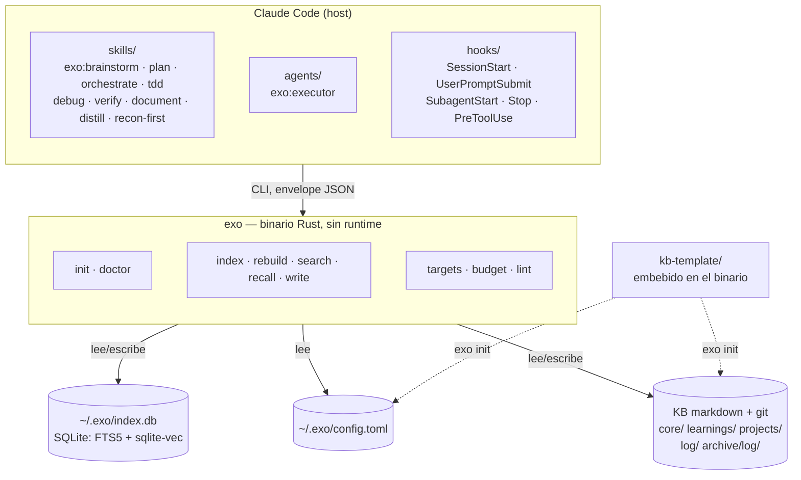

# exo genérico — spec de diseño

> Diseño del trabajo que convierte exo de *framework personal de Paul* en
> **producto instalable por terceros**, en español. Salido del brainstorm del
> 2026-08-26. Estado: **diseñado, pendiente de plan de implementación**.
>
> No sustituye al plan de cierre (`plans/2026-08-17-cierre-exo-m2-a-m5b.md`),
> que fija las campañas M2→M5b. Se solapa en un punto y lo dice: **G1 es
> M5a-02**, el item Alta del backlog, adelantado.

## Decisiones marco (tomadas en el brainstorm, no re-litigar)

| # | Decisión | Consecuencia |
|---|---|---|
| D1 | **Público, open source** | Entra LICENSE, CI, privacy-pass a `evals/`, releases |
| D2 | **Un solo plugin `exo`** | `process` + `reflex` se fusionan y se retiran del marketplace |
| D3 | **Semilla = contrato + núcleo de doctrina** | 5 notas doctrinales reescritas y despersonalizadas, no las 12 de `learnings/` |
| D4 | **Binarios precompilados + instalador** | CI de release para 3 plataformas; se elimina el toolchain C del camino del usuario |
| D5 | **kbx: absorber el núcleo, `rotate` después** | `targets`+`budget`+`lint` a Rust ahora; `rotate`/`stale`/`diff-since`/`history` no |
| D6 | **Contenido en español** | Prosa, docs, skills y errores no se traducen. El modelo `-es` pasa a ser posicionamiento declarado. Multiidioma es un frente futuro |
| D7 | **Identificadores en inglés** | Nombres de skills y verbos del CLI en inglés, cortos y coherentes. Ortogonal a D6: el nombre es un identificador, no contenido |

**Q1 — abierta, a confirmar en el gate de review.** D7 cubre nombres de skills
y verbos del CLI. No cubre las **claves de `data` del envelope**, que hoy son
español (`notas`, `trozos`, `indexadas`, `ruta`, `titulo`) dentro de una
envoltura inglesa (`schema_version`, `command`, `data`). Cambiarlas es breaking
para kbx, los scripts de reflex y la línea base del eval, y solo es barato una
vez: en esta ola o nunca.

Regla propuesta, y la que asume el resto de la spec: **superficie nueva en
inglés, superficie existente intacta.** La config de G1 nace con claves
inglesas porque no rompe a nadie; el envelope se queda en español porque
romperlo no compra nada que D6 pida. Coste asumido: `exo search --json`
devuelve `notas` mientras `config.toml` dice `name`. Es incoherente a la vista
y coherente en la regla.

Dos asunciones que no se preguntaron y quedan declaradas:

- **A1** — `process` y `reflex` se **retiran de golpe** del marketplace, sin
  período de deprecación. No hay terceros instalados; deprecar cuesta más que
  migrar dos máquinas.
- **A2** — `paul-profile` **no** entra en el plugin `exo`. Es el harness de
  campañas de Paul, personal por diseño. Se queda como está en `exo-plugins`.

## Arquitectura objetivo



El cambio estructural es **una sola flecha**. Hoy el binario lee
`~/.basic-memory/config.json` y busca la clave literal `kb-demo`
(`lib.rs:93`): *el sustituto depende del sustituido para arrancar*. Mañana lee
su propia config y el nombre de la KB es un dato.

## Sub-proyectos

Cinco, más una ola 0 de precondiciones. `G1 ∥ G2 → G3 → G4 → G5`.

---

### Ola 0 — precondiciones (no dependen de nada, bloquean a G5)

1. **Empujar las tres ramas de portabilidad** apiladas desde el 2026-08-24:
   `fix/exo-index-portable` → `fix/test-guarda-modelo-portable` →
   `fix/test-recall-cap-portable`. Sin ellas el CI nace rojo en Windows y el
   hook `Stop` **sigue sin reindexar** en la máquina de trabajo.
2. **Pasada de `cargo fmt`** en commit propio: hay **90 diffs preexistentes**.
   Si no, el gate `fmt --check` de G5 nace rojo.

---

### G1 — Config propia · *depende de: nada*

Cierra el item **Alta** del backlog (M5a-02) y desbloquea M5b.

**Fichero:** `~/.exo/config.toml`

```toml
schema_version = 1

[kb]
path = "C:/proyectos/homework/kb-demo"
name = "kb-demo"            # prefijo de permalink: EXPLÍCITO

[index]
db = "~/.exo/index.db"

[embeddings]
model = "jinaai/jina-embeddings-v2-base-es"
dims = 768
min_similarity = 0.35
```

Claves en inglés por D7, coherentes con los flags del CLI.

**Precedencia:** flag CLI > env (`EXO_CONFIG`, `EXO_KB`, `EXO_DB`) >
`~/.exo/config.toml` > **error accionable**. Sin defaults inventados — se
mantiene la aclaración vinculante m2-03 que ya rige `kb_desde_config`.

**Sin fallback a basic-memory.** La migración es explícita y de una vez:
`exo init --from-basic-memory` lee `~/.basic-memory/config.json` y escribe el
toml. Un fallback permanente es código que nadie borra nunca; una migración
explícita se puede eliminar en tres meses.

**Cierra el disenso abierto del gate M4:** el prefijo de permalink sale de
`cfg.kb.name`, no de `kb.file_name()`. La spec §3.1 pasa a ser cierta en vez
de coincidencia.

**Superficie:** `lib.rs:83` (`kb_desde_config`), `lib.rs:131`
(`config_embeddings`), `min_similitud_de_config`, los doc-comments de `--kb`
en `main.rs:123` y `main.rs:185`, el default de `--db`, y los scripts de
reflex que llevan el nombre hardcodeado: `exo-recall.sh:35`,
`recall-inject.sh:201`, `compose-inject.sh:27`.

**Dep nueva:** `toml`. Se consideró JSON (sin dep, `serde_json` ya está) y se
descartó: la config de usuario se edita a mano y quiere comentarios — el
runbook de W11 demuestra que ese fichero es un punto de fallo.

**Error handling.** Fichero ausente ⇒ el mensaje nombra `exo init` o
`exo init --from-basic-memory`. Clave ausente ⇒ nombra la clave y la ruta.
Nunca un default silencioso: es literalmente la clase de fallo que el proyecto
combate.

**Tests:** precedencia (4 casos), fichero ausente, clave ausente, expansión de
`~`, path con barras de Windows, migración desde basic-memory.

---

### G2 — Plugin único `exo` · *depende de: nada*

```
plugins/exo/
  .claude-plugin/plugin.json     name: exo · version: 1.0.0
  skills/    brainstorm plan orchestrate tdd debug verify
             document distill recon-first
  agents/    executor.md
  hooks/     hooks.json
  scripts/   los 22 .sh y sus suites
  LICENSES/  superpowers.LICENSE
  README.md
```

Invocación resultante: `exo:brainstorm` … `exo:recon-first`, agente
`exo:executor`. Versión **1.0.0**: id nuevo, no continuación de `reflex 0.17.0`.

**Renombrado de los dos skills en español (D7):**

| Antes | Ahora | Por qué |
|---|---|---|
| `documenta` | `document` | Directo, 8 caracteres, mismo verbo |
| `consolida` | `distill` | Más corto que `consolidate` (7 vs 11) y es el término que la propia KB usa para el producto de la operación: el **destilado**. Alternativa literal descartada por longitud |

Los otros siete ya estaban en inglés y no se tocan.

**Marketplace:** entrada `exo` por `git-subdir` a `plugins/exo`; se retiran
`process` y `reflex` (A1). `paul-profile` intacto (A2).

**Roturas a barrer en el mismo commit:**

- `core-index.md` de la KB dice literalmente «ROUTING DE PROCESO (plugin
  `process`)» y enumera `documenta` → `exo`, `document`, `distill`.
- `Agent(subagent_type: "reflex:executor")` → `exo:executor`, en docs y skills.
- `documenta-remind.sh` (hook `Stop`) nombra la skill → `document`.
- `skills/documenta/routing.md` → `skills/document/routing.md`.
- Rutas `~/.claude/plugins/cache/exo/reflex/*/scripts/` en runbook y tests.
- `plugins/reflex/README.md` + `plugins/process/README.md` → uno solo.
- `consolida/SKILL.md` lleva **13 rutas absolutas `/home/paul/…`** → se
  parametrizan contra la config de G1.

`CLAUDE_PLUGIN_ROOT` se resuelve solo: los hooks cambian de ruta, no de
contenido.

**Efecto lateral buscado:** los skills `verify`, `plan` y `debug` colisionan
hoy por nombre con builtins y otros plugins. El prefijo `exo:` lo resuelve —
es medio motivo del cambio.

---

### G3 — KB semilla + `exo init` · *depende de: G1*

```
kb-template/
  core/core-index.md                    plantilla, {{KB_NAME}}
  core/doctrina.md
  learnings/_template.md
  learnings/orquestador-limpio.md
  learnings/recon-first.md
  learnings/fallo-silencioso.md
  learnings/el-brief-es-el-cuello-de-botella.md
  projects/_template.md
  log/_template.md
  archive/log/.gitkeep
  AGENTS.md
  README.md
```

Los **directorios** son el contrato de la KB y ya están en inglés
(`core/ learnings/ projects/ log/ archive/`); los **nombres de nota** son
contenido y van en español, porque se convierten en permalink y en título que
el usuario lee. El placeholder `{{KB_NAME}}` es identificador (D7).

Las 5 notas doctrinales van **reescritas**, no copiadas de `kb-demo`: sin
nombres, sin proyectos, sin fechas de la historia de Paul. Frontmatter
`semilla: true` para que un usuario pueda barrerlas con un `grep` cuando ya
tenga las suyas.

**`exo init <ruta> [--name <n>] [--from-basic-memory] [--force]`**

1. Falla si `<ruta>` existe y no está vacía (salvo `--force`).
2. Vuelca la plantilla sustituyendo `{{KB_NAME}}` en permalinks y títulos.
3. `git init` + primer commit.
4. Escribe `~/.exo/config.toml` — **no lo pisa** si existe; pide `--force`.
5. `exo index` inicial.
6. Imprime qué hizo y cuál es el siguiente comando.

**Distribución de la plantilla:** `include_str!` fichero a fichero en un módulo
`plantilla.rs`. Son ~11 ficheros: explícito, sin macro-crate, y el binario
queda autosuficiente — requisito directo de D4.

**Gate de presupuesto:** el `core-index.md` de la semilla debe caber bajo
6.144 B **con el 15% de aire** que exige la propia doctrina (≤5.222 B), o nace
mordiendo su gate el primer día. Test que lo mide en bytes.

---

### G4 — Núcleo de kbx en Rust · *depende de: G1*

Entra (D5):

| Comando | Qué hace | Quién lo consume |
|---|---|---|
| `exo targets` | permalink + tier + tamaño + cabeceras, sin body | `exo:document` |
| `exo budget` | bytes/tier vs presupuesto, marcadores de frontmatter, trinquete F1 (solo baja, 15% de aire), exit 1 en NOTIER | `exo:distill`, pre-commit de la KB |
| `exo lint` | deriva: `duplicate_dir`, `orphan`, `bad_frontmatter`, `root_file`; exclusión `archive`/`docs`/`.superpowers`; waivers solo en `orphan` y `budget_exceeded` | `exo:distill` |

**No entra:** `rotate`, `stale`, `diff-since`, `history`.

**Colisión de nombres resuelta:** `exo doctor` es el preflight de **entorno**
(G5); `exo lint` es el linter de **la KB** (lo que kbx llamaba `doctor`).
Dos cosas distintas, dos nombres distintos.

**Los marcadores de frontmatter conservan el prefijo `kbx_`**
(`kbx_budget_max`, `kbx_orphan_ok`). Están escritos en 11 notas vivas y en
`.kbx-ratchet.json`; renombrarlos es una migración de datos a cambio de nada.
Se documenta que el prefijo es histórico.

**`exo:distill` degrada de forma anunciada.** Sin `rotate`, la skill detecta
la ausencia y **lo dice en una línea visible**. Se relaja aquí el patrón
establecido (`document` degrada con línea visible, `distill` falla-fuerte)
porque el fallo-fuerte deja la skill inservible en Windows — que es exactamente
el estado que esta ola viene a arreglar.

**Gate de paridad:** cada comando portado se valida contra el kbx Go **sobre la
KB real** (`kb-demo`, 155 notas): mismo output para `targets`, `budget` y
`lint`. Sin ese gate es una reimplementación a ciegas. Los tests públicos usan
fixtures, porque la KB real no se publica.

---

### G5 — Distribución, doctor, docs y diagrama · *depende de: G1, G2, ola 0*

**`exo doctor`** — preflight de entorno, falsable. Cada check reporta **el
artefacto que miró**, no un exit code: es la lección literal del runbook de
W11 («el código de salida no es evidencia», seis casos documentados).

- binario en PATH **y con la extensión correcta**: el fallback literal
  `$HOME/.local/bin/exo` falla el test `-x` en msys y manda todos los hooks al
  camino «sin engine» en silencio
- `jq` **ejecutable desde bash**, no alias de ejecución de WindowsApps
- config presente y parseable; KB legible; DB presente y no rancia
- modelo presente en la caché de HF
- Windows: Git Bash presente; detach disponible (`setsid` o `cmd //c start`)
- `--json` y exit code por severidad

**CI** (`.github/workflows/ci.yml`): `cargo test` + `fmt --check` +
`clippy -D warnings` en ubuntu / windows / macos. Depende de la ola 0.

**Release** (`.github/workflows/release.yml`): tag `v*` →
`x86_64-unknown-linux-gnu`, `x86_64-pc-windows-msvc`,
`aarch64-apple-darwin` → GitHub Release con binarios y SHA256.

**`install.sh` / `install.ps1`:** detecta plataforma, baja el binario de la
última release, verifica checksum, lo coloca en PATH, y encadena `exo init`
(si no hay config) + `exo doctor`.

**Requisitos, escritos y verificables** — hoy solo existen narrados en un
runbook:

| Camino | Requisitos |
|---|---|
| **Desde release** (recomendado) | `git` y `jq`. **Ni Rust ni toolchain C.** |
| **Desde fuente** | Rust estable + toolchain C. En Windows, MSVC con `--includeRecommended`: el workload `VCTools` sin ese flag **no trae el compilador**, y winget devuelve éxito igualmente (tres veces, documentado) |
| **Primera indexación** | Descarga del modelo, ~6 min en frío |
| **Windows** | Git Bash. Claude Code lo usa para hooks; no hacen falta wrappers `.cmd` |

**Docs:** `README.md` reescrito con el diagrama, `docs/arquitectura.md`,
`docs/instalacion.md`. `LICENSE` MIT en raíz. `rust-version` en `Cargo.toml`.
Privacy-pass a `evals/` (las 55 queries son reales y están trackeadas).

**Posicionamiento de idioma en el README (D6):** exo es un producto **en
español**; el default de embeddings es `jina-embeddings-v2-base-es` y la línea
base del eval está medida en español. El modelo es configurable desde G1, pero
el soporte multiidioma es un frente futuro, no una promesa. Declararlo es lo
que separa una decisión de producto de un acoplamiento heredado.

**De paso, ya que se tocan docs** — dos items Baja del backlog que es más caro
dejar abiertos: el nombre de `docs/superpowers/` (carpeta de docs del proyecto
cuyo objetivo declarado es jubilar superpowers) y `reports/` colgando de la
raíz fuera de convención.

## Riesgos

1. **`rotate` aplazado deja `exo:distill` cojo.** Mitigación: degradación
   anunciada, y `exo budget` sí avisa cuando una nota muerde — que es el grueso
   del valor. Si duele, `rotate` sube de prioridad con evidencia de uso.
2. **La paridad de G4 se mide sobre una KB que no se publica.** Es correcto
   como gate privado, pero el proyecto público no puede reproducirlo. Los tests
   con fixtures son la red pública; la paridad es la red de Paul.
3. **Windows sigue siendo el target frágil.** El CI en `windows-latest` es el
   gate. Sin la ola 0 no arranca.
4. **Retirar `process`/`reflex` rompe las dos máquinas de Paul** hasta que
   reinstalen. Necesita runbook de cutover, no un commit y a ver qué pasa.
5. **El modelo `-es` acota el mercado por diseño (D6).** Asumido y declarado.
6. **`documenta`→`document` y `consolida`→`distill` rompen la memoria muscular**
   y todas las referencias cruzadas de la KB. Se barren en el mismo commit que
   G2 o quedan punteros muertos.

## Fuera de scope (YAGNI)

- **MCP propio (M5a).** Sigue siendo su campaña; nada de aquí lo necesita.
- **Quitar la dependencia C.** Los binarios precompilados lo vuelven
  irrelevante para el usuario.
- **Multi-KB en una config.** `--kb` ya lo cubre.
- **Portar `stale` / `diff-since` / `history`.** Nada público los exige.
- **Multiidioma.** Frente futuro (D6).
- **Traducir el contenido de `docs/superpowers/`** (56 ficheros, 17.407
  líneas). Es audit trail y se queda como está.
- **Traducir los identificadores del código Rust** (`buscador.rs`,
  `busca_hybrid`, `escritor.rs`). D7 cubre nombres de skills y verbos del CLI —
  la superficie de cara al usuario. Renombrar 6.317 líneas de identificadores
  internos es otra decisión, y no la pide nada de esta ola.
