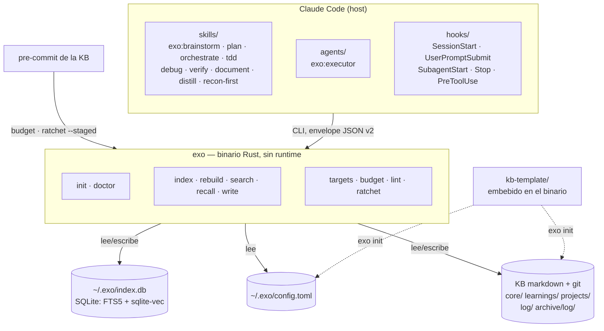

# exo genérico — spec de diseño

> Diseño del trabajo que convierte exo de *framework personal de Paul* en
> **producto instalable por terceros**, en español. Salido del brainstorm del
> 2026-08-26. Estado: **diseñado y adjudicado, pendiente de dos decisiones
> bloqueantes y del plan de implementación**.
>
> No sustituye al plan de cierre (`plans/2026-08-17-cierre-exo-m2-a-m5b.md`),
> que fija las campañas M2→M5b. Se solapa en un punto y lo dice: **G1 es
> M5a-02**, el item Alta del backlog, adelantado.
>
> **Historial.** v1 (brainstorm) → v2 tras review adjudicadora de un consultor
> con acceso al repo Go de kbx, al engine, a los scripts y al harness de
> evals. Los quince veredictos están aplicados; los cambios de fondo fueron:
> el trinquete NO vive en `budget` (V1), Q1 se resuelve al revés de lo
> propuesto (V2), G4 es ~2-3× cualquier otro sub-proyecto (V15) y el rename de
> G2 abre el gate de la KB en silencio (V6).

## Decisiones marco

| # | Decisión | Consecuencia |
|---|---|---|
| D1 | **Público, open source** | Entra LICENSE, CI, privacy-pass, releases. **Arrastra dos decisiones bloqueantes: B1 y B2** |
| D2 | **Un solo plugin `exo`** | `process` + `reflex` se fusionan y se retiran del marketplace |
| D3 | **Semilla = contrato + núcleo de doctrina** | 5 notas doctrinales reescritas y despersonalizadas, no las 12 de `learnings/` |
| D4 | **Binarios precompilados + instalador** | CI de release para 3 plataformas; se elimina el toolchain C del camino del usuario |
| D5 | **kbx: absorber el núcleo, `rotate` después** | `targets`+`budget`+`lint`+**`ratchet`** a Rust ahora; `rotate`/`stale`/`diff-since`/`history` no. **Supersede la spec madre §2.5** ("kbx no se migra en ningún escenario"), que queda derogada en ese punto |
| D6 | **Contenido en español** | Prosa, docs, skills y errores no se traducen. El modelo `-es` pasa a ser posicionamiento declarado. Multiidioma es un frente futuro |
| D7 | **Identificadores en inglés** | Nombres de skills, verbos del CLI y claves de config en inglés |
| D8 | **Claves de `data` del envelope: al inglés, en esta ola** | Resuelve Q1 al revés de lo propuesto en v1 (ver abajo). `SCHEMA_VERSION` 1→2 |
| D9 | **Flags largos del CLI: al inglés, en esta ola** | 10 flags renombrados con el nombre español como `alias` oculto; se retira en 1.1 (ver abajo) |

### D8 — por qué Q1 se resolvió al revés

v1 proponía «superficie nueva en inglés, superficie existente intacta». Estaba
argumentado sobre **dos hechos falsos**:

- «renombrar rompe kbx» — **falso**: kbx lee el índice SQLite en `mode=ro`
  (`kbx/internal/index/db.go`), no consume el envelope JSON.
- «`exo search --json` devuelve `notas`» — **falso**: devuelve `results`
  (`engine/src/buscador.rs:34-50`, struct `Busqueda`).

El estado real es peor que el que v1 describía. La incoherencia no es «config
vs envelope», es **comando a comando dentro del mismo binario**:

| Comando | Claves de `data` hoy |
|---|---|
| `search` | `results` · `query` · `search_type` · `elapsed_s` · `avisos` — inglés salvo `avisos` y `ruta` |
| `recall` | `notas` · `truncado` · `modo` · `cap_bytes` — español |
| `index` | `indexadas` · `saltadas` · `borradas` · `trozos_embebidos` · `trozos_reusados` — español |
| `targets`/`budget`/`lint`/`ratchet` (G4) | `tiers` · `offenders` · `notier` · `candidates` · `findings` — **inglés**, heredado de kbx |

Sin D8, el 1.0 público emite inglés para la mitad de sus comandos y español
para la otra mitad, del mismo binario.

**Blast radius medido:** un solo consumidor real, `recall-inject.sh`, con
cuatro expresiones jq (`:177`, `:186`, `:246`, `:299`) más sus fixtures. El
harness de evals solo toca claves inglesas (`replay-engine.py:74-75`). El
mecanismo de bump ya está previsto en `engine/src/envelope.rs:4-6`.

Renombrado: `notas`→`notes`, `ruta`→`path`, `titulo`→`title`,
`truncado`→`truncated`, `indexadas`→`indexed`, `saltadas`→`skipped`,
`borradas`→`deleted`, `trozos_*`→`chunks_*`, `avisos`→`warnings`,
`modo`→`mode`. Va en el mismo commit que la migración del script y sus
fixtures, con `SCHEMA_VERSION` a 2.

**Corrección sobre v2:** la lista de arriba incluía
`lineas_perdidas`→`dropped_lines`. Se retira: `ResultadoCap`
(`recall.rs:101-105`) no deriva `Serialize` y `lineas_perdidas` solo llega al
aviso de stderr (`main.rs:451`) — no es clave del envelope. Renombrarlo sería
tocar un identificador interno, que está explícitamente fuera de scope.

### D9 — los flags largos, la última mezcla

D7 lleva al inglés los nombres de skills y los **verbos** del CLI; D8, las
claves del envelope. Ninguna de las dos cubría los **flags**, y así el 1.0
público emitiría `--limite` al lado de `--json` y de `{"notes": …}`: la misma
incoherencia que D7 y D8 existen para matar, en la superficie que un tercero
teclea a mano.

Diez flags: `--titulo`→`--title`, `--crea`→`--create`, `--limite`→`--limit`
(×2), `--min-similitud`→`--min-similarity` (×2), `--escala-fts`→`--fts-scale`,
`--contenido`→`--content`, `--nota`→`--note`, `--refresca`→`--refresh`. No se
tocan los que ya son ingleses —`--db`, `--kb`, `--dir`, `--from`, `--tier`,
`--force`, `--json`, `--type`, `--bonus`, `--cap-bytes`, `--query`—:
renombrar de más también rompe.

**Mecanismo:** `#[arg(long = "limit", alias = "limite")]`. El campo Rust no
cambia (mismo criterio que D8), `--help` documenta solo el nuevo, y el viejo
sigue parseando **sin aparecer**. El alias no es cortesía con terceros —no los
hay todavía—: es lo que impide que durante el cutover un plugin cacheado en
`~/.claude/plugins/cache/` con los scripts viejos muera con `unexpected
argument` a mitad de un hook. Se retira en 1.1, con item de backlog abierto al
crearlo.

**Por qué ahora y no después:** hoy rompe cuatro invocaciones propias, dos
skills y el harness de evals. Después de publicar, rompe a terceros.

## Decisiones bloqueantes pendientes (de Paul, no del consultor)

Ambas son de una sola ventana: después del primer push público no tienen
arreglo. **Bloquean G5, no antes.**

**B1 — destino de la historia git.** `git log --format=%ae | sort -u` sobre
este repo devuelve `dev@example.invalid` y
`dev@example.invalid`: dos identidades corporativas de
empresa-x en la autoría de un repo personal. Opciones: publicar tal cual ·
reescribir con `git filter-repo` a una identidad personal · repo nuevo con
historia colapsada. Reescribir después de publicar es imposible.

**B2 — canal de distribución del plugin.** `exo-plugins` es **privado**
(`gh repo view … --json visibility` → PRIVATE) y contiene `paul-profile` como
directorio local (`marketplace.json`, `source: "./plugins/paul-profile"`).
Hacerlo público para servir el plugin `exo` publicaría también el harness
personal, contra A2. **Recomendación: servir el plugin desde el propio repo
`exo`**, que ya es la fuente de verdad declarada en su README — quita un repo
de la ecuación y deja `exo-plugins` privado con `paul-profile` dentro.

## Asunciones adjudicadas

- **A1 — retirar `process`/`reflex` de golpe, sin deprecación. SE SOSTIENE.**
  `exo-plugins` es privado: no hay terceros posibles, solo las dos máquinas de
  Paul. Condición: el runbook de cutover de G2 y el repunte de las dos cachés
  instaladas (`0.16.0`, `0.17.0`).
- **A2 — `paul-profile` fuera del plugin `exo`. SE SOSTIENE**, pero «se queda
  como está» era falso: referencia `process:orchestrate` y `reflex:executor`
  (`plugin.json:3`, `skills/fabrica/SKILL.md:8,43,61`), que mueren con A1. Se
  repunta a `exo:orchestrate`/`exo:executor` en el mismo cutover. Es
  literalmente el riesgo 5 de la spec madre: *reflex desenchufado sin síntoma*.

## Arquitectura objetivo



El cambio estructural es **una sola flecha**. Hoy el binario lee
`~/.basic-memory/config.json` y busca la clave literal `kb-demo`
(`lib.rs:93`): *el sustituto depende del sustituido para arrancar*. Mañana lee
su propia config y el nombre de la KB es un dato.

## Orden y dependencias

```
ola 0  →  G1 ∥ G2  →  G3 ∥ G4  →  G5
```

Corregido respecto a v1 (V7): **G3 y G4 son paralelos** — ambos dependen solo
de G1; la cadena `G3→G4` era una dependencia falsa. Y **G5 depende de los
cuatro**, no solo de G1+G2: `install.sh` encadena `exo init` (G3) y el plugin
de G2 shippea skills que invocan `targets`/`budget`/`lint`/`ratchet` (G4).

| Sub-proyecto | Tamaño relativo | Base de la estimación |
|---|---|---|
| Ola 0 | **0,25** | Solo queda `cargo fmt` (90 diffs) más un check |
| G1 | **1** | ~300-500 líneas Rust + 6 grupos de tests, superficie inventariada |
| G2 | **2** | Cero lógica, blast radius ancho; el coste es el cutover |
| G3 | **2** | `init` es pequeño; domina reescribir 5 notas clean-room con gate de bytes |
| **G4** | **5–6** | ~2.000 líneas Go de producción + ~2.500 de tests, más harness de paridad entre dos bindings de SQLite. **Del orden de kbx v1 entero, en otro lenguaje, con gate de paridad encima** |
| G5 | **3** | CI×3 SO + release + 2 instaladores + `doctor` falsable + docs; varianza alta por Windows |

G4 no es «uno más»: es **un tercio largo del total**.

---

## Ola 0 — precondiciones

1. **~~Empujar las tres ramas de portabilidad.~~ YA HECHO.** Los tres fixes
   están mergeados en `main` (`00b014f`, `55fc426`, `5e5e490`), publicados como
   reflex `0.17.0` (`67c077d`) e instalados en la caché de esta máquina.
   Verificado: `git branch --contains` de las tres da `main`.
2. **Pasada de `cargo fmt`** en commit propio: **90 diffs preexistentes**,
   contados hoy. Sin esto el gate `fmt --check` de G5 nace rojo.
3. **Check falsable que sustituye al item 1** — el fix está instalado pero
   *no hay evidencia de que se haya ejecutado*: `index.db` tiene mtime del
   2026-08-24 16:59 y no hay ningún evento `index` posterior en
   `~/.claude/reflex-log.jsonl`. Tras una sesión real en W11: `stat` de la DB
   + evento en el log. *Instalado no es ejecutado* — la distinción que este
   proyecto existe para no volver a perder.

---

## G1 — Config propia · *depende de: nada*

Cierra el item **Alta** del backlog (M5a-02) y desbloquea M5b.

**Fichero:** `~/.exo/config.toml`

```toml
schema_version = 1

[kb]
path = "C:/proyectos/homework/kb-demo"
name = "kb-demo"            # prefijo de permalink: EXPLÍCITO

[index]
db = "~/.exo/index.db"

[embeddings]
model = "jinaai/jina-embeddings-v2-base-es"
dims = 768
min_similarity = 0.35
```

**Precedencia:** flag CLI > env (`EXO_CONFIG`, `EXO_KB`, `EXO_DB`) >
`~/.exo/config.toml` > **error accionable**. Sin defaults inventados — se
mantiene la aclaración vinculante m2-03 que ya rige `kb_desde_config`.

**Sin fallback a basic-memory.** La migración es explícita y de una vez:
`exo init --from-basic-memory` lee `~/.basic-memory/config.json` y escribe el
toml. Un fallback permanente es código que nadie borra nunca.

**Cierra el disenso abierto del gate M4:** el prefijo de permalink sale de
`cfg.kb.name`, no de `kb.file_name()`. La spec §3.1 pasa a ser cierta en vez
de coincidencia.

**Superficie:** `lib.rs:83` (`kb_desde_config`), `lib.rs:131`
(`config_embeddings`), `min_similitud_de_config`, los doc-comments de `--kb`
(`main.rs:123`, `main.rs:185`), el default de `--db`, y los scripts con el
nombre hardcodeado: `exo-recall.sh:35`, `recall-inject.sh:201`,
`compose-inject.sh:27`. Y, por D9, los diez flags largos en español de
`main.rs` con sus siete consumidores vivos.

**Dep nueva:** `toml`. Se consideró JSON (sin dep) y se descartó: la config se
edita a mano y quiere comentarios — el runbook de W11 demuestra que ese
fichero es un punto de fallo.

**Error handling.** Fichero ausente ⇒ el mensaje nombra `exo init` o
`exo init --from-basic-memory`. Clave ausente ⇒ nombra la clave y la ruta.
Nunca un default silencioso.

**También en G1 (H9):** barrer el hallazgo vivo **#3 del gate M4** — la spec de
write promete `data.candidates` en el rechazo exit 3 (nombre corregido por D8;
la spec de write llevaba `dup_candidatas`) y solo hay una línea
humana por stderr. Es **contrato por prosa** en una superficie que un tercero
va a consumir. O se implementa o se corrige la spec de write; publicarlo como
está exporta el enemigo declarado del proyecto.

**Tests:** precedencia (4 casos), fichero ausente, clave ausente, expansión de
`~`, path con barras de Windows, migración desde basic-memory.

---

## G2 — Plugin único `exo` · *depende de: nada*

```
plugins/exo/
  .claude-plugin/plugin.json     name: exo · version: 1.0.0
  skills/    brainstorm plan orchestrate tdd debug verify
             document distill recon-first
  agents/    executor.md
  hooks/     hooks.json
  scripts/   los 24 .sh y sus suites
  LICENSES/  superpowers.LICENSE
  README.md
```

Invocación: `exo:brainstorm` … `exo:recon-first`, agente `exo:executor`.
Versión **1.0.0**: id nuevo, no continuación de `reflex 0.17.0`.

**Renombrado de los dos skills en español (D7):**

| Antes | Ahora | Por qué |
|---|---|---|
| `documenta` | `document` | Directo, mismo verbo |
| `consolida` | `distill` | 7 caracteres frente a 11 de `consolidate`, y es el término que la propia KB usa para el producto de la operación: el **destilado** |

### Superficie de cutover — inventario completo

v1 se dejaba fuera lo más peligroso. La lista real:

1. **`kb-demo/.git/hooks/pre-commit` — CRÍTICO.** El shim resuelve
   `$HOME/.claude/plugins/cache/exo/reflex/*/scripts/kb-precommit.sh`
   (`:13`). Con el plugin renombrado el glob **no matchea**, y su rama de fallo
   (`:20`) es `echo … >&2; exit 0`: **el gate de la KB se abre y el commit
   pasa**. No vive en ningún repo del monorepo, así que ningún grep del
   monorepo lo encuentra. Repuntar en G2, en el mismo commit.
2. **`kb-precommit.sh`** — invoca `kbx ratchet --staged` (`:22`), `kbx budget`
   y recomienda `kbx rotate` (`:58`). Y su propia degradación es «kbx ausente
   ⇒ exit 0» (`:15-17`). Son **dos pasos**: repuntar la ruta en G2, reescribir
   a verbos `exo` en G4.
3. `core-index.md` de la KB — «ROUTING DE PROCESO (plugin `process`)» y la
   enumeración con `documenta`.
4. `Agent(subagent_type: "reflex:executor")` → `exo:executor`, en docs y skills.
5. `documenta-remind.sh` (hook `Stop`) nombra la skill.
6. `skills/documenta/routing.md` → `skills/document/routing.md`.
7. `paul-profile` (A2): `plugin.json:3`, `skills/fabrica/SKILL.md:8,43,61`.
8. `plugins/reflex/README.md` + `plugins/process/README.md` → uno solo.
9. `consolida/SKILL.md`: **13 rutas absolutas `/home/paul/…`** → se
   parametrizan contra la config de G1.
10. Las dos cachés instaladas (`0.16.0`, `0.17.0`) y el runbook de W11.

**La ventana G2→G4 (H8), a decidir aquí y no en el commit.** Entre la fusión y
el port de verbos, `exo:distill` sigue dependiendo del binario `kbx`
(`SKILL.md:31,71,80,108`), que **no existe en W11**. O G2 shippea `distill`
con degradación total anunciada, o el rewiring de `distill`/`document` se
mueve entero a G4. **Decisión: se mueve a G4** — shippear un skill que en una
de las dos máquinas no puede hacer nada es publicar un comentario.

`CLAUDE_PLUGIN_ROOT` se resuelve solo: los hooks cambian de ruta, no de
contenido.

**Efecto lateral buscado:** `verify`, `plan` y `debug` colisionan hoy por
nombre con builtins y otros plugins. El prefijo `exo:` lo resuelve.

---

## G3 — KB semilla + `exo init` · *depende de: G1*

```
kb-template/
  core/core-index.md                    plantilla, {{KB_NAME}}
  core/doctrina.md
  learnings/_template.md
  learnings/orquestador-limpio.md
  learnings/recon-first.md
  learnings/fallo-silencioso.md
  learnings/el-brief-es-el-cuello-de-botella.md
  projects/_template.md
  log/_template.md
  archive/log/.gitkeep
  AGENTS.md
  README.md
```

Los **directorios** son el contrato de la KB y ya están en inglés; los
**nombres de nota** son contenido y van en español, porque se convierten en
permalink y en título que el usuario lee. El placeholder `{{KB_NAME}}` es
identificador (D7).

Las 5 notas doctrinales van **reescritas**, no copiadas de `kb-demo`: sin
nombres, sin proyectos, sin fechas de la historia de Paul. Frontmatter
`semilla: true` para que un usuario pueda barrerlas con un `grep`.

**`exo init [--kb <ruta>] [--name <n>] [--from-basic-memory] [--force]`**

> Corregido el 2026-08-26 durante la ejecución de la ola 1A: v2 escribía
> `<ruta>` posicional. Un reviewer levantó el conflicto contra la
> implementación, que usa `--kb`. Manda el flag, no el posicional: `--kb` es
> el nombre establecido para la raíz de la KB en **todos** los demás
> subcomandos (`index`, `search`, `recall`, `write`), y un posicional solo en
> `init` sería una excepción sin razón. La notación posicional de v2 era un
> bosquejo de la forma del comando, no una decisión sobre posicional vs flag.

1. Falla si `<ruta>` existe y no está vacía (salvo `--force`).
2. Vuelca la plantilla sustituyendo `{{KB_NAME}}` en permalinks y títulos.
3. `git init` + primer commit.
4. Escribe `~/.exo/config.toml` — **no lo pisa** si existe; pide `--force`.
5. `exo index` inicial.
6. Imprime qué hizo y cuál es el siguiente comando.

**Distribución de la plantilla:** `include_str!` fichero a fichero en un módulo
`plantilla.rs`. Son ~11 ficheros: explícito, sin macro-crate, binario
autosuficiente — requisito directo de D4.

**Gate de presupuesto:** el `core-index.md` de la semilla debe caber bajo
6.144 B **con el 15% de aire** que exige la propia doctrina (≤5.222 B), o nace
mordiendo su gate el primer día. Test que lo mide en bytes.

---

## G4 — Núcleo de kbx en Rust · *depende de: G1* · **el sub-proyecto grande**

### Entra — cuatro comandos, no tres

| Comando | Qué hace | Quién lo consume |
|---|---|---|
| `exo targets` | permalink + tier + tamaño + cabeceras, sin body | `exo:document` |
| `exo budget` | bytes/tier vs presupuesto, offenders, waived, `no_air` informativo, exit 1 en NOTIER | `exo:distill`, pre-commit |
| `exo lint` | deriva de la KB (6 checks, abajo) | `exo:distill` |
| **`exo ratchet`** | **el trinquete F1** | **pre-commit (`--staged`)**, `exo:distill` |

**V1 — el trinquete no vive en `budget`.** v1 de esta spec lo ubicaba dentro de
`budget` y ahí no está. En kbx real, `budget` solo agrega bytes/tier +
offenders + waived + `no_air` informativo; el trinquete completo es
`kbx ratchet` (`cmd/kbx/ratchet.go`, `internal/ratchet/{check,load,staged}.go`),
un comando aparte de ~700 líneas entre producción y tests, con: `--seal`
(escribe `.kbx-ratchet.json`), `--staged` (juzga el git index), abstención por
shallow-clone, ancla de activación, absolución de renames y guarda de aire.
Sin portarlo, el pre-commit de la KB (`kb-precommit.sh:22`) pierde su mitad
fuerte — y como su degradación es «binario ausente ⇒ commit permitido», el
gate se apagaría **sin romper nada**. El fallo silencioso canónico.

**`exo lint` — 6 checks, no 4.** El `doctor` de kbx tiene 7
(`kbx/internal/doctor/doctor.go`, `Run`): `duplicate_dir`, `orphan`,
`bad_frontmatter`, `root_file`, `budget_exceeded`, `budget_prose_drift` y
`schema_drift`. Se portan **6**. `budget_prose_drift` (F3.4) es
innegociable: es precisamente la herramienta que hace cumplir *«una regla que
se cita y se ignora es un comentario»*, y perderla en silencio sería el chiste
del proyecto. `schema_drift` **muere con la absorción y se declara**: existía
porque kbx y exo eran dos binarios contra un schema compartido; con uno solo
deja de tener objeto. Declararlo importa porque el gate de paridad compara
contra un doctor de 7 tipos.

### No entra

`rotate`, `stale`, `diff-since`, `history`.

**`exo:distill` degrada de forma anunciada.** Sin `rotate`, la skill detecta la
ausencia y **lo dice en una línea visible**. Se relaja aquí el patrón
establecido (`document` degrada visible, `distill` falla-fuerte) porque el
fallo-fuerte deja la skill inservible en Windows — el estado que esta ola
viene a arreglar.

**H13:** con `ratchet --seal` dentro, la doctrina de kbx «read-only salvo
`rotate`» pasa a «salvo `rotate` y `--seal`». Escrito, no asumido.

### Nombres que NO se tocan

Los marcadores de frontmatter conservan el prefijo `kbx_` (`kbx_budget_max`,
`kbx_orphan_ok`) y el sello sigue siendo `.kbx-ratchet.json`. Están escritos en
11 notas vivas; renombrarlos es una migración de datos a cambio de nada. Se
documenta que el prefijo es histórico.

### Invariantes portables — tests obligatorios (V13/H7)

Todos verificados en el código Go, todos pertenecientes a comandos que **sí**
se portan. Un port sin estos tests es una reimplementación a ciegas:

1. **`frontmatter.isDelimiter` tolera `---\r`.** Sin eso, en un checkout con
   CRLF el parser lee **nada** y todo exita 0. El invariante más letal para el
   target Windows. (commit `5c7eb3d`)
2. **Guarda NULL del orphan-check:** `WHERE destino_permalink IS NOT NULL` es
   load-bearing — con 23 links sin resolver, `NOT IN` sobre NULL devuelve
   **cero huérfanos en verde**. Medido: 0 sin guarda, 7 con.
3. **Dedup de `targets` por `ruta` (file_path), nunca por permalink**; sin
   `LIMIT` en SQL, truncado post-dedup.
4. **`BudgetMax`: solo entero positivo activa el techo.** 0, negativo o basura
   se ignoran — *fail-toward-red*.
5. **`waived` se puebla solo si el check disparó-y-se-suprimió**, y jamás
   gatea el exit.
6. **`LastCommit` de `targets` es fail-loud** (`targets.go:207`). El idioma git
   ya presente en el engine es **fail-silent** (`indexer.rs:24`, `git_epoch_de
   → Option`). Un port que reutilice el idioma de casa degrada `last_commit`
   en silencio: es la trampa concreta de este port.
7. **Ratchet:** sello borrado = subir a infinito · sello huérfano no puede
   lavar una declaración (`0ae126d`) · sello corrupto en HEAD es error, no
   abstención (`load.go`) · aritmética **entera** de aire
   (`ceiling*100 >= size*115`, `check.go`).

Los cuatro invariantes que v1 citaba como duda (reconstrucción byte a byte,
backstop `os.Link`/`EEXIST`, corte por posición, avisos encadenados) son
**todos de `rotate`** y quedan correctamente fuera.

### Gate de paridad — ejecutable, no aspiracional (V3/V4)

v1 decía «mismo output que el kbx Go sobre la KB real» y eso, tal cual, **no
se puede correr**:

- El checkout local de kbx está en `9395199` y va **18 commits por detrás** de
  `origin/main` — le falta toda la ola de la guarda de aire. Una paridad
  contra este árbol consagraría el comportamiento pre-F1-completo.
- En W11 **no hay toolchain Go**: kbx no compila donde más falta hace.
- kbx **no tiene flag de versión** (`cmd/kbx/main.go`), así que «el kbx
  instalado en `~/.local/bin`» no es evidencia falsable de qué código se
  compara.

**Definición operativa:**

- **Referencia pineada a `origin/main` de kbx, commit `fe46443`**, compilado
  fresco con `make install` antes de cualquier corrida. Añadir `-ldflags` con
  el commit al Makefile de kbx para que el binario sepa decir qué es.
- **Corre en la máquina Linux**, la única con toolchain Go. Se declara así en
  la spec en vez de fingir que es reproducible en W11.
- **«Mismo output» = comparación de `data` normalizada**, no byte a byte: el
  `command` difiere (`doctor`→`lint`) y los `schema_version` son
  independientes.
- **`targets` no es byte-comparable** y se excluye de la comparación estricta:
  ordena por rank bm25 **sin tie-break** (`targets.go`, `ORDER BY rank`), y dos
  bindings distintos de SQLite (mattn vs rusqlite bundled) pueden ordenar
  empates de forma distinta, con `snippet()` divergiendo en bordes de
  tokenización. Se compara **como conjunto**, no como secuencia.
- **`budget`, `lint` y `ratchet` sí son byte-comparables a nivel `data`**:
  tienen sorts explícitos.
- Los tests **públicos** usan fixtures; la paridad es la red privada de Paul y
  la spec lo dice en vez de prometer lo que el repo público no puede
  reproducir.

---

## G5 — Distribución, doctor, docs y diagrama · *depende de: G1, G2, G3, G4, ola 0*

**`exo doctor`** — preflight de **entorno** (distinto de `exo lint`, que es de
la KB). Falsable: cada check reporta **el artefacto que miró**, no un exit
code. Es la lección literal del runbook de W11, con seis casos documentados.

- binario en PATH **y con la extensión correcta**: el fallback literal
  `$HOME/.local/bin/exo` falla el test `-x` en msys y manda todos los hooks al
  camino «sin engine» en silencio
- `jq` **ejecutable desde bash**, no alias de ejecución de WindowsApps
- config presente y parseable; KB legible; DB presente y no rancia
- modelo presente en la caché de HF
- Windows: Git Bash presente; detach disponible (`setsid` o `cmd //c start`)
- **el shim `pre-commit` de la KB resuelve a un script existente** — el fallo
  de V6 convertido en check permanente
- `--json` y exit code por severidad

**CI** (`.github/workflows/ci.yml`): `cargo test` + `fmt --check` +
`clippy -D warnings` en ubuntu / windows / macos. Depende de la ola 0.2.

**Release** (`.github/workflows/release.yml`): tag `v*` →
`x86_64-unknown-linux-gnu`, `x86_64-pc-windows-msvc`,
`aarch64-apple-darwin` → GitHub Release con binarios y SHA256.

**`install.sh` / `install.ps1`:** detecta plataforma, baja el binario de la
última release, verifica checksum, lo coloca en PATH, y encadena `exo init`
(si no hay config) + `exo doctor`.

**Requisitos, escritos y verificables** — hoy solo existen narrados en un
runbook:

| Camino | Requisitos |
|---|---|
| **Desde release** (recomendado) | `git` y `jq`. **Ni Rust ni toolchain C.** |
| **Desde fuente** | Rust estable + toolchain C. En Windows, MSVC con `--includeRecommended`: el workload `VCTools` sin ese flag **no trae el compilador**, y winget devuelve éxito igualmente (tres veces, documentado) |
| **Primera indexación** | Descarga del modelo, ~6 min en frío |
| **Windows** | Git Bash. Claude Code lo usa para hooks; no hacen falta wrappers `.cmd` |

**Docs:** `README.md` reescrito con el diagrama, `docs/arquitectura.md`,
`docs/instalacion.md`. `LICENSE` MIT en raíz. `rust-version` en `Cargo.toml`.

**Privacy-pass — más ancho que `evals/` (V12).** D1 publica `docs/superpowers/`
entero: 56 ficheros con rutas de máquina, el usuario corporativo `paul` y el
runbook completo de la máquina de empresa-x. Que sea audit trail resuelve la
*traducción*, no la *privacidad*. El pass cubre: `evals/` (55 queries reales
trackeadas), `docs/superpowers/` y los `docs/` de raíz.

**Posicionamiento de idioma en el README (D6):** exo es un producto **en
español**; el default de embeddings es `jina-embeddings-v2-base-es` y la línea
base del eval está medida en español. El modelo es configurable desde G1, pero
multiidioma es un frente futuro, no una promesa. Declararlo es lo que separa
una decisión de producto de un acoplamiento heredado.

**De paso, ya que se tocan docs:** el nombre de `docs/superpowers/` (carpeta de
docs del proyecto cuyo objetivo declarado es jubilar superpowers) y `reports/`
colgando de la raíz. Dos items Baja del backlog, más caros abiertos que
cerrados.

## Riesgos

1. **G4 es un tercio largo del proyecto y v1 lo trataba como un quinto.** Si el
   plan lo trocea sin abrir el repo Go, sale corto. Mitigación: los siete
   invariantes de arriba son la lista de la compra, no una nota al pie.
2. **`rotate` aplazado deja `exo:distill` cojo.** Mitigación: degradación
   anunciada, y `budget`+`ratchet` sí avisan cuando una nota muerde — el grueso
   del valor.
3. **La paridad se mide sobre una KB que no se publica y en una sola máquina.**
   Declarado, no disimulado. Los fixtures son la red pública.
4. **Windows sigue siendo el target frágil.** El CI en `windows-latest` es el
   gate, y el invariante CRLF del punto 1 de H7 es su prueba de fuego.
5. **El cutover de G2 puede abrir el gate de la KB en silencio.** Es el riesgo
   con peor relación daño/visibilidad de toda la ola. Mitigación: el shim entra
   en el inventario de cutover **y** en `exo doctor` como check permanente.
6. **B1 y B2 sin resolver bloquean G5**, y son irreversibles después del primer
   push.

## Fuera de scope (YAGNI)

- **MCP propio (M5a).** Sigue siendo su campaña.
- **Quitar la dependencia C.** Los binarios precompilados lo vuelven
  irrelevante para el usuario.
- **Multi-KB en una config.** `--kb` ya lo cubre.
- **Portar `rotate` / `stale` / `diff-since` / `history`.**
- **Multiidioma.** Frente futuro (D6).
- **Traducir el contenido de `docs/superpowers/`** (56 ficheros, 17.407
  líneas). Es audit trail. Nota: esto exime de *traducir*, no de *revisar en
  privacy-pass* — ver G5.
- **Traducir los identificadores internos del código Rust** (`buscador.rs`,
  `busca_hybrid`, `escritor.rs`). D7, D8 y D9 cubren la superficie de cara al
  usuario. Los 6.317 líneas de identificadores internos son otra decisión, y
  no la pide nada de esta ola.
